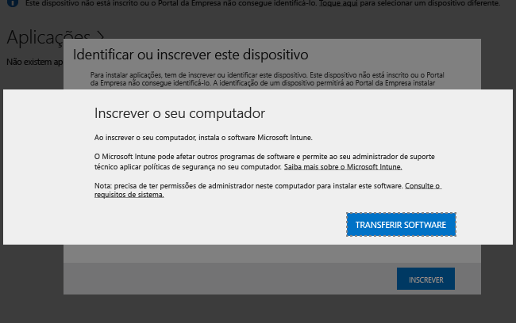

---

title: Instalar o software de cliente de PCs | Documentos da Microsoft
description: "Utilize este guia para ajudá-lo a gerir os PCs Windows através do software de cliente do Microsoft Intune."
keywords: 
author: staciebarker
ms.author: stabar
ms.date: 07/19/2016
ms.topic: article
ms.prod: 
ms.service: microsoft-intune
ms.technology: 
ms.assetid: 64c11e53-8d64-41b9-9550-4b4e395e8c52
ms.reviewer: owenyen
ms.suite: ems
translationtype: Human Translation
ms.sourcegitcommit: 928e4e8097b9cd326e0863a45b183226a7eae056
ms.openlocfilehash: c9a29b6bf9af97f05730251a37b313a662c27a35


---

# <a name="install-the-intune-software-client-on-windows-pcs"></a>Instalar o software de cliente do Intune em PCs Windows
Os PCs Windows podem ser inscritos instalando o software de cliente do Intune. O software de cliente do Intune pode ser instalado das seguintes formas:

- Instalado manualmente
- Instalado através da Política de Grupo
- Incluído numa imagem de disco
- Instalado por utilizadores

O software de cliente do Intune que foi transferido pela primeira vez contém os requisitos mínimos de software necessários para inscrever o PC na gestão do Intune. Quando um PC é inscrito, o software de cliente do Intune transfere o software de cliente completo que é necessário para a gestão do PC.

Esta série de transferências minimiza o tempo necessário para a inscrição inicial do seu PC no Intune. Também garante que, após a conclusão da segunda transferência, o cliente tem o software mais recente disponível.

## <a name="download-the-intune-client-software"></a>Transferir o software de cliente do Intune

Todos os métodos, com exceção daqueles em que são os próprios utilizadores a instalar o software de cliente do Intune, necessitam que o software seja transferido para poder ser implementado.

1.  Na [consola de administração do Microsoft Intune](https://manage.microsoft.com/), clique em **Admin (Administrador)** &gt; **Client Software Download (Transferir Software de Cliente)**.

  

2.  Na página **Client Software Download (Transferência de Software de Cliente)**, clique em **Client Software Download (Transferir Software de Cliente)**. Em seguida, guarde o pacote **Microsoft_Intune_Setup.zip** que contém o software numa localização segura na sua rede.

    > [!NOTE]
    > O pacote de instalação do software de cliente do Intune contém informações sobre a sua conta. Se utilizadores não autorizados conseguirem obter acesso ao pacote de instalação, poderão inscrever computadores na conta representada pelo certificado incorporado e poderão obter acesso a recursos da empresa.

3.  Extraia os conteúdos do pacote de instalação para uma localização segura na sua rede.

    > [!IMPORTANT]
    > Não mude o nome ou remova o ficheiro **ACCOUNTCERT** que é extraído ou a instalação de software de cliente falhará.

## <a name="deploy-the-client-software-manually"></a>Implementar o software de cliente manualmente

Num computador, aceda à pasta onde se encontram os ficheiros de instalação do software de cliente. Em seguida, execute **Microsoft_Intune_Setup.exe** para instalar o software de cliente.

    > [!NOTE]
    > The status of the installation is displayed when you hover over the icon in the taskbar on the client computer.

## <a name="deploy-the-client-software-by-using-group-policy"></a>Implementar o software de cliente com uma Política de Grupo

1.  Na pasta que contém os ficheiros**Microsoft_Intune_Setup.exe** e **MicrosoftIntune.accountcert**, execute o seguinte comando para extrair os programas de instalação baseados no Windows Installer para computadores de 32 bits e 64 bits:

    ```
    Microsoft_Intune_Setup.exe/Extract <destination folder>
    ```

2.  Copie os ficheiros **Microsoft_Intune_x86.msi**, **Microsoft_Intune_x64.msi** e **MicrosoftIntune.accountcert** para uma localização de rede que possa ser acedida por todos os computadores nos quais irá instalar o software de cliente.

    > [!IMPORTANT]
    > Não separe ou mude o nome dos ficheiros ou a instalação do software de cliente falhará.

3.  Utilize a Política de Grupo para implementar software nos computadores na sua rede.

    Para obter mais informações sobre como utilizar a Política de Grupo para implementar software automaticamente, consulte a documentação do Windows Server.

## <a name="deploy-the-client-software-as-part-of-an-image"></a>Implementar o software de cliente como parte de uma imagem
Pode implementar o software de cliente do Intune em computadores como parte de uma imagem de sistema operativo, ao utilizar o seguinte procedimento como guia:

1.  Copie os ficheiros de instalação do cliente, **Microsoft_Intune_Setup.exe** e **MicrosoftIntune.accountcert**, para a pasta **%Systemdrive%\Temp\Microsoft_Intune_Setup** no computador de referência.

2.  Crie a entrada de registo **WindowsIntuneEnrollPending** ao adicionar o seguinte comando ao script **SetupComplete.cmd** :

    ```
    %windir%\system32\reg.exe add HKEY_LOCAL_MACHINE\Software\Microsoft\Onlinemanagement\Deployment /v
    WindowsIntuneEnrollPending /t REG_DWORD /d 1
    ```

3.  Adicione o seguinte comando ao **setupcomplete.cmd** para executar o pacote de inscrição com o argumento da linha de comandos /PrepareEnroll:

    ```
    %systemdrive%\temp\Microsoft_Intune_Setup\Microsoft_Intune_Setup.exe /PrepareEnroll
    ```
    > [!TIP]
    > O script **SetupComplete.cmd** permite à Configuração do Windows efetuar modificações ao sistema antes de o utilizador iniciar sessão. O argumento da linha de comandos **/PrepareEnroll** prepara um computador de destino para ser inscrito automaticamente no Intune após a Configuração do Windows ser concluída.

4.  Coloque o**SetupComplete.cmd** na pasta **%Windir%\Setup\Scripts** no computador de referência.

5.  Capture uma imagem do computador de referência e, em seguida, efetue a implementação nos computadores visados.

Quando o computador de destino reiniciar no final da Configuração do Windows, é criada a chave de registo **WindowsIntuneEnrollPending**. O pacote de inscrição verifica se o computador está inscrito. Se o computador estiver inscrito, não é necessária mais nenhuma ação. Se o computador não estiver inscrito, o pacote de inscrição cria uma Tarefa de Inscrição Automática do Microsoft Intune.

Quando a tarefa de inscrição automática for executada na próxima hora agendada, verifica a existência do valor de registo **WindowsIntuneEnrollPending** e tenta inscrever o PC de destino no Intune. Se a inscrição falhar por alguma razão, é repetida da próxima vez que a tarefa for executada. As repetições serão efetuadas durante um mês.

A Tarefa de Inscrição Automática do Intune, o valor de registo **WindowsIntuneEnrollPending** e o certificado de conta serão eliminados do computador de destino quando a inscrição for bem sucedida ou após um mês (o que ocorrer primeiro).

## <a name="instruct-users-to-self-enroll"></a>Dar instruções aos utilizadores para se inscreverem

Os utilizadores podem instalar o software de cliente do Intune ao aceder ao [site do Portal da Empresa](http://portal.manage.microsoft.com). Se o portal Web conseguir detetar que o dispositivo é um PC Windows, irá pedir aos utilizadores para inscreverem o PC através da transferência do software de cliente do Intune. Após a transferência do software, os utilizadores poderão instalá-lo para que os seu PCs passem a ser geridos.



## <a name="monitor-and-validate-successful-client-deployment"></a>Monitorizar e validar implementações de cliente com êxito
Utilize um dos seguintes procedimentos para ajudá-lo a monitorizar e a validar implementações de cliente com êxito.

### <a name="to-verify-the-installation-of-the-client-software-from-the-microsoft-intune-administrator-console"></a>Para verificar a instalação do software de cliente a partir da consola do administrador do Microsoft Intune

1.  Na [consola de administração do Microsoft Intune](https://manage.microsoft.com/), clique em **Groups (Grupos)** &gt; **All Devices (Todos os Dispositivos)** &gt; **All Computers (Todos os Computadores)**.

2.  Na lista, localize os computadores que estão a comunicar com o Intune ou procure um computador gerido específico ao escrever o nome do computador (ou qualquer parte do nome) na caixa **Search devices (Procurar dispositivos)**.

3.  Analise o estado do computador no painel inferior da consola. Resolva os erros existentes.

### <a name="to-create-a-computer-inventory-report-to-display-all-enrolled-computers"></a>Para criar um relatório de inventário de computadores para apresentar todos os computadores inscritos

1.  Na [consola de administração do Microsoft Intune](https://manage.microsoft.com/), clique em **Reports (Relatórios)** &gt; **Computer Inventory Reports (Relatórios de Inventário de Computadores)**.

2.  Na página **Create New Report (Criar Novo Relatório)**, deixe os valores predefinidos em todos os campos (exceto se quiser aplicar filtros) e, em seguida, clique em **View Report (Ver Relatório)**.

3.  A página **Relatório de Inventário de Computadores** é aberta numa nova janela que apresenta todos os computadores inscritos com êxito no Intune.

    > [!TIP]
    > Clique em qualquer cabeçalho de coluna no relatório para ordenar a lista pelos conteúdos dessa coluna.


### <a name="see-also"></a>Consulte também
[Gerir PCs Windows com o Microsoft Intune](manage-windows-pcs-with-microsoft-intune.md)
[Resolver problemas da configuração do cliente](../troubleshoot/troubleshoot-client-setup-in-microsoft-intune.md)


<!--HONumber=Dec16_HO2-->


