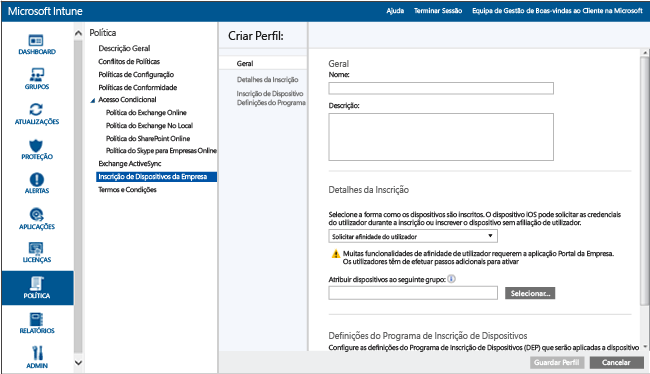
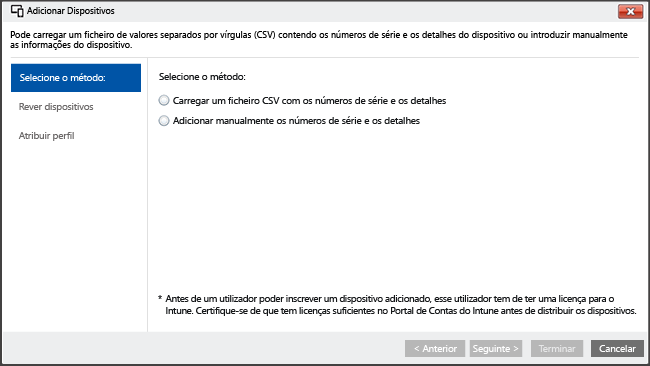

# <a name="enroll-ios-devices-with-apple-configurator-by-using-setup-assistant"></a>Inscrever dispositivos iOS com o Apple Configurator ao utilizar o Assistente de Configuração

[!INCLUDE[classic-portal](../includes/classic-portal.md)]

O Intune suporta a inscrição de dispositivos iOS pertencentes à empresa com o [Apple Configurator](http://go.microsoft.com/fwlink/?LinkId=518017) em execução num computador Mac. Este processo efetua a reposição de fábrica do dispositivo e prepara-o para executar o Assistente de Configuração, ao instalar as políticas da empresa para o novo utilizador do dispositivo.

## <a name="setup-assistant-enrollment-for-ios-devices-with-microsoft-intune"></a>Inscrição do Assistente de Configuração para dispositivos iOS com Microsoft Intune
Através do Apple Configurator, pode repor um dispositivo iOS para as definições de fábrica e preparar a sua configuração para o novo utilizador do dispositivo. Este método requer que ligue o dispositivo iOS a um computador Mac através de USB para configurar a inscrição empresarial e parte do princípio de que está a utilizar o Apple Configurator 2.0. A maioria dos cenários exige que a política aplicada ao dispositivo iOS inclua **afinidade de utilizador** para ativar a aplicação Portal da Empresa do Intune.

**Pré-requisitos**
* [Inscrição de iOS ativada](set-up-ios-and-mac-management-with-microsoft-intune.md) mediante a instalação de um certificado APNs.
* Acesso físico aos dispositivos iOS&mdash;os dispositivos têm de ser repostos para as definições de fábrica sem proteção por palavra-passe
* Números de série de dispositivos&mdash;consulte [Como obter um número de série iOS](https://support.apple.com/en-us/HT204308)
* Cabos de ligação USB
* Um computador Mac com o [Apple Configurator 2.0](https://itunes.apple.com/us/app/apple-configurator-2/id1037126344?mt=12)


1.  **Crie um grupo de dispositivos móveis** (opcional).
    Se a sua empresa precisar de grupos de dispositivos móveis para ajudar a gerir dispositivos, crie-os. Para saber mais, consulte [Utilizar grupos para gerir utilizadores e dispositivos no Microsoft Intune](use-groups-to-manage-users-and-devices-with-microsoft-intune.md).

2.  **Criar um perfil para dispositivos**.
    Um perfil de inscrição de dispositivos especifica as definições aplicadas a um grupo de dispositivos. Os seguintes passos mostram como criar um perfil de inscrição de dispositivos para os dispositivos iOS inscritos através do Apple Configurator.

    1.  Na [consola de administração do Microsoft Intune](http://manage.microsoft.com) aceda a **Policy** &gt; **Corporate Device Enrollment** e, em seguida, selecione **Add**.
    

    2.  Introduza os detalhes dos perfis de dispositivo:

        -   **Name**&mdash;nome do perfil de inscrição de dispositivos (não visível para os utilizadores).

        -   **Description**&mdash;uma descrição do perfil de inscrição de dispositivos (não visível para os utilizadores).

        -   **Enrollment Details**&mdash;especifica a forma como os dispositivos são inscritos.

            -   **Prompt for user affinity**&mdash;o dispositivo tem de ser afiliado a um utilizador durante a configuração inicial e, em seguida, pode receber permissões para aceder ao e-mail e aos dados da empresa. O valor **User affinity** deve ser configurado para dispositivos geridos por DEP que pertencem aos utilizadores e que precisam de utilizar o portal da empresa para serviços como a instalação de aplicações.

            -   **No user affinity**&mdash;o dispositivo não está afiliado a um utilizador. Utilize esta afiliação em dispositivos que efetuem tarefas sem aceder aos dados de utilizador locais. As aplicações que requerem afiliação de utilizadores (incluindo a aplicação Portal da Empresa utilizada para instalar aplicações de linha de negócio) não irão funcionar.

        -   **Device group pre-assignment**&mdash;todos os dispositivos implementados com este perfil irão inicialmente pertencer a este grupo. Pode reatribuir dispositivos depois da inscrição.

            [!INCLUDE[groups deprecated](../includes/group-deprecation.md)]

        -  **Device Enrollment Program**&mdash;O Device Enrollment Program (DEP) da Apple não pode ser utilizado com a inscrição do Assistente de Configuração. Certifique-se de que a alternância de modo está definida como **off**.

    3.  Clique em **Save Profile** para adicionar o perfil.

3.  **Adicionar dispositivos iOS para inscrição com o Assistente de Configuração**.
    Na [Consola de administração do Microsoft Intune](http://manage.microsoft.com), aceda a **Groups** &gt; **All Devices** &gt; **All Corporate-owned Devices** &gt; **All Devices** e, em seguida, selecione **Add devices**. Pode adicionar dispositivos de duas formas:

    

    -   **Upload a CSV file containing serial numbers**&mdash;crie uma lista de valores separados por vírgulas (.csv) de duas colunas sem cabeçalho, limitada até 5 000 dispositivos ou 5 MB por ficheiro .csv.

        |||
        |-|-|
        |&lt;Série n.º 1&gt;|&lt;Detalhes do Dispositivo n.º 1&gt;|
        |&lt;Série n.º2&gt;|&lt;Detalhes do Dispositivo n.º 2&gt;|
        Se abrir este ficheiro .csv num editor de texto, este será apresentado como:

        ```
        0000000,PO 1234
        111111111,PO 1234
        ```

    -   **Adicionar manualmente os detalhes de dispositivos**&mdash;Introduza o número de série e os detalhes de um máximo de 15 dispositivos.

    > [!NOTE]
    > Posteriormente, se tiver de remover dispositivos pertencentes à empresa da gestão do Intune, poderá ter de remover o número de série do dispositivo do Intune no grupo de dispositivos **By iOS Serial Number** em **Corporate Pre-enrolled devices** para desativar a inscrição do dispositivo. Se o Intune efetuar um procedimento de recuperação após desastre na altura em que remover números de série, terá de verificar que apenas os números de série dos dispositivos ativos estão presentes nesse grupo.

    Selecione **Next**.

4.  **Selecionar os dispositivos a inscrever**.
    Confirme os dispositivos a inscrever. Os números de série já inscritos ou inscritos através de outros meios não podem ser importados. Selecione **Seguinte** para continuar.

5.  **Assign profile**.
    Especifique o perfil a atribuir aos dispositivos adicionados a partir da lista de perfis disponíveis, consulte os **Enrollment profile details**e, em seguida, selecione **Finish**. Os dispositivos adicionados manualmente podem ser atribuídos a qualquer perfil de inscrição.

6.  **Export a profile to deploy to iOS devices**.
    Na [consola de administração do Microsoft Intune](http://manage.microsoft.com) aceda a **Policy** &gt; **Corporate Device Enrollment**e, em seguida, selecione o perfil de dispositivo a implementar nos dispositivos móveis. Selecione **Export** na barra de tarefas. Copie e guarde o **URL do Perfil**. Irá carregá-lo no Apple Configurator mais tarde para definir o perfil do Intune utilizado pelos dispositivos iOS.
    Para suportar o Apple Configurator 2, o URL do Perfil 2.0 tem de ser editado. Para tal, substitua este código:
    ```
    https://manage.microsoft.com/EnrollmentServer/Discovery.svc/iOS/ESProxy?id=
    ```
    Por este código:

    ```
    https://appleconfigurator2.manage.microsoft.com/MDMServiceConfig?id=
    ```

   No procedimento seguinte, irá carregar o URL deste perfil para o serviço DEP da Apple com o Apple Configurator para definir o perfil do Intune utilizado pelos dispositivos iOS.


7.  **Preparar o dispositivo com o Apple Configurator**.
    Os dispositivos iOS são ligados ao computador Mac e inscritos na gestão de dispositivos móveis.

    1.  Num computador Mac, abra o **Apple Configurator 2**. Na barra de menus, selecione **Apple Configurator 2** e selecione **Preferências**.

         > [!WARNING]
         > Os dispositivos serão repostos para as configurações de fábrica durante o processo de inscrição. Como melhor prática, reponha o dispositivo e ligue-o. Os dispositivos deverão aparecer no ecrã **Hello** quando liga o dispositivo.

    2. No painel de preferências, selecione **Servidores** e selecione o símbolo de adição (+) para iniciar o assistente do Servidor MDM. Selecione **Seguinte**.

    3. Introduza o **Nome** e o **URL de inscrição** para o servidor MDM do Passo n.º 6, em Inscrição do Assistente de Configuração para dispositivos iOS com Microsoft Intune. Para o URL de Inscrição, introduza o URL do perfil de inscrição exportado do Intune. Selecione **Seguinte**.  

       Pode ignorar o aviso "URL do servidor não verificado" em segurança. Para continuar, selecione **Seguinte** até que o assistente esteja concluído.

    4.  Ligue os dispositivos móveis iOS ao computador Mac com um adaptador USB.

        > [!WARNING]
        > Os dispositivos serão repostos para as configurações de fábrica durante o processo de inscrição. Como melhor prática, reponha o dispositivo e ligue-o. Os dispositivos deverão aparecer no ecrã **Hello** quando inicia o Assistente de Configuração.

    5.  Selecione **Preparar**. No painel Preparar o Dispositivo iOS, selecione **Manual** e, em seguida, selecione **Seguinte**.

    6. No painel Inscrever no Servidor MDM, selecione o nome do servidor que criou e selecione **Seguinte**.

    7. No painel Supervisionar Dispositivos, selecione o nível de supervisão e, em seguida, selecione **Seguinte**.

    8. No painel Criar uma Organização, selecione a **Organização** ou crie uma nova organização e, em seguida, selecione **Seguinte**.

    9. No painel Configurar Assistente de Configuração iOS, selecione os passos a serem apresentados ao utilizador e, em seguida, selecione **Preparar**. Se lhe for pedido, autentique para atualizar as definições de fidedignidade.  

    10. Quando concluir a preparação do dispositivo iOS, desligue o cabo USB.  

8.  **Distribua os dispositivos**.
    Os dispositivos estão agora prontos para a inscrição na empresa. Desligue os dispositivos e distribua-os pelos utilizadores. Quando os utilizadores ligarem os respetivos dispositivos, o Assistente de Configuração será iniciado.


### <a name="see-also"></a>Consulte também
[Pré-requisitos para inscrever dispositivos](prerequisites-for-enrollment.md)


<!--HONumber=Dec16_HO2-->


