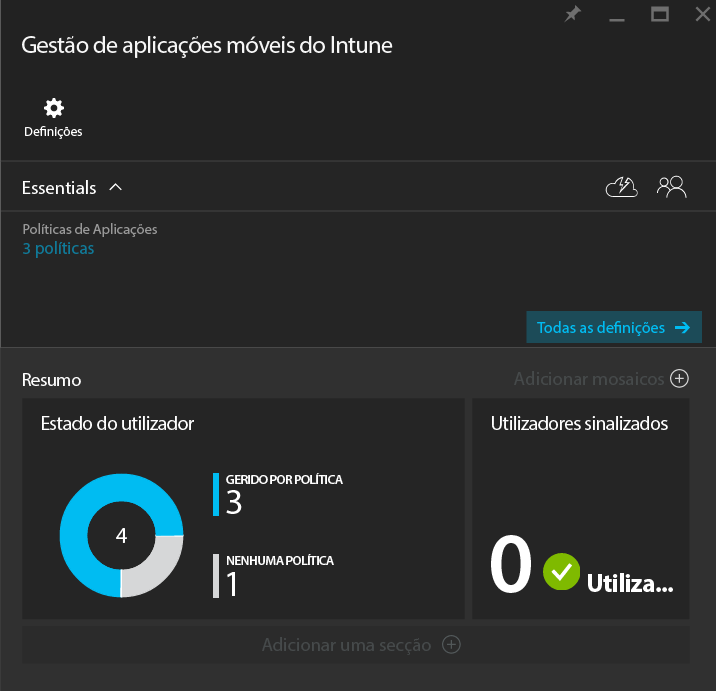
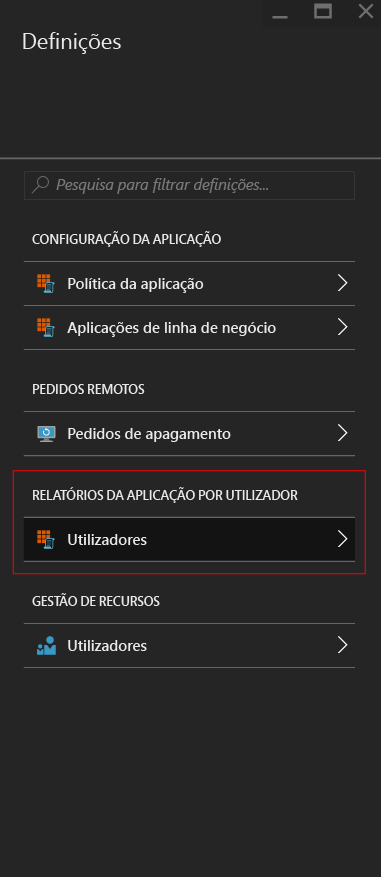
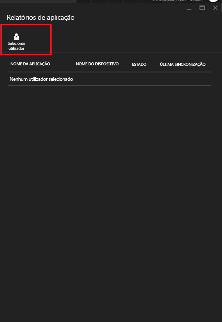
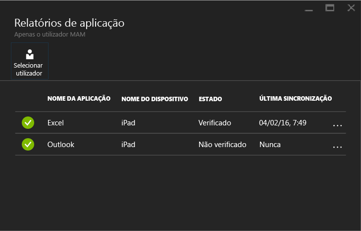

# Monitorizar políticas de gestão de aplicações móveis com o Microsoft Intune

[!INCLUDE[classic-portal](../includes/classic-portal.md)]

Depois de ter configurado uma política de gestão de aplicações móveis (MAM) e tê-la aplicado aos utilizadores, pode monitorizar o estado de conformidade no [portal do Azure](https://portal.azure.com). O portal do Azure inclui informações sobre os utilizadores afetados pela política, o estado de conformidade e quaisquer problemas que possam estar a ocorrer nos utilizadores.
## Vista de resumo
No painel **Gestão de aplicações móveis do Intune**, pode ver um resumo do estado de conformidade:

-   **Utilizadores:** o número total de utilizadores na sua empresa que estão a utilizar as aplicações associadas à política.

-   **GERIDO POR POLÍTICA:** o número de utilizadores que utilizaram, pelo menos, uma das aplicações no contexto profissional.

-   **NENHUMA POLÍTICA:** o número de utilizadores que estão a utilizar as aplicações associadas à política, mas não são visados pela política. Poderá considerar adicionar estes utilizadores à sua política.

- **Utilizadores sinalizados:** o número de utilizadores que estão com problemas. Atualmente, apenas os utilizadores com dispositivos com jailbreak são reportados como **Utilizadores sinalizados**.

## Vista detalhada
Pode aceder à vista detalhada do resumo ao selecionar os mosaicos **Estado de utilizador** e **Utilizadores sinalizados**.

### Estado de utilizador
Pode procurar um único utilizador e ver o estado de conformidade do mesmo. O painel **Relatório da aplicação** mostra as seguintes informações para um utilizador selecionado:
- Dispositivos associados à conta de utilizador

- Aplicações com a política de MAM no dispositivo

- Estado:

  - **Com entrada dada:** a política foi implementada no utilizador e a aplicação foi utilizada no contexto profissional pelo menos uma vez.

  - **Sem entrada dada:** a política foi implementada para o utilizador, mas a aplicação não foi utilizada no contexto profissional desde então.

>[!NOTE]
> Se o utilizador que procurou não tiver a política de MAM implementada, verá uma mensagem a informar que não existem aplicações segmentadas para esse utilizador.

Para ver o relatório para um utilizador, siga estes passos:

1.  Para selecionar um utilizador, selecione o mosaico **Resumo** ou selecione a opção **RELATÓRIO DA APLICAÇÃO POR UTILIZAODR** no painel **Definições**:

    

2. No painel **Relatório da aplicação** que abrir, selecione **Selecionar utilizador** para procurar um utilizador do Azure Active Directory.

    

3. Selecione o utilizador na lista. Irá ver os detalhes do estado de conformidade do utilizador.

    

### Utilizadores sinalizados
A vista detalhada mostra a mensagem de erro, a aplicação que foi acedida quando ocorreu o erro, a plataforma do dispositivo e um carimbo de data/hora.  

### Consulte também
[Gerir a transferência de dados entre aplicações iOS](manage-data-transfer-between-ios-apps-with-microsoft-intune.md)

* [O que esperar quando a sua aplicação Android é gerida por políticas de MAM](user-experience-for-mam-enabled-android-apps-with-microsoft-intune.md)
* [O que esperar quando a sua aplicação iOS é gerida por políticas de MAM](user-experience-for-mam-enabled-ios-apps-with-microsoft-intune.md)

<!--HONumber=Dec16_HO3-->

