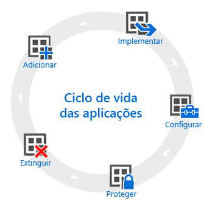

# Descrição geral do ciclo de vida das aplicações

[!INCLUDE[classic-portal](../includes/classic-portal.md)]

O ciclo de vida das aplicações do Intune começa quando uma aplicação é adicionada e avança por fases adicionais até ser removida.

## Adicionar

O primeiro passo na implementação de aplicações consiste em adicionar as aplicações que pretende gerir e implementar no Intune. Apesar de poder utilizar muitos tipos de aplicações diferentes, os procedimentos básicos são iguais. Com o Intune, pode adicionar aplicações para [dispositivos inscritos](add-apps-for-mobile-devices-in-microsoft-intune.md) ou [PCs Windows que gere com o software de cliente Intune](add-apps-for-windows-pcs-in-microsoft-intune.md).

## Implementar

Depois de adicionar a aplicação ao Intune, pode [implementá-la nos dispositivos que gere](deploy-apps.md). O Intune facilita este processo e, após a implementação da aplicação, pode [monitorizar o êxito](monitor-apps-in-microsoft-intune.md) da implementação a partir da consola de administração do Intune. Além disso, em algumas lojas de aplicações, como as da [Apple](manage-ios-apps-you-purchased-through-a-volume-purchase-program-with-microsoft-intune.md) e do [Windows](manage-apps-you-purchased-from-the-windows-store-for-business-with-microsoft-intune.md), pode comprar licenças de aplicações em volume para a sua empresa. O Intune pode sincronizar os dados com estas lojas para poder implementar e monitorizar a utilização de licenças para estes tipos de aplicações diretamente a partir da consola de administração do Intune.

## Configurar

Como parte do ciclo de vida das aplicações, são lançadas regularmente novas versões das aplicações. O Intune fornece ferramentas para [atualizar aplicações](update-apps-using-microsoft-intune.md) facilmente, que tenha implementado numa versão mais recente. Além disso, pode configurar funcionalidades adicionais para algumas aplicações, por exemplo:
- As [políticas de configuração de aplicações iOS](configure-ios-apps-with-mobile-app-configuration-policies-in-microsoft-intune.md) fornecem definições para aplicações iOS compatíveis utilizadas quando a aplicação é executada. Por exemplo, uma aplicação pode necessitar de definições de imagem corporativa específicas ou do nome de um servidor ao qual ligar.
- As [políticas de browser gerido](manage-internet-access-using-managed-browser-policies.md) ajudam a configurar as definições para o Intune Managed Browser, que substitui o browser do dispositivo predefinido e permite restringir os sites que os utilizadores podem visitar.

## Proteger

O Intune fornece várias formas para ajudar a proteger os dados nas suas aplicações. Os métodos principais são:
- O [acesso condicional](restrict-access-to-email-and-o365-services-with-microsoft-intune.md) controla o acesso ao e-mail e a outros serviços com base nas condições especificadas. As condições incluem tipos de dispositivos ou conformidade com uma [política de conformidade do dispositivo](introduction-to-device-compliance-policies-in-microsoft-intune.md) que tenha implementado.
- A [gestão de aplicações móveis (MAM)](protect-app-data-using-mobile-app-management-policies-with-microsoft-intune.md) funciona com aplicações individuais para ajudar a proteger os dados da empresa que utilizam. Por exemplo, pode restringir a cópia de dados entre aplicações não geridas e aplicações geridas ou pode impedir a execução das aplicações nos dispositivos com jailbreak ou rooting.

## Extinguir

Eventualmente, é provável que as aplicações implementadas fiquem desatualizadas e tenham de ser removidas. O Intune facilita a [extinção de aplicações no serviço](retire-apps-using-microsoft-intune.md).

<!--HONumber=Dec16_HO5-->

