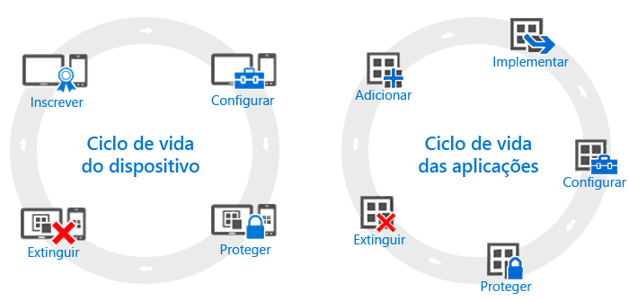

# Descrição geral dos ciclos de vida de dispositivos e aplicações

[!INCLUDE[classic-portal](../includes/classic-portal.md)]

Embora as necessidades de cada organização possam ser diferentes, existem alguns passos comuns que todas elas têm de seguir de forma contínua, independentemente das necessidades operacionais. Estes passos podem ser agrupados em duas categorias principais, chamadas **ciclos de vida**. O ciclo de vida de implementação que segue depende do cenário que está a tentar ativar. Por exemplo, pode precisar apenas do ciclo de vida de dispositivos, do ciclo de vida de aplicações ou de ambos.

Para fins de gestão, todos os dispositivos têm um ciclo de vida. Este é iniciado quando inscreve o dispositivo e prolonga-se até à sua extinção. O [ciclo de vida de gestão de dispositivos](overview-of-device-lifecycle-in-microsoft-intune.md) descreve como inscrever, configurar e proteger o dispositivo e, em seguida, como removê-lo da gestão.

Do mesmo modo, as aplicações com que trabalha têm os seus próprios [ciclos de vida de aplicação](overview-of-app-lifecycle-in-microsoft-intune.md), que incluem passos que vão desde adicionar uma aplicação ao Intune até removê-la quando deixa de ser precisa.

<!--HONumber=Dec16_HO5-->

