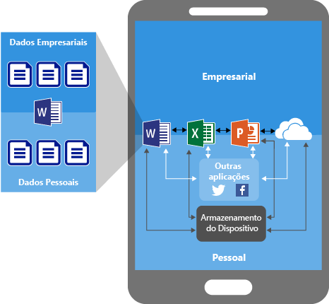
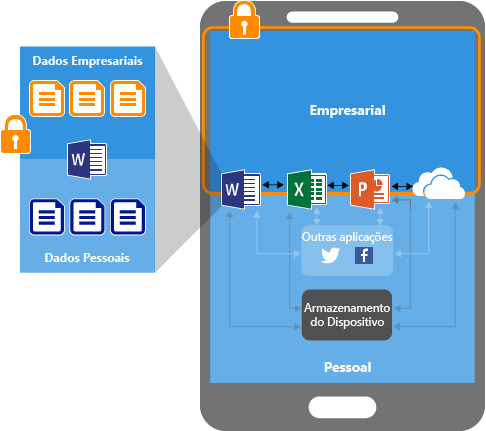
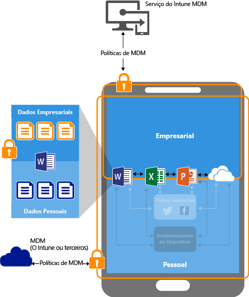
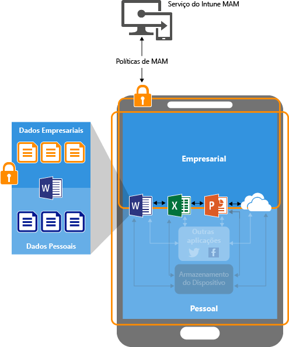

# Proteger os dados da aplicação através de políticas de gestão de aplicações móveis com o Microsoft Intune

## Como pode proteger dados de aplicações
Os seus funcionários utilizam dispositivos móveis para tarefas pessoais e profissionais. Se, por um lado, quer garantir que os seus funcionários são produtivos, por outro, também quer evitar a perda de dados, intencional e acidental.  Além disso, pretende ser capaz de proteger os dados da empresa aos quais os seus funcionários acedem com dispositivos que não gere.

Pode utilizar políticas de gestão de aplicações móveis (MAM) do Intune para ajudar a proteger os dados da sua empresa. Uma vez que as políticas de MAM do Intune podem ser utilizadas **independentemente de qualquer solução de gestão de dispositivos móveis (MDM)**, pode utilizar as MAM para proteger os dados da sua empresa ao inscrever ou não os dispositivos numa solução de gestão de dispositivos. Ao implementar **políticas ao nível da aplicação**, pode restringir o acesso aos recursos da empresa e manter os dados sob a alçada do seu departamento de TI.

Pode configuradas políticas de MAM para aplicações executadas em dispositivos que estão:

-   **Inscritos no Microsoft Intune:** os dispositivos desta categoria pertencem, normalmente, à empresa.

-   **Inscritos numa solução de MDM de terceiros:** os dispositivos desta categoria pertencem, normalmente, à empresa.

  > [!NOTE]
  > Não recomendamos a utilização de políticas de MAM com soluções de gestão de aplicações móveis ou de contentores seguros de terceiros.

-   **Não inscritos em nenhuma solução de MDM:** os dispositivos desta categoria pertencem, normalmente, aos funcionários e não são geridos ou não estão inscritos no Intune ou noutras soluções de MDM de terceiros.

> [!IMPORTANT]
> Pode criar políticas de gestão de aplicações móveis para as aplicações móveis do Office que se ligam aos serviços do Office 365. As políticas de MAM não são suportadas para aplicações que se ligam aos serviços Exchange no local, ao Skype para Empresas nem ao SharePoint.

## Benefícios da utilização de políticas de MAM

-   **Ajudam a proteger os dados da sua empresa ao nível da aplicação.** Como a gestão de aplicações móveis não requer a gestão de dispositivos, pode proteger os dados da empresa nos dispositivos geridos e não geridos. A gestão centra-se na identidade do utilizador, o que elimina a necessidade de gestão de dispositivos.

-   **A produtividade do utilizador não é afetada e as políticas não são aplicadas quando a aplicação for utilizada num contexto pessoal.** As políticas são aplicadas apenas num contexto profissional, o que lhe permite proteger os dados da empresa sem afetar os dados pessoais.

A utilização de MDM com políticas de MAM tem outras vantagens e as empresas podem utilizar as políticas de MAM com e sem MDM ao mesmo tempo. Por exemplo, um funcionário poderá utilizar um telemóvel atribuído pela empresa, bem como um tablet pessoal. Neste caso, o telemóvel da empresa está inscrito na MDM e protegido por políticas de MAM, ao passo que o dispositivo pessoal está protegido apenas por políticas de MAM.

- **A MDM assegura que o dispositivo está protegido.** Por exemplo, pode exigir um PIN para aceder ao dispositivo ou pode implementar aplicações geridas no mesmo. Também pode implementar aplicações em dispositivos através da sua solução de MDM, para obter maior controlo sobre a gestão de aplicações.

- **As políticas de MAM asseguram que as proteções de camada de aplicação estão implementadas.** Por exemplo, pode ter uma política que exige um PIN para abrir uma aplicação num contexto profissional, impedir que os dados sejam partilhados entre aplicações e impedir que os dados de aplicações da empresa sejam guardados numa localização de armazenamento pessoal.

## Dispositivos que suportam MAM
Atualmente, as políticas de MAM são suportadas em:
-   iOS 8.1 ou posterior
-   Android 4 ou posterior

Os dispositivos Windows não são atualmente suportados.
##  Como é que as políticas de MAM protegem os dados das aplicações

###  Aplicações sem políticas de MAM

Quando utiliza as aplicações sem restrições, os dados pessoais e da empresa podem confundir-se. Os dados da empresa podem acabar em localizações como um armazenamento pessoal ou podem ser transferidos para aplicações fora da sua competência, resultando em perda de dados. As setas no diagrama mostram a movimentação de dados sem restrições entre aplicações (empresariais e pessoais) e para localizações de armazenamento.

### Proteção de dados com políticas de MAM

Pode utilizar as políticas de MAM para impedir que os dados da empresa sejam guardados no armazenamento local do dispositivo e para restringir a movimentação de dados para outras aplicações que não estão protegidas por políticas de MAM. As definições das políticas de MAM incluem:
- Políticas de reposicionamento de dados como **Impedir operações Guardar como** e **Restringir operações cortar, copiar e colar**.
- Aceder a definições de política, como **Exigir PIN simples para o acesso** e **Bloquear execução de aplicações geridas em dispositivos desbloqueados por jailbreak ou rooting**.

### Proteção de dados com políticas de MAM nos dispositivos geridos por uma solução MDM

**Para dispositivos inscritos numa solução de MDM**: o diagrama anterior mostra as camadas de proteção que as políticas MDM e MAM oferecem em conjunto.

A solução de MDM:

-   Inscreve o dispositivo.

-   Implementa aplicações no dispositivo.

-   Fornece gestão e conformidade dos dispositivos contínuas.

**As políticas de MAM acrescentam valor porque:**

-   Ajudam a proteger os dados da empresa contra fugas para aplicações e serviços de consumidor.

-   Aplicam restrições (guardar como, área de transferência, PIN, etc.) a aplicações móveis.

-   Eliminam dados da empresa de aplicações sem as remover do dispositivo.

### Proteção de dados com políticas de MAM para dispositivos sem inscrição

O diagrama anterior ilustra como as políticas de proteção de dados funcionam ao nível da aplicação sem MDM.

Para dispositivos BYOD que não estejam inscritos em nenhuma solução de MDM, as políticas de MAM podem ajudar a proteger os dados da empresa ao nível da aplicação.

No entanto, existem algumas limitações a ter em atenção:

-   Não pode implementar aplicações no dispositivo. O utilizador tem de obter as aplicações na loja.

-   Não pode aprovisionar perfis de certificado nestes dispositivos.

-   Não pode configurar definições de Wi-Fi nem de VPN da empresa nestes dispositivos.

## Várias identidades

As aplicações que suportam várias identidades permitem-lhe utilizar contas diferentes (profissionais e pessoais) para aceder às mesmas aplicações, enquanto as políticas de MAM são aplicadas apenas quando as aplicações são utilizadas no contexto de trabalho.  

Por exemplo, quando um utilizador inicia a aplicação OneDrive com a sua conta profissional, não é possível mover os ficheiros para uma localização de armazenamento pessoal. No entanto, quando utilizam o OneDrive com a sua conta pessoal, podem copiar e mover dados dos seus OneDrive pessoais, sem restrições.  

Todas as aplicações móveis do Office suportam acesso de várias identidades.

##  Passos seguintes
- [Configurar políticas de gestão de aplicações móveis](get-ready-to-configure-mobile-app-management-policies-with-microsoft-intune.md)

- [Criar e implementar políticas de gestão de aplicações móveis com o Microsoft Intune](create-and-deploy-mobile-app-management-policies-with-microsoft-intune.md)

<!--HONumber=Nov16_HO5-->

