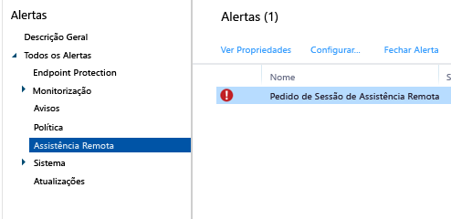

# Pedir e fornecer assistência remota para PCs Windows

O Microsoft Intune pode utilizar o software [TeamViewer](https://www.teamviewer.com), adquirido separadamente, para que possa atribuir assistência remota aos seus utilizadores a executarem o cliente de software do Intune. Quando um utilizador solicita a ajuda do Microsoft Intune Center, é informado por um alerta. Pode aceitar o pedido e, em seguida, fornecer assistência. Esta funcionalidade substitui a funcionalidade existente de Assistência Remota do Windows no Intune.

## Antes de começar

Antes de começar a estabelecer e responder aos pedidos de assistência remota, verifique se os seguintes pré-requisitos estão implementados:

- Tem de estar [inscrito numa conta do TeamViewer](https://login.teamviewer.com/LogOn#register) para iniciar sessão no site do TeamViewer.
- Os PCs Windows que pretende administrar têm de ser [geridos pelo cliente de PC Windows](manage-windows-pcs-with-microsoft-intune.md)
- Todos os sistemas operativos de PCs Windows suportados pelo Intune podem ser administrados.

## Configurar o TeamViewer Connector

1. Na [consola de administração do Microsoft Intune](https://manage.microsoft.com), escolha **Admin**.
2. Na área de trabalho **Admin**, selecione **TeamViewer**.
3. Na página **TeamViewer**, em **TeamViewer Connector**, escolha **Ativar**.
4. Na caixa de diálogo **Ativar TeamViewer**, leia e, em seguida, **Aceite** os termos de licenciamento. Se ainda não tem uma licença do TeamViewer, escolha **Comprar uma licença do TeamViewer**.
5. Depois de a janela TeamViewer do browser abrir, inicie sessão no site com as suas credenciais do TeamViewer.
6. No site do TeamViewer, leia e, em seguida, aceite as opções para permitir que o Intune estabeleça ligação ao TeamViewer.
7. Na consola do Intune, certifique-se de que o item **TeamViewer Connector** é apresentado como **Ativado**.

## Abrir um pedido de assistência remota (utilizador final)

1. Num cliente de PC Windows, abra o **Microsoft Intune Center**.
2. Em **Assistência Remota**, escolha **Pedir Assistência Remota**.
3. Depois de aprovar o pedido (ver abaixo), o TeamViewer abre no cliente. O utilizador tem de aceitar todas as mensagens que indicam que o browser está a tentar abrir a aplicação TeamViewer.
4. O utilizador verá uma mensagem a perguntar-lhe se pode controlar o PC dele. Esta mensagem tem de ser aceite para continuar.
5. Durante a sessão de assistência remota, o utilizador verá uma janela que lhe mostra que está ligado. Se ele fechar esta janela, a sessão remota termina.

## Responder a um pedido de assistência remota

1. Quando um utilizador submete um pedido de assistência remota, pode vê-la na área de trabalho **Alertas**, em **Monitorização** > **Assistência Remota**. Por exemplo:
> 

 Se um pedido não tiver resposta durante mais de 4 horas, é removido.
2. Para aceitar o pedido, selecione **Aprovar o pedido e iniciar a Assistência Remota**.
3. Na caixa de diálogo **Um Novo Pedido de Assistência Remota está Pendente**, selecione **Aceitar o pedido de assistência remota**. O TeamViewer irá instalar todas as aplicações necessárias no seu computador, se ainda não estiverem instaladas.
4. O TeamViewer notifica o utilizador final de que pretende assumir o controlo do PC dele. Depois de o utilizador aceitar o pedido, a janela do TeamViewer abre e pode controlar o PC.

Durante uma sessão de assistência remota, pode utilizar todos os comandos do TeamViewer disponíveis para controlar o PC remoto. Para obter ajuda com estes comandos, transfira o [Manual para controlo remoto](http://www.teamviewer.com/en/support/documents/) do site do TeamViewer.

## Fechar a sessão de assistência remota

A partir do menu **Ações** da janela **TeamViewer**, escolha **Terminar Sessão**.

## Reiniciar um PC Windows remotamente
Quando ajudar os seus utilizadores com problemas, poderá ter de ocasionalmente reiniciar remotamente os seus PCs. Utilize os seguintes passos para reiniciar remotamente um PC Windows.

1.  Na [consola de administração do Microsoft Intune](https://manage.microsoft.com/), escolha **Grupos** &gt; **Todos os Dispositivos** (ou outro grupo que contenha o computador que pretende reiniciar).

2.  Selecione um ou mais computadores e, em seguida, escolha **Tarefas Remotas** &gt; **Reiniciar o Computador**.

3.  Para ver o estado da tarefa, escolha **Tarefas Remotas** no canto inferior direito da página.

4.  Na caixa de diálogo **Estado da Tarefa**, reveja as tarefas remotas atuais, os estados de tarefas, o nome do dispositivo e todos os erros comunicados.

### Consulte também

[Tarefas de gestão comuns de PCs Windows com o cliente de software do Intune](common-windows-pc-management-tasks-with-the-microsoft-intune-computer-client.md)

<!--HONumber=Nov16_HO4-->

