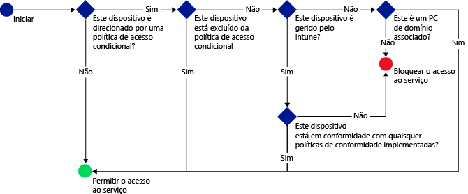

# Proteger o acesso ao e-mail, ao Office 365 e a outros serviços com o Microsoft Intune

[!INCLUDE[classic-portal](../includes/classic-portal.md)]

Pode proteger o acesso aos e-mails da sua empresa, aos serviços do Office 365 como o **Exchange No Local**, o **Exchange Online**, o **Exchange Online Dedicado**, o **SharePoint Online**, o **Skype para Empresas Online** e a outros serviços ao utilizar o Acesso Condicional do Enterprise Mobility + Security (EMS). Esta capacidade permite assegurar que o acesso ao e-mail da empresa e aos serviços do Office 365 é restringido aos dispositivos que estão em conformidade com as regras de acesso condicional que definiu, seja na consola de administrador do Intune ou no portal clássico do Azure.
## Como funciona o acesso condicional?
Pode utilizar as definições de política de conformidade para avaliar a conformidade de um dispositivo. Uma política de acesso condicional utiliza a avaliação para restringir ou permitir o acesso a um serviço específico. Quando utiliza uma política de acesso condicional em combinação com uma política de conformidade de dispositivos, apenas os dispositivos conformes têm permissão para aceder ao serviço. A política de conformidade e a política de acesso condicional são implementadas no utilizador. Qualquer dispositivo que o utilizador utilize para aceder aos serviços é analisado relativamente à conformidade com as políticas.

> [!IMPORTANT]
> Tenha em atenção que o utilizador que está a utilizar o dispositivo tem de ter uma política de conformidade implementada para que o dispositivo seja avaliado em termos de conformidade.
> Se não estiver implementada nenhuma política de conformidade para o utilizador, o dispositivo é tratado como conforme e não são aplicadas restrições de acesso.

Quando os dispositivos não cumprem as condições definidas nas políticas, o utilizador final é orientado através do processo de inscrição do dispositivo e da correção do problema que impede o dispositivo de estar conforme.

Fluxo típico de acesso condicional:

## Considerações sobre configuração

### Licenciamento

O Microsoft Intune e o Azure Active Directory (Azure AD) Premium funcionam de forma totalmente integrada em conjunto de forma a fornecer múltiplas camadas de controlo através do acesso condicional do EMS. Se quiser implementar políticas de acesso condicional com o Intune, tem de ter licença para ambos os produtos.

As **licenças do Azure AD Premium** podem ser compradas como serviço autónomo ou podem ser compradas (juntamente com o Intune) como parte do contrato Enterprise. Se tiver implementado políticas de acesso condicional com o Intune, certifique-se de que obteve as devidas licenças do Azure AD Premium ou **EMS**.

- Saiba mais sobre a [página de preços do Enterprise Mobility](https://www.microsoft.com/cloud-platform/enterprise-mobility-pricing) ou a [página de preços do Azure Active Directory](https://azure.microsoft.com/pricing/details/active-directory/).

Além disso, certifique-se de que os utilizadores aos quais planeia aplicar políticas de acesso condicional têm [atribuídas licenças do Azure AD Premium ou EMS](/Intune/get-started/start-with-a-paid-subscription-to-microsoft-intune-step-4.md).

### Definições de conformidade de dispositivos

Para configurar o acesso condicional, configure uma política de conformidade de dispositivos e uma política de acesso condicional. A política de conformidade inclui definições como código de acesso, encriptação e se o dispositivo tem ou não jailbreak. O dispositivo tem de cumprir estas regras para ser considerado conforme.

- Saiba mais sobre a [política de conformidade de dispositivos e como funciona](introduction-to-device-compliance-policies-in-microsoft-intune.md).

### Política de acesso condicional

Pode definir uma política de acesso condicional para proteger o acesso, com base em:
- No estado de conformidade do dispositivo.
- Na plataforma que está em execução no dispositivo.
- No tipo de aplicações que são utilizadas para aceder aos serviços.

Ao contrário de outras políticas do Intune, não precisa implementar políticas de acesso condicional. Em vez disso, depois de configurar a política e selecionar os utilizadores que devem ter a política, esta é aplicada a todos os utilizadores visados. Quando um utilizador é direcionado por uma política, cada dispositivo que utiliza tem de estar em conformidade para que possam aceder aos recursos.

## Passos seguintes

2. [Criar uma política de conformidade de dispositivos](create-a-device-compliance-policy-in-microsoft-intune.md).

2.  Crie uma política de acesso condicional para um dos seguintes serviços ou produtos na cloud da Microsoft:

  - [Criar uma política de acesso condicional para o Exchange Online](restrict-access-to-exchange-online-with-microsoft-intune.md)
  - [Criar uma política de acesso condicional para o Exchange No Local](restrict-access-to-exchange-onpremises-with-microsoft-intune.md)
  - [Criar uma política de acesso condicional para o novo Exchange Online Dedicado](restrict-access-to-exchange-online-with-microsoft-intune.md)
  - [Criar uma política de acesso condicional para o Exchange Online Dedicado legado](restrict-access-to-exchange-onpremises-with-microsoft-intune.md)
  - [Criar uma política de acesso condicional para o SharePoint Online](restrict-access-to-sharepoint-online-with-microsoft-intune.md)
  - [Criar uma política de acesso condicional para o Skype para Empresas Online](restrict-access-to-skype-for-business-online-with-microsoft-intune.md)
  - [Criar uma política de acesso condicional para o Dynamics CRM Online](restrict-access-to-dynamics-crm-online-with-microsoft-intune.md)

