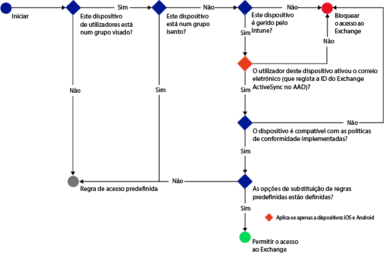
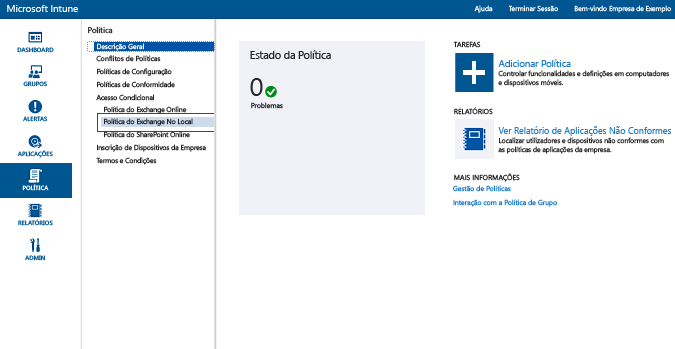
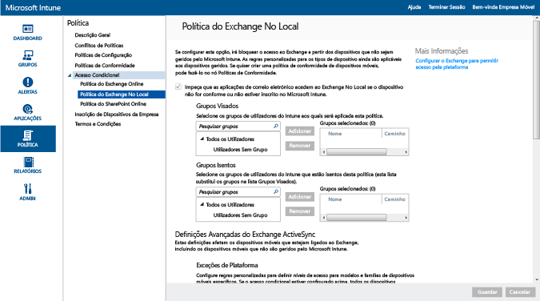

# Proteger o acesso ao e-mail no Exchange no local e no Exchange Online Dedicado legado com o Intune

[!INCLUDE[classic-portal](../includes/classic-portal.md)]

Com o Microsoft Intune, pode configurar o acesso condicional para controlar o acesso ao e-mail no Exchange no local ou no Exchange Online Dedicado legado.
Para saber mais sobre como funciona o acesso condicional, leia o artigo [Proteger o acesso ao e-mail e aos serviços do Office&365;](restrict-access-to-email-and-o365-services-with-microsoft-intune.md).

> [!NOTE]
> Se tiver um ambiente do Exchange Online Dedicado e precisar de saber se está na configuração nova ou legada, contacte o seu gestor de conta.

## Antes de começar

Certifique-se de que verifica o seguinte:

-   A sua versão do Exchange tem de ser o **Exchange 2010 ou posterior**. São suportadas matrizes do Servidor de Acesso de Cliente (CAS) do Exchange Server.

-   Tem de utilizar o [conector do Exchange no local do Intune](intune-on-premises-exchange-connector.md), que liga o [!INCLUDE[wit_nextref](../includes/wit_nextref_md.md)] ao Exchange no local. Este procedimento permite-lhe gerir dispositivos através da consola do [!INCLUDE[wit_nextref](../includes/wit_nextref_md.md)].

    -   O conector do Exchange no local disponível na consola do Intune é específico do seu inquilino do Intune e não pode ser utilizado com nenhum outro inquilino. Recomendamos que também assegure que o conector do Exchange para o seu inquilino está instalado **em apenas um computador**.

        Pode transferir o conector a partir da consola de administração do Intune. Para obter instruções sobre como configurar o conector do Exchange no local, consulte [Configurar o conector do Exchange no local no Exchange alojado ou no local](intune-on-premises-exchange-connector.md).

    -   Pode instalar o conector em qualquer computador, desde que o mesmo possa comunicar com o servidor do Exchange.

    -   O conector suporta o **ambiente do Exchange CAS**. Em teoria, pode instalar o conector no servidor do Exchange CAS diretamente, se quiser. No entanto, não o recomendamos porque aumenta a carga no servidor. Quando configurar o conector, tem de configurá-lo para comunicar com um dos servidores do Exchange CAS.

-   Tem de configurar o **Exchange ActiveSync** com a autenticação baseada em certificado ou com a entrada de credenciais de utilizador.

### Requisitos de conformidade do dispositivo

Quando configurar políticas de acesso condicional e direcioná-las para um utilizador, antes de um utilizador poder ligar ao respetivo e-mail, o **dispositivo** que utiliza tem de ser:

-  Um PC associado a um domínio ou **inscrito** no [!INCLUDE[wit_nextref](../includes/wit_nextref_md.md)].

-  **Registado no Azure Active Directory**. Além disso, o ID do Exchange ActiveSync do cliente tem de ser registado no Azure Active Directory.

  O serviço de Registos de Dispositivos do Azure Active Directory é ativado automaticamente para os clientes do Intune e do Office 365. Os clientes que já implementaram o serviço de Registos de Dispositivos do ADFS não verão dispositivos registados no Active Directory no local. **Isto não é aplicável a PC com Windows ou a dispositivos Windows Phone**.

-   **Conforme** com todas as políticas de conformidade do [!INCLUDE[wit_nextref](../includes/wit_nextref_md.md)] implementadas nesse dispositivo.

### Como o acesso condicional funciona com o Exchange no local

O seguinte diagrama ilustra o fluxo utilizado pelas políticas de acesso condicional no Exchange no local para avaliar se deve permitir ou bloquear dispositivos.

Se uma política de acesso condicional não for cumprida, existirá um período de 10 minutos entre o bloqueio do dispositivo e a receção por parte do utilizador de uma das seguintes mensagens de quarentena quando inicia sessão:

- Se o dispositivo não estiver inscrito no [!INCLUDE[wit_nextref](../includes/wit_nextref_md.md)], ou não estiver registado no Azure Active Directory, será apresentada uma mensagem com instruções sobre como instalar a aplicação Portal da Empresa, inscrever o dispositivo e ativar o e-mail. Este processo também associa o ID do Exchange ActiveSync do ao registo do dispositivo no Azure Active Directory.

-   Se o dispositivo não for conforme, é apresentada uma mensagem que direciona o utilizador para o site do Portal da Empresa do [!INCLUDE[wit_nextref](../includes/wit_nextref_md.md)] ou para a aplicação Portal da Empresa, onde é possível localizar informações sobre o problema e como resolvê-lo.

## Suporte para dispositivos móveis
As seguintes versões são suportadas:
-   Windows Phone 8.1 e posterior.

-   Aplicação de e-mail nativa no iOS.

-   Clientes de correio Exchange ActiveSync, como o Gmail para Android 4 ou posterior.
- Clientes de correio Exchange ActiveSync em **dispositivos Android for Work**: apenas as aplicações **Gmail** e **Nine Work** são suportadas no **perfil de trabalho** em dispositivos Android for Work. Para obter acesso condicional ao seu trabalho com o Android for Work, tem de implementar um perfil de e-mail para a aplicação Gmail ou Nine Work, bem como implementar essas aplicações como uma instalação obrigatória. 

[!INCLUDE[wit_nextref](../includes/afw_rollout_disclaimer.md)]

> [!NOTE]
> A aplicação Microsoft Outlook para Android e iOS não é suportada.

## Suporte de PCs
É suportado o seguinte:
-   A aplicação **Correio**no Windows 8.1 e posterior (quando o PC está inscrito no [!INCLUDE[wit_nextref](../includes/wit_nextref_md.md)]).

##  Configurar uma política de acesso condicional

1.  Na [consola de administração do Microsoft Intune](https://manage.microsoft.com), escolha **Policy** > **Conditional Access** > **Exchange on-premises policy**.

2.  Configure a política com as definições necessárias: 

  - **Impedir que as aplicações de e-mail acedam ao Exchange no local se o dispositivo não estiver em conformidade ou não estiver inscrito no Microsoft Intune**: quando seleciona esta opção, os dispositivos que não são geridos pelo [!INCLUDE[wit_nextref](../includes/wit_nextref_md.md)], ou que não estão em conformidade com uma política de conformidade, são impedidos de aceder aos serviços do Exchange.

  - **Substituição da regra predefinida - Permitir sempre aos dispositivos inscritos e em conformidade aceder ao Exchange**: quando seleciona esta opção, os dispositivos inscritos no Intune e em conformidade com as políticas de conformidade estão autorizados a aceder ao Exchange.
  Esta regra substitui a **Regra Predefinida**, o que significa que mesmo que defina a **Regra Predefinida** para colocar em quarentena ou bloquear o acesso, os dispositivos inscritos e em conformidade continuarão a poder aceder ao Exchange.

  - **Grupos Visados**: selecione os grupos de utilizadores do [!INCLUDE[wit_nextref](../includes/wit_nextref_md.md)] que têm de inscrever o respetivo dispositivo no [!INCLUDE[wit_nextref](../includes/wit_nextref_md.md)] antes de poderem aceder ao Exchange.

  - **Grupos Excluídos**: selecione os grupos de utilizadores do [!INCLUDE[wit_nextref](../includes/wit_nextref_md.md)] excluídos da política de acesso condicional. Os utilizadores nesta lista estão excluídos, mesmo que também estejam na lista **Grupos Visados**.

  - **Exceções de Plataforma**: selecione **Adicionar Regra** para configurar uma regra que defina os níveis de acesso para famílias e modelos de dispositivos móveis especificados. Como estes dispositivos podem ser de qualquer tipo, também pode configurar os tipos de dispositivos não suportados pelo [!INCLUDE[wit_nextref](../includes/wit_nextref_md.md)].

  - **Regra Predefinida**: em dispositivos que não são abrangidos por qualquer uma das outras regras, pode optar por permitir que acedam ao Exchange, que o bloqueiem ou o coloquem em quarentena. Quando define a regra para permitir o acesso, para os dispositivos inscritos e em conformidade, o acesso ao e-mail é concedido automaticamente para dispositivos iOS, Windows e Samsung KNOX. O utilizador não tem de passar por nenhum processo para obter acesso ao respetivo e-mail.

        Em dispositivos Android sem o Samsung KNOX, os utilizadores finais recebem um e-mail de quarentena que inclui instruções orientadas para verificar a inscrição e a conformidade antes de poderem aceder ao e-mail. Se definir a regra para bloquear o acesso ou colocar dispositivos em quarentena, todos os dispositivos ficam bloqueados de aceder ao Exchange, independentemente de já estarem inscritos ou não no Intune. Para impedir que os dispositivos inscritos e em conformidade sejam afetados por esta regra, selecione a caixa **Substituição da Regra Predefinida**.
>[!TIP]
>Se a sua intenção for bloquear primeiro todos os dispositivos antes de conceder acesso ao e-mail, selecione a regra Bloquear acesso ou Quarentena. A regra predefinida é aplicada a todos os tipos de dispositivos, pelo que os tipos de dispositivos configurados como exceções de plataforma não suportados pelo [!INCLUDE[wit_nextref](../includes/wit_nextref_md.md)] também são afetados.

  - **Notificação do Utilizador**: além do e-mail de notificação enviado pelo Exchange, o Intune envia um e-mail que contém passos para desbloquear o dispositivo. Pode editar a mensagem predefinida para personalizá-la de acordo com as suas necessidades. No caso de o dispositivo do utilizador ser bloqueado antes de receber o e-mail de notificação do Intune com as instruções de correção (este e-mail é enviado para a caixa de correio do Exchange do utilizador), o utilizador pode utilizar um dispositivo desbloqueado ou outro método para aceder ao Exchange e ver a mensagem.

        This is especially true when the **Default Rule** is set to block or quarantine. In this case, the user has to go to their app store, download the Microsoft Company Portal app, and enroll their device. This is applicable to iOS, Windows, and Samsung KNOX devices. For devices that don't run Samsung KNOX, you need to send the quarantine email to an alternate email account. The user has to copy the email to their blocked device to complete the enrollment and compliance process.
  > [!NOTE]
  > Para o Exchange poder enviar o e-mail de notificação, tem de especificar a conta utilizada para enviá-lo.
  >
  > Para obter detalhes, veja [Configurar o conector do Exchange no local no Exchange alojado ou no local](intune-on-premises-exchange-connector.md).

3.  Quando tiver terminado, escolha **Guardar**.

-   Não tem de implementar a política de acesso condicional, pois esta entra em vigor imediatamente.

-   Depois de um utilizador configurar um perfil do Exchange ActiveSync, o dispositivo pode demorar entre uma a três horas até ser bloqueado (se não for gerido pelo [!INCLUDE[wit_nextref](../includes/wit_nextref_md.md)]).

-   Se um utilizador bloqueado inscrever posteriormente o dispositivo no [!INCLUDE[wit_nextref](../includes/wit_nextref_md.md)] e corrigir a não conformidade, o acesso ao e-mail será desbloqueado em dois minutos.

-   Se o utilizador anular a inscrição no [!INCLUDE[wit_nextref](../includes/wit_nextref_md.md)], o dispositivo poderá demorar entre uma a três horas até ser bloqueado.

**Para ver alguns cenários de exemplo de como poderia configurar a política de acesso condicional para proteger o acesso ao dispositivo[, veja ](restrict-email-access-example-scenarios.md)Cenários de exemplo da proteção de acesso ao e-mail**.

## Passos seguintes
-   [Proteger o acesso ao SharePoint Online](restrict-access-to-sharepoint-online-with-microsoft-intune.md)

-   [Proteger o acesso ao Skype para Empresas Online](restrict-access-to-skype-for-business-online-with-microsoft-intune.md)

<!--HONumber=Feb17_HO2-->

