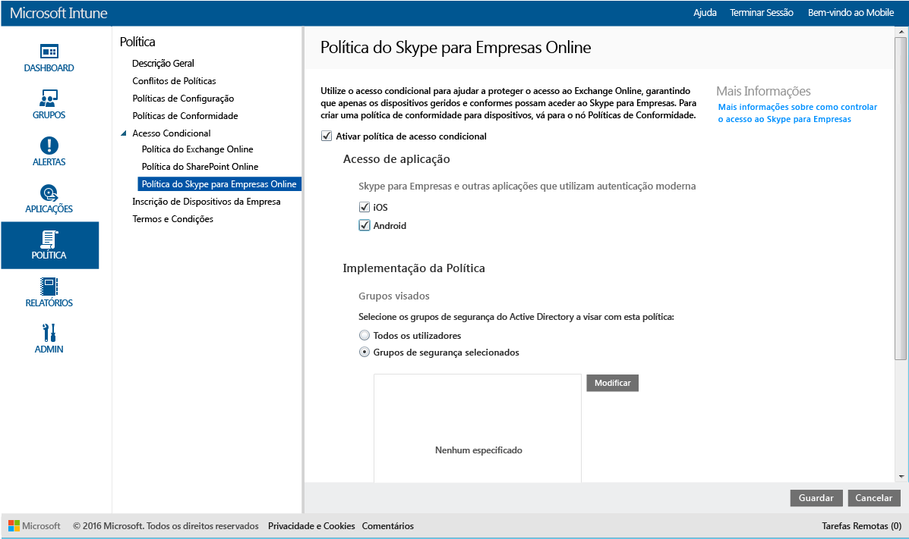

# Proteger o acesso ao Skype para Empresas Online com o Microsoft Intune

[!INCLUDE[classic-portal](../includes/classic-portal.md)]

Pode utilizar a política de acesso condicional para o **Skype para Empresas Online** para controlar o acesso ao Skype para Empresas Online.
O acesso condicional tem dois componentes:
- Uma política de conformidade de dispositivos que o dispositivo tem de cumprir para ser considerado compatível.
- Uma política de acesso condicional onde especifica as condições que o dispositivo tem de cumprir para poder aceder ao serviço.
Para saber mais sobre como funciona o acesso condicional, leia o artigo [Proteger o acesso ao e-mail e aos serviços do Office 365](restrict-access-to-email-and-o365-services-with-microsoft-intune.md).

Quando um utilizador visado tentar utilizar o Skype para Empresas Online no respetivo dispositivo, ocorre a seguinte avaliação:

**Antes de** configurar uma política de acesso condicional para o Skype para Empresas Online, tem de:
- Ter uma **subscrição do Skype para Empresas Online** e atribuir uma licença do Skype para Empresas Online aos utilizadores.
- Ter uma subscrição do **Enterprise Mobility + Security (EMS)** ou do **Azure Active Directory (Azure AD) Premium**  e os utilizadores têm de ter uma licença do EMS ou do Azure AD. Para obter mais detalhes, veja [Preços do Enterprise Mobility](https://www.microsoft.com/cloud-platform/enterprise-mobility-pricing) ou [Preços do Azure Active Directory](https://azure.microsoft.com/pricing/details/active-directory/).

-   [Ativar a autenticação moderna](https://docs.microsoft.com/intune/deploy-use/restrict-access-to-skype-for-business-online-with-microsoft-intune) para o Skype para Empresas Online.
-  Todos os seus utilizadores têm de utilizar o **Skype para Empresas Online**. Se tiver uma implementação com o Skype para Empresas Online e o Skype para Empresas no local, a política de acesso condicional não será aplicada aos utilizadores.

O dispositivo que necessita de acesso ao Skype para Empresas Online tem de:

-   Ser um dispositivo **Android** ou **iOS**.

-   Estar **inscrito** no Intune.

-   Estar **conforme** com todas políticas de conformidade do Intune implementadas.

O estado do dispositivo é armazenado no Azure Active Directory, o qual concede ou bloqueia o acesso, com base nas condições que especificar.

Se não for cumprida uma condição, é apresentada ao utilizador uma das duas mensagens seguintes quando iniciar sessão:

-   Se o dispositivo não estiver inscrito no Intune ou registado no Azure Active Directory, será apresentada uma mensagem com instruções sobre como instalar a aplicação Portal da Empresa e inscrevê-la.

-   Se o dispositivo não estiver conforme, será apresentada uma mensagem que direciona o utilizador para o site do Portal da Empresa do Intune ou para a aplicação Portal da Empresa, onde poderá localizar as informações sobre o problema e como resolvê-lo.

## Configurar o acesso condicional para o Skype para Empresas Online

### Passo 1: configurar grupos de segurança do Azure Active Directory
Antes de começar, configure grupos de segurança do Azure Active Directory para a política de acesso condicional. Pode configurar estes grupos no **centro de administração do Office 365**. Estes grupos servirão para visar ou excluir os utilizadores da política. Quando um utilizador é visado por uma política, cada dispositivo que utiliza tem de estar em conformidade para poder aceder aos recursos.

Pode especificar dois tipos de grupo a utilizar para a política do Skype para Empresas:

-   **Grupos visados**: contém os grupos de utilizadores aos quais se aplica a política.

-   **Grupos excluídos**: contém os grupos de utilizadores excluídos da política.

Se um utilizador estiver em ambos os grupos, estará excluído da política.

### Passo 2: configurar e implementar uma política de conformidade
[Crie](create-a-device-compliance-policy-in-microsoft-intune.md) e [implemente](deploy-and-monitor-a-device-compliance-policy-in-microsoft-intune.md) uma política de conformidade em todos os dispositivos que serão afetados pela política. Estes seriam todos os dispositivos utilizados pelos utilizadores nos **Grupos visados**.

> [!NOTE]
> Enquanto as políticas de conformidade são implementadas nos grupos do Intune, as políticas de acesso condicional são direcionadas para os grupos de segurança do Azure Active Directory.

> [!IMPORTANT]
> Se não tiver implementado uma política de conformidade, os dispositivos serão tratados como conformes.

Quando estiver pronto, avance para o **Passo 3**.

### Passo 3: Configurar a política do Skype para Empresas Online
Em seguida, configure a política para exigir que apenas os dispositivos geridos e conformes podem aceder ao Skype para Empresas Online. Esta política será armazenada no Azure Active Directory.

1.  Na [consola de administração do Microsoft Intune](https://manage.microsoft.com), escolha **Política** > **Acesso Condicional** > **Política do Skype para Empresas Online**.

  

2.  Escolha **Ativar política de acesso condicional**.

3.  Em **Acesso da aplicação**, pode optar por aplicar a política de acesso condicional a:

    -   **iOS**

    -   **Android**

4.  Em **Grupos Visados**, escolha **Modificar** para selecionar os grupos de segurança do Azure Active Directory aos quais será aplicada a política. Pode optar por direcionar esta opção a todos os utilizadores ou apenas a um grupo de utilizadores específico.

5.  Como opção, em **Grupos Excluídos**, selecione **Modificar** para selecionar os grupos de segurança do Azure Active Directory que estão excluídos desta política.

6.  Quando tiver terminado, escolha **Guardar**.

Configurou o acesso condicional para o Skype para Empresas Online. Não tem de implementar a política de acesso condicional, pois esta entra em vigor imediatamente.

## Monitorizar a conformidade e as políticas de acesso condicional
Na área de trabalho **Grupos**, pode ver o estado do acesso condicional dos seus dispositivos.

Selecione qualquer grupo de dispositivos móveis. Em seguida, no separador **Dispositivos**, escolha um dos seguintes **Filtros**:

* **Dispositivos não registados no AAD**: estes dispositivos estão bloqueados no Skype para Empresas Online.

* **Dispositivos não conformes**: estes dispositivos estão bloqueados no Skype para Empresas Online.

* **Dispositivos registados no AAD e conformes**: estes dispositivos podem aceder ao Skype para Empresas Online.

