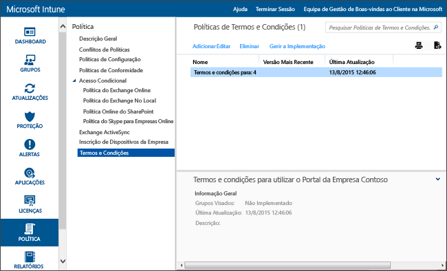

# Definições de política de termos e condições no Microsoft Intune

[!INCLUDE[classic-portal](../includes/classic-portal.md)]

Pode implementar termos e condições do Intune para grupos de utilizadores para explicar como a inscrição, o acesso a recursos de trabalho e a aplicação Portal da Empresa afetam os dispositivos e os utilizadores. Os utilizadores têm de aceitar os termos e condições antes de poderem utilizar o Portal da Empresa para inscrever e aceder ao seu trabalho.

Pode criar e implementar diversas políticas que contêm diferentes termos e condições. Pode também produzir versões dos mesmos termos e condições em idiomas diferentes e, em seguida, implementá-los nos grupos adequados.

## Criar uma política de termos e condições

1.  Na [consola de administração do Microsoft Intune](https://manage.microsoft.com) clique em **Política** &gt; **Termos e Condições**.

    

2.  Clique em **Adicionar** para criar uma nova política de termos e condições.

    Também pode **Editar** ou **Eliminar** uma política existente.

3.  Na página **Criar Termos e Condições**, especifique as seguintes informações:

    -   **Nome**&mdash;um nome exclusivo da política apresentado na consola do Intune.

    -   **Descrição**&mdash;detalhes que o ajudam a identificar a política na consola do Intune.

    -   **Título**&mdash;o título que os utilizadores veem no portal da empresa.

    -   **Texto a explicar o que significa se o utilizador aceita**&mdash;etiqueta que os utilizadores veem sobre a aceitação. Por exemplo, "Concordo com os termos e condições".

4.  Quando terminar, clique em **Guardar**. A nova política é apresentada no nó **Termos e Condições** da área de trabalho **Política**.

## Implementar uma política de termos e condições

1.  Na [consola de administração do Microsoft Intune](https://manage.microsoft.com), clique em **Política** &gt; **Termos e Condições**.

2.  Na lista **Políticas dos Termos e Condições**, selecione a política que pretende implementar e, em seguida, clique em **Gerir Implementação**.

3.  Na caixa de diálogo **Gerir a Implementação**, selecione os grupos de utilizadores nos quais irá implementar a política e clique em **OK**.

    Quando os utilizadores abrangidos acedem ao portal da empresa, o Intune apresenta os termos e condições implementadas. Os utilizadores têm de aceitar estes termos antes de terem acesso aos recursos da empresa.

## Monitorizar uma política de termos e condições

1.  Na [consola de administração do Microsoft Intune](https://manage.microsoft.com), clique em **Política** &gt; **Termos e Condições**.

2.  Na janela **Criar Novo Relatório**, clique em **Ver Relatório**. O relatório irá abrir com detalhes sobre quais os utilizadores aceitaram os termos e condições implementados.

### Atualizações e controlo de versão para termos e condições
Ao editar uma política de termos e condições existentes, pode escolher que comportamento ocorre ao implementar a política. Utilize o procedimento seguinte para ajudar a atualizar os termos existentes e as políticas de condições.

## Trabalhar com múltiplas versões de termos e condições

1.  Na [consola de administração do Microsoft Intune](https://manage.microsoft.com), clique em **Política** &gt; **Termos e Condições**.

2.  Selecione a política de termos e condições que pretende editar e, em seguida, clique em **Editar**.

3.  Na página **Editar Termos e Condições**, efetue as edições necessárias e, em seguida, especifique se esta nova versão necessita que todos os utilizadores aceitem os termos e condições ou se apenas os novos utilizadores irão ver a nova versão.

    Recomendamos que aumente o número da versão e solicite a aceitação sempre que efetua alterações significativas na sua política de termos e condições. Mantenha o número da versão atual se, por exemplo, estiver a corrigir erros de digitação ou a alterar a formatação.

### Consulte também
[Gerir definições e funcionalidades nos seus dispositivos com as políticas do Microsoft Intune](manage-settings-and-features-on-your-devices-with-microsoft-intune-policies.md)

