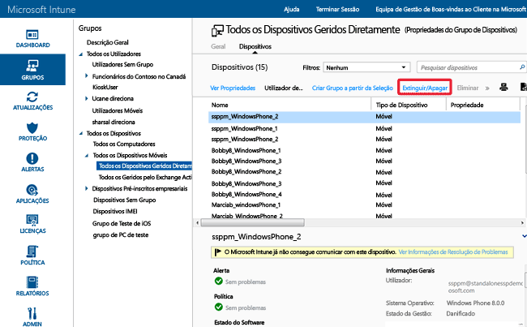

# Ajudar a proteger os dados com a eliminação completa ou seletiva através do Microsoft Intune

[!INCLUDE[classic-portal](../includes/classic-portal.md)]

Pode eliminar aplicações e dados a partir dos dispositivos geridos pelo Intune que já não são precisos, que estão a ser reobjetivados ou que desapareceram. Para tal, o Intune fornece as funcionalidades de eliminação completa e eliminação seletiva. Os utilizadores também podem emitir um comando de eliminação remota de dados no dispositivo a partir da aplicação Portal da Empresa do Intune em dispositivos de propriedade privada inscritos no Intune.

  > [!NOTE]
  > Este tópico aborda apenas a eliminação de dispositivos geridos pela gestão de dispositivos móveis do Intune. Também pode utilizar o [portal do Azure](https://portal.azure.com) para [apagar dados da empresa das aplicações](wipe-managed-company-app-data-with-microsoft-intune.md). Também pode [extinguir computadores geridos com o software de cliente Intune](retire-a-windows-pc-with-microsoft-intune.md).

## Eliminação completa

A **Eliminação completa** restaura as predefinições do dispositivo, removendo todos os dados e definições da empresa e do utilizador. O dispositivo é removido do Intune. A eliminação completa é útil para repor um dispositivo antes de o atribuir a um novo utilizador ou em caso de perda ou roubo do dispositivo.  **Seja cuidadoso com a seleção da eliminação completa. Não é possível recuperar os dados no dispositivo**.

> [!Warning]
> A eliminação pode fazer com que os dispositivos Windows 10 RTM (dispositivos anteriores ao Windows 10 versão 1511) com menos de 4 GB de RAM fiquem inacessíveis. Para aceder a um dispositivo Windows 10 que deixou de responder, pode arrancá-lo a partir de uma unidade USB.

### Apagar remotamente um dispositivo a partir da consola do administrador do Intune

1.  Selecione dispositivos a serem apagados. Pode encontrá-los através do utilizador ou do dispositivo.

    -   **Por utilizador:**

        1.  Na [consola de administrador do Intune](https://manage.microsoft.com/), escolha **Grupos** &gt; **Todos os Utilizadores**.

        2.  Escolha o nome do utilizador cujo dispositivo móvel pretende apagar. Escolha **Ver Propriedades**.

        3.  Na página **Propriedades** do utilizador, escolha **Dispositivos** e, em seguida, escolha o nome do dispositivo móvel que pretende apagar. Para selecionar múltiplos dispositivos, utilize Ctrl+clique.

    -   **Por dispositivo:**

        1.  Na [consola de administrador do Intune](https://manage.microsoft.com/), escolha **Grupos** &gt; **Todos os Dispositivos Móveis**.

         

        2.  Escolha **Dispositivos** e, em seguida, escolha o nome do dispositivo móvel que pretende apagar. Para selecionar múltiplos dispositivos, utilize Ctrl+clique.

2.  Escolha **Extinguir/Apagar**.

3.  É apresentada uma mensagem de confirmação que lhe pergunta se pretende extinguir o dispositivo.

    -   Para executar uma **Eliminação seletiva** que remova apenas as aplicações e dados da empresa, selecione **Sim**.

    -   Para efetuar uma **Eliminação completa** que apague todas as aplicações e dados e devolva o dispositivo às predefinições de fábrica, selecione **Apagar o dispositivo antes de o extinguir**. Esta ação aplica-se a todas as plataformas exceto ao Windows 8.1. **Não é possível recuperar os dados removidos por uma eliminação completa**.

Se o dispositivo estiver ativo e ligado, demora menos de 15 minutos até um comando de eliminação ser propagado em todos os tipos de dispositivo.

#### Para eliminar dispositivos no portal do Azure Active Directory

1.  Navegue para [http://aka.ms/accessaad](http://aka.ms/accessaad) ou escolha **Administração** &gt; **Azure AD** a partir de [https://portal.office.com](https://portal.office.com).

2.  Inicie sessão com o seu ID de Organização através da ligação no lado esquerdo da página.

3.  Se não tiver uma, crie uma Subscrição do Azure. Se tiver uma conta paga (escolha a ligação de subscrição **Registar o Azure Active Directory gratuito**), não deverá ser preciso um cartão de crédito ou um pagamento para esta subscrição.

4.  Selecione **Active Directory** e, em seguida, selecione a sua organização.

5.  Selecione o separador **Utilizadores** .

6.  Selecione o utilizador cujos dispositivos pretende eliminar.

7.  Escolha **Dispositivos**.

8.  Remova os dispositivos conforme adequado, como aqueles que já não estão em utilização ou que têm definições incorretas.

## Eliminação seletiva

A **eliminação seletiva** remove os dados da empresa, incluindo os dados de gestão de aplicações móveis (MAM) (onde for aplicável), definições e perfis de e-mail de um dispositivo. A eliminação seletiva mantém os dados pessoais do utilizador no dispositivo. O dispositivo é removido do Intune. As seguintes tabelas descrevem os dados que são removidos e o efeito nos dados que permanecem no dispositivo após uma eliminação seletiva. (As tabelas estão organizadas por plataforma.)

**iOS**

|Tipo de dados|iOS|
|-------------|-------|
|Aplicações da empresa e dados associados instalados pelo Intune|As aplicações são desinstaladas. Os dados da aplicação da empresa são removidos.  Os dados de aplicações da Microsoft que utilizam a gestão de aplicações móveis são removidos. A aplicação não é removida.|
|Definições|As configurações que foram definidas pela política do Intune já não são aplicadas e os utilizadores podem alterar as definições.|
|Definições de perfis de Wi-Fi e da VPN|Removidos.|
|Definições de perfil de certificado|Os certificados são removidos e revogados.|
|Agente de Gestão|O perfil de gestão é removido.|
|E-mail|Os perfis de e-mail aprovisionados através do Intune são removidos e o e-mail em cache no dispositivo é eliminado. Se o Microsoft Exchange estiver alojado no local, os perfis de e-mail e o e-mail em cache não serão removidos.|
|Outlook|Os e-mails recebidos pela aplicação Microsoft Outlook para iOS são removidos. Exceção: se o Exchange estiver alojado no local, o e-mail não será removido.|
|Anulação da associação ao Azure Active Directory (AAD)|O Registo do AAD é removido.|
|Contactos | Os contactos sincronizados diretamente da aplicação para o livro de endereços nativo são removidos.  Não é possível limpar contactos sincronizados do livro de endereços nativo para outra origem externa.    Atualmente, apenas o Outlook é suportado.

**Android**

|Tipo de dados|Android|Android Samsung KNOX Standard|
|-------------|-----------|------------------------|
|Ligações Web|Removidos.|Removidos.|
|Aplicações não geridas do Google Play|As aplicações e os dados permanecem instalados.|As aplicações e os dados permanecem instalados.|
|Aplicações de linha de negócio não geridas|As aplicações e os dados permanecem instalados.|As aplicações são desinstaladas e, como resultado, os dados locais da aplicação são removidos. Não são removidos dados fora da aplicação (por exemplo, num cartão SD).|
|Aplicações geridas do Google Play|Os dados da aplicação são removidos. A aplicação não é removida. Os dados protegidos pela encriptação MAM fora da aplicação (por exemplo, cartão SD) permanecem encriptados e inutilizáveis, mas não são removidos.|Os dados da aplicação são removidos. A aplicação não é removida. Os dados protegidos pela encriptação MAM fora da aplicação (por exemplo, cartão SD) permanecem encriptados, mas não são removidos.|
|Aplicações de linha empresarial geridas|Os dados da aplicação são removidos. A aplicação não é removida. Os dados protegidos pela encriptação MAM fora da aplicação (por exemplo, cartão SD) permanecem encriptados e inutilizáveis, mas não são removidos.|Os dados da aplicação são removidos. A aplicação não é removida. Os dados protegidos pela encriptação MAM fora da aplicação (por exemplo, cartão SD) permanecem encriptados e inutilizáveis, mas não são removidos.|
|Definições|As configurações que foram definidas pela política do Intune já não são aplicadas e os utilizadores podem alterar as definições.|As configurações que foram definidas pela política do Intune já não são aplicadas e os utilizadores podem alterar as definições.|
|Definições de perfis de Wi-Fi e da VPN|Removidos.|Removidos.|
|Definições de perfil de certificado|Certificados revogados mas não removidos.|Certificados removidos e revogados.|
|Agente de Gestão|O privilégio de Administrador de Dispositivos é revogado.|O privilégio de Administrador de Dispositivos é revogado.|
|E-mail|N/D. Veja o item do Outlook.|Os perfis de e-mail aprovisionados através do Intune são removidos e o e-mail em cache no dispositivo é eliminado.|
|Outlook|Os e-mails recebidos pela aplicação Microsoft Outlook para Android são removidos, mas apenas se o Outlook estiver protegido por políticas de MAM. Caso contrário, o Outlook não é eliminado durante a anulação da inscrição. Exceção: se o Exchange estiver alojado no local, o e-mail não será removido.|Os e-mails recebidos pela aplicação Microsoft Outlook para Android são removidos, mas apenas se o Outlook estiver protegido por políticas de MAM. Caso contrário, o Outlook não é eliminado durante a anulação da inscrição. Exceção: se o Exchange estiver alojado no local, o e-mail não será removido.|
|Anulação da associação ao Azure Active Directory (AAD)|Registo do AAD removido.|Registo do AAD removido.|
|Contactos | Os contactos sincronizados diretamente da aplicação para o livro de endereços nativo são removidos.  Não é possível limpar contactos sincronizados do livro de endereços nativo para outra origem externa.    Atualmente, apenas o Outlook é suportado.|Os contactos sincronizados diretamente da aplicação para o livro de endereços nativo são removidos.  Não é possível limpar contactos sincronizados do livro de endereços nativo para outra origem externa.    Atualmente, apenas o Outlook é suportado.

**Android for Work**

Ao efetuar uma eliminação seletiva num dispositivo Android for Work, remove todos os dados, aplicações e definições no perfil de trabalho nesse dispositivo. Esta ação extingue o dispositivo da gestão com o Intune. A eliminação completa não é suportada no Android for Work.

**Windows**

|Tipo de dados|Windows 8.1 (MDM) e Windows RT 8.1|Windows RT|Windows Phone 8 e Windows Phone 8.1|Windows 10|
|-------------|----------------------------------------------------------------|--------------|-----------------------------------------|--------|
|Aplicações da empresa e dados associados instalados pelo Intune|Os ficheiros protegidos pelo EFS terão as respetivas chaves revogadas e o utilizador não poderá abrir os ficheiros.|Não remove aplicações da empresa.|As aplicações instaladas originalmente através do portal da empresa são desinstaladas. Os dados da aplicação da empresa são removidos.|As aplicações são desinstaladas e as chaves de sideload são removidas.|
|Definições|As configurações que foram definidas pela política do Intune já não são aplicadas e os utilizadores podem alterar as definições.|As configurações que foram definidas pela política do Intune já não são aplicadas e os utilizadores podem alterar as definições.|As configurações que foram definidas pela política do Intune já não são aplicadas e os utilizadores podem alterar as definições.|As configurações que foram definidas pela política do Intune já não são aplicadas e os utilizadores podem alterar as definições.|
|Definições de perfis de Wi-Fi e da VPN|Removidos.|Removidos.|Não suportada.|Removidos.|
|Definições de perfil de certificado|Certificados removidos e revogados.|Certificados removidos e revogados.|Não suportada.|Certificados removidos e revogados.|
|E-mail|Remove o e-mail que tenha o EFS ativado, que inclui a aplicação Correio para e-mail e anexos do Windows.|Não suportada.|Os perfis de e-mail aprovisionados através do Intune são removidos e o e-mail em cache no dispositivo é eliminado.|Remove o e-mail que tenha o EFS ativado, que inclui a aplicação Correio para e-mail e anexos do Windows. Remove as contas de e-mail que tenham sido aprovisionadas pelo Intune. **Exceção**: se o Microsoft Exchange estiver alojado no local, as contas de e-mail não serão removidas.|
|Anulação da associação ao Azure Active Directory (AAD)|Não.|Não.|Registo do AAD removido.|Não aplicável. O Windows 10 não suporta a eliminação seletiva para dispositivos associados ao Azure Active Directory.|

## Apagar conteúdo com o Sistema de Encriptação de Ficheiros (EFS) ativado
A eliminação seletiva de conteúdo encriptado com o EFS é suportada pelo Windows 8.1 e Windows RT 8.1. As seguintes informações aplicam-se a uma eliminação seletiva de conteúdos com o EFS ativado:

-   Apenas as aplicações e os dados protegidos pelo EFS através do mesmo domínio de Internet que a conta do Intune são apagados seletivamente. Para mais informações, consulte o artigo [Eliminação Seletiva do Windows para a Gestão de Dados de Dispositivos](http://technet.microsoft.com/library/dn486874.aspx).

-   Se forem efetuadas alterações ao domínio associado ao EFS, as alterações podem demorar até 48 horas antes de as aplicações e os dados que utilizam o novo domínio poderem ser apagados seletivamente.

-   Cada domínio registado no Intune será apagado.

As aplicações e os dados atualmente suportados pela eliminação seletiva com o EFS são:

-   Aplicação Correio para Windows

-   Pastas de trabalho

-   Ficheiros e pastas encriptados pelo EFS. Para mais informações, consulte o artigo [Melhores práticas para o Sistema de Encriptação de Ficheiros](http://support.microsoft.com/kb/223316).

-   Se a sua organização manter a respetiva identidade no Active Directory, tem de utilizar a ferramenta Sincronização de Diretórios (DirSync) para sincronizar informações com o AAD para que a eliminação seletiva com o EFS funcione corretamente.  Para mais informações sobre o DirSync, consulte o tópico [Cenário de Sincronização de Diretórios](http://technet.microsoft.com/library/dn441212.aspx) na documentação do Azure Active Directory.

## Monitorizar as ações de extinção e eliminação
Para obter um relatório dos dispositivos que foram extintos, apagados ou eliminados:

1.  Na [consola de administrador do Intune](https://manage.microsoft.com/), escolha **Relatórios** &gt; **Relatórios de Histórico de Dispositivos**.

2.  Forneça uma data de início e de fim para o relatório e, em seguida, selecione **Ver Relatório**.

Este relatório também mostra quem efetuou a ação.

### Consulte também
[Extinguir dispositivos](retire-devices-from-microsoft-intune-management.md)

[Eliminação Seletiva do Windows para Gestão de Dados do Dispositivo](http://technet.microsoft.com/library/dn486874.aspx)

<!--HONumber=Feb17_HO2-->

