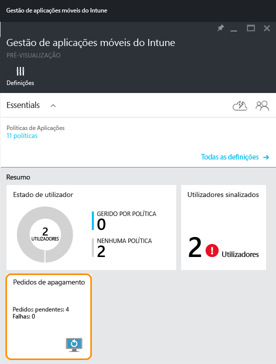
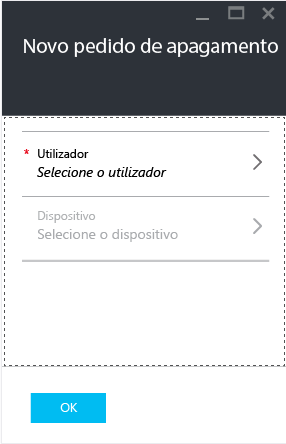
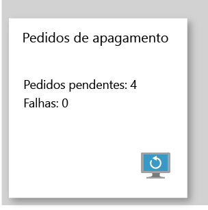

# Eliminar dados de aplicações geridas pela empresa com o Microsoft Intune

[!INCLUDE[classic-portal](../includes/classic-portal.md)]

Quando um dispositivo se perde ou é roubado ou se o funcionário sair da sua empresa, quer ter a certeza de que os dados empresariais da aplicação são removidos do dispositivo. No entanto, poderá não querer remover os dados pessoais do dispositivo, especialmente se o dispositivo pertencer ao funcionário.

Para remover seletivamente os dados de aplicações da empresa, utilize os passos neste tópico para criar um pedido de eliminação de dados. Depois de concluir o pedido, da próxima vez que a aplicação for executada no dispositivo, os dados da empresa são removidos da aplicação.
>[!NOTE]
> Os contactos sincronizados diretamente da aplicação para o livro de endereços nativo são removidos. Não é possível limpar contactos sincronizados do livro de endereços nativo para outra origem externa. Atualmente, só é aplicável à aplicação Microsoft Outlook.

## Criar um pedido de eliminação

1.  No painel **Gestão de aplicações móveis do Intune**, selecione o mosaico **Pedidos de eliminação**.

    

2.  Selecione **Novos pedidos de eliminação**. Esta ação abre o painel **Novo pedido de eliminação**.

    

3.  Selecione **Utilizador** para abrir o painel **Utilizador** e selecione o utilizador cujos dados da aplicação quer apagar.

4.  Escolha **Dispositivo**.  É aberto o painel **Dispositivo** que lista todos os dispositivos associados ao utilizador selecionado.  Selecione o dispositivo que pretende eliminar.

5.  Está agora novamente no painel **Novo pedido de eliminação**. Escolha **Ok** para fazer um pedido de eliminação. O serviço cria e controla um pedido de eliminação separado para cada aplicação protegida no dispositivo.

## Monitorizar os pedidos de eliminação
O painel **Gestão de aplicações móveis do Intune** tem um relatório resumido no mosaico **Pedido de eliminação**.  Apresenta o estado geral e inclui o número de pedidos pendentes e falhas. Pode seguir os seguintes passos para obter mais detalhes:

1.  No painel **Gestão de aplicações móveis do Intune**, selecione o mosaico **Pedido de eliminação** para abrir o painel **Pedido de eliminação**.

2.  No painel **Pedido de eliminação**, pode ver a lista dos pedidos agrupados por utilizadores. Uma vez que o sistema cria um pedido de eliminação para cada aplicação protegida em execução no dispositivo, poderá ver múltiplos pedidos para um utilizador. O estado indica se um pedido de eliminação está **pendente**, **falhou** ou se teve **êxito**.

O utilizador tem de abrir a aplicação para que a eliminação ocorra. Após efetuar o pedido, a eliminação pode durar até 30 minutos.

As eliminações em estado pendente são apresentadas até que as elimine manualmente.  Para eliminar manualmente um pedido de eliminação, clique com o botão direito do rato e selecione eliminar.

### Consulte também
[Proteger dados de aplicações através de políticas de gestão de aplicações móveis](protect-app-data-using-mobile-app-management-policies-with-microsoft-intune.md)

[Utilizar o portal do Azure](azure-portal-for-microsoft-intune-mam-policies.md)

<!--HONumber=Dec16_HO2-->

