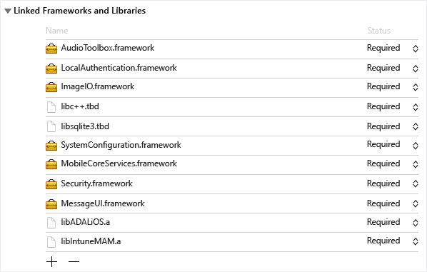
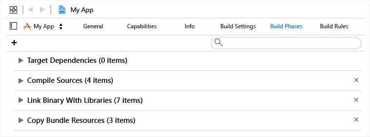
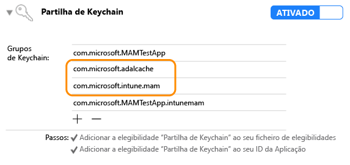

# <a name="microsoft-intune-app-sdk-for-ios-developer-guide"></a>Guia para programadores do SDK da Aplicação do Microsoft Intune para iOS

> [!NOTE]
> Recomendamos que leia primeiro o artigo [Guia de Introdução ao SDK da Aplicação do Intune](intune-app-sdk-get-started.md), que explica como preparar a integração em cada plataforma suportada.

O SDK da Aplicação do Microsoft Intune para iOS permite-lhe incorporar as políticas de proteção de aplicações do Intune (também conhecidas como políticas de **APLICAÇÕES** ou **MAM**) na sua aplicação iOS nativa. Uma aplicação preparada para MAM é uma aplicação que está integrada com o SDK da Aplicação do Intune. Os administradores de TI podem implementar políticas de proteção de aplicações na aplicação móvel quando o Intune está a gerir a aplicação de forma ativa.

## <a name="prerequisites"></a>Pré-requisitos

* Irá precisar de um computador Mac OS que execute o OS X 10.8.5 ou posterior e tenha o Xcode 8 ou posterior instalado.

* A aplicação tem de ser destinada ao iOS 9 ou superior.

* Consulte os [Termos de Licenciamento do SDK da Aplicação do Intune para iOS](https://github.com/msintuneappsdk/ms-intune-app-sdk-ios/blob/master/Microsoft%20License%20Terms%20Intune%20App%20SDK%20for%20iOS%20.pdf). Imprimir e guardar uma cópia dos termos de licenciamento nos seus registos. Ao transferir e utilizar o SDK da Aplicação do Intune para iOS, aceita esses termos de licenciamento.  Caso não aceite os termos, não deverá utilizar o software.

* Transfira os ficheiros para o SDK da Aplicação do Intune para iOS no [GitHub](https://github.com/msintuneappsdk/ms-intune-app-sdk-ios).

## <a name="whats-in-the-sdk"></a>O que está no SDK

O SDK da Aplicação do Intune para iOS inclui uma biblioteca estática, ficheiros de recursos, cabeçalhos de API, um ficheiro .plist de definições de depuração e uma ferramenta de configurador. As aplicações móveis podem simplesmente incluir os ficheiros de recursos e ligar estaticamente às bibliotecas para a maioria das imposições de políticas. As funcionalidades avançadas de MAM do Intune são impostas através de APIs.

Este guia abrange a utilização dos seguintes componentes do SDK da Aplicação do Intune para iOS:

* **libIntuneMAM.a**: biblioteca estática do SDK da Aplicação do Intune. Se a aplicação não utilizar extensões, ligue esta biblioteca ao seu projeto de forma a ativar a aplicação para a gestão de aplicações móveis do Intune.

* **IntuneMAM.framework**: estrutura do SDK da Aplicação do Intune. Ligue esta estrutura ao seu projeto de forma a ativar a aplicação para a gestão de aplicações móveis do Intune. Utilize a estrutura em vez da biblioteca estática, se a sua aplicação utilizar extensões, para que o projeto não crie múltiplas cópias da biblioteca estática.

* **IntuneMAMResources.bundle**: um pacote de recursos que possui os recursos dos quais o SDK depende.

* **Cabeçalhos**: expõe as APIs do SDK da Aplicação do Intune. Se utilizar uma API, terá de incluir o ficheiro de cabeçalho que contém a API. Os seguintes ficheiros de cabeçalho incluem as chamadas de função da API necessárias para ativar a funcionalidade do SDK da Aplicação do Intune:

    * IntuneMAMAsyncResult.h
    * IntuneMAMDataProtectionInfo.h
    * IntuneMAMDataProtectionManager.h
    * IntuneMAMFileProtectionInfo.h
    * IntuneMAMFileProtectionManager.h
    * IntuneMAMPolicyDelegate.h
    * IntuneMAMLogger.h


## <a name="how-the-intune-app-sdk-works"></a>Como funciona o SDK da Aplicação do Intune

O objetivo do SDK da Aplicação do Intune para iOS consiste em adicionar capacidades de gestão para aplicações iOS com alterações de código mínimas. Quanto menos alterações de código houver, menos tempo há para comercializar, sem afetar a consistência e a estabilidade da sua aplicação móvel.


## <a name="build-the-sdk-into-your-mobile-app"></a>Criar o SDK na sua aplicação móvel

Para ativar o SDK da Aplicação do Intune, siga estes passos:

1. **Opção 1 (recomendada)**: ligue o `IntuneMAM.framework` ao seu projeto. Arraste `IntuneMAM.framework` para a lista **Binários Incorporados** do destino do projeto.

    > [!NOTE]
    > Se utilizar a estrutura, terá de retirar manualmente as arquiteturas do simulador da estrutura universal antes de submeter a sua aplicação à App Store. Veja [Enviar a aplicação à App Store](#Submit-your-app-to-the-App-Store) para obter mais detalhes.

2. **Opção 2**: ligue à biblioteca `libIntuneMAM.a`. Arraste a biblioteca `libIntuneMAM.a` para a lista **Estruturas e Bibliotecas Ligadas** do destino do projeto.

    

    > [!NOTE]
    > Se planeia lançar a sua aplicação na App Store, utilize a versão do `libIntuneMAM.a` criada para lançamento e não a versão de depuração. A versão de lançamento estará na pasta **release**. A versão de depuração tem uma saída verbosa ideal que ajuda a resolver problemas com o SDK da Aplicação do Intune.

    Adicione `-force_load {PATH_TO_LIB}/libIntuneMAM.a` a qualquer um dos seguintes, substituindo `{PATH_TO_LIB}` pela localização do SDK da Aplicação do Intune:
      * A definição de configuração da compilação `OTHER_LDFLAGS` do projeto
      * **Outros Sinalizadores do Linker** da IU

        > [!NOTE]
        > Para localizar `PATH_TO_LIB`, selecione o ficheiro `libIntuneMAM.a` e escolha **Informações** a partir do menu **Ficheiro**. Copie e cole as informações **Onde** (o caminho) na secção **Geral** da janela **Informações**.

3. Adicione estas estruturas de iOS ao projeto:
    * MessageUI.framework
    * Security.framework
    * MobileCoreServices.framework
    * SystemConfiguration.framework
    * libsqlite3.tbd
    * libc++.tbd
    * ImageIO.framework
    * LocalAuthentication.framework
    * AudioToolbox.framework


4. Adicione o pacote de recursos `IntuneMAMResources.bundle` ao projeto arrastando o pacote de recursos em **Copiar Recursos do Pacote** em **Fases de Criação**.

    

5. Se a sua aplicação móvel definir um ficheiro nib ou de guião gráfico principal no respetivo ficheiro Info.plist, remova os campos **Guião Gráfico Principal** ou **Nib Principal**. No Info.plist, cole esses campos e os valores correspondentes num novo dicionário com o nome **IntuneMAMSettings** com os seguintes nomes de chaves, conforme aplicável:
    * MainStoryboardFile
    * MainStoryboardFile~ipad
    * MainNibFile
    * MainNibFile~ipad
    > [!NOTE]
  > Se a sua aplicação móvel não definir um ficheiro nib ou guião gráfico principal no respetivo ficheiro Info.plist, estas definições não são obrigatórias.

    Pode ver o ficheiro Info.plist em formato não processado (para ver os nomes de chaves) clicando com o botão direito do rato em qualquer parte do corpo do documento e alterando o tipo de vista para **Mostrar Chaves/Valores Não Processados**.

6. Ative a partilha de keychain (se não estiver já ativada) ao selecionar **Capacidades** no destino de cada projeto e ao ativar o comutador **Partilha de Keychain**. A partilha de keychain é necessária para avançar para o passo seguinte.

  > [!NOTE]
    > O perfil de aprovisionamento tem de suportar os novos valores de partilha de keychain. Os grupos de acesso de keychain devem suportar um caráter universal. Pode verificar isto ao abrir o ficheiro .mobileprovision num editor de texto, procurando **keychain-access-groups** e assegurando que tem um caráter universal. Por exemplo:
    ```xml
    <key>keychain-access-groups</key>
    <array>
    <string>YOURBUNDLESEEDID.*</string>
    </array>
    ```

7. Depois de ativar a partilha de keychain, siga estes passos para criar um grupo de acesso separado no qual serão armazenados os dados do SDK da Aplicação do Intune. Pode criar um grupo de acesso de keychain com a IU ou o ficheiro de elegibilidade. Se estiver a utilizar a IU para criar o grupo de acesso de keychain, siga os passos abaixo:

    1. Se a sua aplicação móvel não tiver nenhum grupo de acesso de keychain definido, adicione o ID do pacote da aplicação como primeiro grupo.

    2. Adicione o grupo de keychain partilhado `com.microsoft.intune.mam` aos seus grupos de acesso existentes. O SDK da Aplicação do Intune utiliza este grupo de acesso para armazenar dados.

    3. Adicione `com.microsoft.adalcache` aos grupos de acesso existentes.

        4. Adicione `com.microsoft.workplacejoin` aos grupos de acesso existentes.
            

      5. Se estiver a utilizar o ficheiro de elegibilidade para criar o grupo de acesso de keychain, preceda o grupo de acesso de keychain de `$(AppIdentifierPrefix)` no ficheiro de elegibilidade. Por exemplo:

            * `$(AppIdentifierPrefix)com.microsoft.intune.mam`
            * `$(AppIdentifierPrefix)com.microsoft.adalcache`

    > [!NOTE]
    > Um ficheiro de elegibilidade é um ficheiro XML exclusivo para a sua aplicação móvel. Serve para especificar permissões e capacidades especiais na aplicação iOS.

7. Se a aplicação definir esquemas de URL no respetivo ficheiro Info.plist, adicione outro esquema, com um sufixo `-intunemam`, a cada esquema de URL.

8. Para as aplicações móveis desenvolvidas para iOS 9+, inclua cada protocolo transmitido pela aplicação a `UIApplication canOpenURL` na matriz `LSApplicationQueriesSchemes` do ficheiro Info.plist da aplicação. Além disso, para cada protocolo listado, adicione um novo protocolo e anexe-o com `-intunemam`. Também tem de incluir `http-intunemam`, `https-intunemam`e `ms-outlook-intunemam` na matriz.

9. Se a aplicação tiver grupos de aplicações definidos nas suas elegibilidades, adicione estes grupos ao dicionário **IntuneMAMSettings** na chave `AppGroupIdentifiers` como uma matriz de cadeias.


## <a name="configure-azure-active-directory-authentication-library-adal"></a>Configurar a Azure Active Directory Authentication Library (ADAL)

O SDK da Aplicação do Intune utiliza a [Azure Active Directory Authentication Library](https://github.com/AzureAD/azure-activedirectory-library-for-objc) para os cenários de autenticação e iniciação condicional. Também recorre à ADAL para registar a identidade do utilizador com o serviço MAM para uma gestão sem cenários de inscrição de dispositivos.

Normalmente, a ADAL requer que as aplicações sejam registadas no Azure Active Directory (AAD) e obtenham um ID exclusivo (ID de Cliente) e outros identificadores para garantir a segurança dos tokens concedidos à aplicação. Salvo especificação em contrário, o SDK da Aplicação do Intune utiliza valores de registo predefinidos quando contacta o Azure AD.  

Se a sua aplicação já utilizar a ADAL para autenticar os utilizadores, esta deverá utilizar os seus valores de registo existentes e substituir os valores predefinidos do SDK da Aplicação do Intune. Isto garante que os utilizadores não recebem um pedido de autenticação duas vezes (uma vez pelo SDK da Aplicação do Intune e uma vez pela aplicação).

### <a name="recommendations"></a>Recomendações

Recomenda-se que a aplicação se ligue à [versão mais recente da ADAL](https://github.com/AzureAD/azure-activedirectory-library-for-objc/releases) no ramo principal. Atualmente, o SDK da Aplicação do Intune utiliza o ramo de mediação da ADAL para suportar as aplicações que exigem acesso condicional. (Estas aplicações, por conseguinte, dependem da aplicação Microsoft Authenticator.) Porém, o SDK ainda é compatível com o ramo principal da ADAL. Utilize o ramo que se destina à sua aplicação.

### <a name="link-to-adal-binaries"></a>Ligar aos binários da ADAL

Siga os passos abaixo para ligar a aplicação aos binários da ADAL:

1. Transfira a [Azure Active Directory Authentication Library (ADAL) para Objective-C](https://github.com/AzureAD/azure-activedirectory-library-for-objc) a partir do GitHub e siga as [instruções](https://github.com/AzureAD/azure-activedirectory-library-for-objc/blob/master/README.md) sobre como transferir a ADAL através de submódulos Git ou CocoaPods.

2. Inclua o pacote de recursos `ADALiOSBundle.bundle` no projeto arrastando o pacote de recursos em **Copiar Recursos do Pacote** em **Fases de Criação**.

3. Adicione `-force_load {PATH_TO_LIB}/libADALiOS.a` à definição de configuração da compilação `OTHER_LDFLAGS` do projeto ou **Outros Sinalizadores do Linker** na IU. `PATH_TO_LIB` deve ser substituído pela localização dos binários da ADAL.


### <a name="share-the-adal-token-cache-with-other-apps-signed-with-the-same-provisioning-profile"></a>Partilhar a cache de token da ADAL com outras aplicações assinadas com o mesmo perfil de aprovisionamento?**

Se quiser partilhar tokens da ADAL entre aplicações assinadas com o mesmo perfil de aprovisionamento, siga as instruções abaixo:

1. Se a sua aplicação não tiver nenhum grupo de acesso de keychain definido, adicione o ID do pacote da aplicação como primeiro grupo.

2. Ative o início de sessão único (SSO) da ADAL ao adicionar os grupos de acesso `com.microsoft.adalcache` e `com.microsoft.workplacejoin` nas elegibilidades de keychain.

3. Se estiver explicitamente a definir o grupo de keychain da cache partilhada da ADAL, confirme que está definido como `<app_id_prefix>.com.microsoft.adalcache`. A ADAL define isto automaticamente, a menos que efetue uma substituição. Se quiser especificar um grupo de keychain personalizado para substituir `com.microsoft.adalcache`, especifique-o no ficheiro Info.plist, em IntuneMAMSettings, com a chave `ADALCacheKeychainGroupOverride`.

### <a name="configure-adal-settings-for-the-intune-app-sdk"></a>Configurar as definições da ADAL para o SDK da Aplicação do Intune

Se a aplicação já utilizar a ADAL para autenticação e tiver as suas próprias definições da ADAL, poderá forçar o SDK da Aplicação do Intune a utilizar as mesmas definições durante a autenticação no Azure Active Directory. Esta ação garante que a aplicação não solicita a autenticação ao utilizador duas vezes. Veja [Configurar as definições para o SDK da Aplicação do Intune](#configure-settings-for-the-intune-app-sdk) para obter mais informações sobre o preenchimento das seguintes informações:  

* ADALClientId
* ADALAuthority
* ADALRedirectUri
* ADALRedirectScheme
* ADALCacheKeychainGroupOverride

Se a aplicação já utilizar a ADAL, as configurações seguintes são obrigatórias:

1. No ficheiro Info.plist do projeto, no dicionário **IntuneMAMSettings** com o nome de chave `ADALClientId`, especifique o ID de Cliente a utilizar nas chamadas da ADAL.

2. Também no dicionário **IntuneMAMSettings** com o nome de chave `ADALAuthority`, especifique a autoridade do Azure AD.

3. Também no dicionário **IntuneMAMSettings** com o nome de chave `ADALRedirectUri`, especifique o URI de redirecionamento a utilizar nas chamadas da ADAL. Também pode ter de especificar o `ADALRedirectScheme`, consoante o formato do URI de redirecionamento da sua aplicação.


Além disso, pode substituir o URL da autoridade do Azure AD por um URL específico de inquilino no tempo de execução. Para tal, basta definir a propriedade `aadAuthorityUriOverride` na instância `IntuneMAMPolicyManager`.

> [!NOTE]
> A definição do URL da autoridade do AAD é obrigatória para a [APLICAÇÃO sem a inscrição de dispositivos ](#App-protection-policy-without-device-enrollment) para permitir ao SDK reutilizar o token de atualização da ADAL obtido pela aplicação.

O SDK continuará a utilizar este URL de autoridade para a atualização da política e para futuros pedidos de inscrição, a menos que o valor seja limpo ou alterado.  Assim, é importante limpar o valor quando um utilizador gerido terminar sessão na aplicação e reiniciar o valor quando um novo utilizador gerido iniciar sessão.

### <a name="if-your-app-does-not-use-adal"></a>Se a aplicação não utilizar a ADAL

Se a sua aplicação não utilizar a ADAL, o SDK da Aplicação do Intune irá disponibilizar valores predefinidos para os parâmetros da ADAL e processar a autenticação no Azure AD. Não precisa de especificar nenhum valor para as definições da ADAL listadas acima.

## <a name="app-protection-policy-without-device-enrollment"></a>Política de proteção de aplicações sem inscrição de dispositivos

### <a name="overview"></a>Descrição Geral
A política de proteção de aplicações do Intune sem a inscrição de dispositivos, também conhecida como **APP-WE** ou MAM-WE, permite que as aplicações sejam geridas pelo Intune sem a necessidade de o dispositivo ser inscrito na gestão de dispositivos móveis do Intune (MDM). Para suportar esta nova funcionalidade, a aplicação tem de participar no registo das contas de utilizador para gestão. Para utilizar as novas APIs, siga estes passos:

1. Utilize a versão mais recente do SDK da Aplicação do Intune, que suporta a gestão de aplicações com ou sem a inscrição de dispositivos.

2. Adicione o IntuneMAMEnrollment.h aos ficheiros que irão chamar as APIs.

### <a name="register-user-accounts"></a>Registar contas de utilizadores

Uma aplicação pode receber uma política de proteção de aplicações do serviço do Intune se a aplicação estiver inscrita no serviço APP-WE em nome de uma conta de utilizador especificada. A aplicação é responsável por registar utilizadores com sessão recentemente iniciada no SDK. Após a nova conta de utilizador ser autenticada, a aplicação deverá chamar o método `registerAndEnrollAccount` em Headers/IntuneMAMEnrollment.h:

```objc
/**


 *  This method will add the account to the list of registered accounts.
 *  An enrollment request will immediately be started.
 *  @param identity The UPN of the account to be registered with the SDK
 */

(void)registerAndEnrollAccount:(NSString *)identity;

```
Ao chamar o método `registerAndEnrollAccount`, o SDK irá registar a conta de utilizador e tentar inscrever a aplicação em nome desta conta. Se a inscrição falhar por algum motivo, o SDK irá automaticamente voltar a tentar a inscrição após 24 horas. Para fins de depuração, a aplicação pode receber notificações, através de um delegado, sobre os resultados de pedidos de inscrição.

Depois de esta API ser invocada, a aplicação pode continuar a funcionar normalmente. Se a inscrição for bem-sucedida, o SDK irá informar o utilizador de que é preciso reiniciar a aplicação. Nessa altura, o utilizador pode reiniciar a aplicação imediatamente.

### <a name="deregister-user-accounts"></a>Anular o registo de contas de utilizadores

Para que a sessão de um utilizador numa aplicação seja terminada, a aplicação deverá anular o registo do utilizador a partir do SDK. Isto garante que:

1. Deixarão de ocorrer novas tentativas de inscrição na conta do utilizador.

2. A política de proteção de aplicações será removida.

3. Se a aplicação iniciar uma eliminação seletiva (opcional), todos os dados empresariais serão eliminados.

Antes de o utilizador terminar a sessão, a aplicação deve chamar a seguinte API em `Headers/IntuneMAMEnrollment.h`:

```objc
/*
 *  This method will remove the provided account from the list of
 *  registered accounts.  Once removed, if the account has enrolled
 *  the application, the account will be un-enrolled.
 *  @note In the case where an un-enroll is required, this method will block
 *  until the Intune MAM AAD token is acquired, then return.  This method must be called before  
 *  the user is removed from the application (so that required AAD tokens are not purged
 *  before this method is called).
 *  @param identity The UPN of the account to be removed.
 *  @param doWipe   If YES, a selective wipe if the account is un-enrolled
 */

(void)deRegisterAndUnenrollAccount:(NSString *)identity withWipe:(BOOL)doWipe;
```

Este método tem de ser chamado antes de os tokens Azure AD da conta de utilizador serem eliminados. O SDK necessita do(s) token(s) do AAD da conta do utilizador para fazer pedidos específicos ao serviço APP-WE em nome do utilizador.

Se a aplicação eliminar os dados do utilizador empresariais automaticamente, o sinalizador `doWipe` poderá ser definido como falso. Caso contrário, a aplicação pode indicar ao SDK para iniciar uma eliminação seletiva. Isto resultará numa chamada para o delegado de eliminação seletiva da aplicação.

```objc
[[IntuneMAMEnrollmentManager instance] deRegisterAndUnenrollAccount:@”user@foo.com” withWipe:YES];
```

### <a name="apps-that-do-not-use-adal"></a>Aplicações que não utilizam a ADAL

As aplicações que não iniciam a sessão do utilizador através da ADAL podem receber uma política de proteção de aplicações do serviço do Intune ao chamar a API para que o SDK processe essa autenticação. As aplicações devem utilizar esta técnica quando não tiverem autenticado um utilizador com o Azure AD, mas ainda precisam de obter uma política de proteção de aplicação para ajudar a proteger os dados. A título de exemplo, quando outro serviço de autenticação está a ser utilizado para início de sessão na aplicação ou a aplicação não suporta o início sessão em nenhuma situação. Para tal, a aplicação deve chamar o método `loginAndEnrollAccount` que em Headers/IntuneMAMEnrollment.h:

```objc
/**
 *  Creates an enrollment request which is started immediately.
 *  If no token can be retrieved for the identity, the user will be prompted
 *  to enter their credentials, after which enrollment will be retried.
 *  @param identity The UPN of the account to be logged in and enrolled.
 */
 (void)loginAndEnrollAccount: (NSString *)identity;

```

Ao chamar este método, o SDK pedirá ao utilizador as credenciais se não encontrar nenhum token. O SDK tentará, em seguida, inscrever a aplicação com o serviço APP-WE em nome da conta de utilizador indicada. O método pode ser chamado com "nil" como identidade. Neste caso, o SDK será inscrito com o utilizador gerido existente no dispositivo ou solicitará um nome de utilizador ao utilizador, se não for encontrado um utilizador existente.

Se a inscrição falhar, a aplicação deverá considerar chamar esta API novamente numa altura posterior, consoante os detalhes da falha. A aplicação pode receber [notificações](#Status-result-and-debug-notifications), através de um delegado, sobre os resultados de pedidos de inscrição.

Depois de esta API ser invocada, a aplicação poderá continuar a funcionar normalmente. Se a inscrição for bem-sucedida, o SDK irá informar o utilizador de que é preciso reiniciar a aplicação.

## <a name="status-result-and-debug-notifications"></a>Notificações de estado, de resultado e de depuração

A aplicação pode receber notificações de estado, de resultado e de depuração relativas aos seguintes pedidos ao serviço MAM do Intune:

 - Pedidos de inscrição
 - Pedidos de atualização da política
 - Pedidos de anulação de inscrição

As notificações são apresentadas através de métodos de delegado no `Headers/IntuneMAMEnrollmentDelegate.h`:

```objc
/**
 *  Called when an enrollment request operation is completed.
 * @param status status object containing debug information
 */

(void)enrollmentRequestWithStatus:(IntuneMAMEnrollmentStatus *)status;

/**
 *  Called when a MAM policy request operation is completed.
 *  @param status status object containing debug information
 */
(void)policyRequestWithStatus:(IntuneMAMEnrollmentStatus *)status;

/**
 *  Called when a un-enroll request operation is completed.
 *  @Note: when a user is un-enrolled, the user is also de-registered with the SDK
 *  @param status status object containing debug information
 */

(void)unenrollRequestWithStatus:(IntuneMAMEnrollmentStatus *)status;

```

Estes métodos delegados devolvem um objeto `IntuneMAMEnrollmentStatus` com as seguintes informações:

- A identidade da conta associada ao pedido
- Um código de estado que indica o resultado do pedido
- Cadeia de erro com uma descrição do código de estado
- Um objeto `NSError`

Este objeto é definido em `IntuneMAMEnrollmentStatus.h`, juntamente com os códigos de estado específicos que podem ser devolvidos.


### <a name="sample-code"></a>Código de exemplo

Estes são exemplos de implementações dos métodos delegados:

```objc
- (void)enrollmentRequestWithStatus:(IntuneMAMEnrollmentStatus *)status
{
    NSLog(@"enrollment result for identity %@ with status code %ld", status.identity, (unsigned long)status.statusCode);
    NSLog(@"Debug Message: %@", status.errorString);
}


- (void)policyRequestWithStatus:(IntuneMAMEnrollmentStatus *)status
{
    NSLog(@"policy check-in result for identity %@ with status code %ld", status.identity, (unsigned long)status.statusCode);
    NSLog(@"Debug Message: %@", status.errorString);
}

- (void)unenrollRequestWithStatus:(IntuneMAMEnrollmentStatus *)status
{
    NSLog(@"un-enroll result for identity %@ with status code %ld", status.identity, (unsigned long)status.statusCode);
    NSLog(@"Debug Message: %@", status.errorString);
}

```

## <a name="app-restart"></a>Reinício da aplicação

Quando uma aplicação receber políticas de proteção de aplicações pela primeira vez, deve reiniciar para aplicar os hooks obrigatórios. Para notificar a aplicação de que é obrigatório reiniciar, o SDK disponibiliza um método delegado em Headers/IntuneMAMPolicyDelegate.h.

```objc
 - (BOOL) restartApplication
```
O valor deste método devolvido indica ao SDK se a aplicação terá de processar o reinício obrigatório:   

 - Se o valor devolvido for verdadeiro, a aplicação terá de processar o reinício.   

 - Se o valor devolvido for False, o SDK irá reiniciar a aplicação após este método ser devolvido. O SDK irá mostrar imediatamente uma caixa de diálogo que indica ao utilizador para reiniciar a aplicação.

## <a name="customize-your-apps-behavior"></a>Personalizar o comportamento da sua aplicação

O SDK da Aplicação do Intune tem várias APIs que pode chamar para obter informações sobre a política de proteção aplicada à aplicação. Pode utilizar estes dados para personalizar o comportamento da sua aplicação. A maioria das definições de política de proteção de aplicação é imposta pelo SDK e não pela aplicação. A única definição que a aplicação deve implementar é o controlo de Guardar Como.

### <a name="get-app-protection-policy"></a>Obter a política de proteção de aplicações

#### <a name="intunemampolicymanagerh"></a>IntuneMAMPolicyManager.h
A classe IntuneMAMPolicyManager expõe a política de proteção de aplicação do Intune implementada na aplicação. Em particular, expõe as APIs que são úteis para [Ativar identidades múltiplas](#-enable-multi-identity-optional).

#### <a name="intunemampolicyh"></a>IntuneMAMPolicy.h
A classe IntuneMAMPolicy expõe a política de proteção de aplicação do Intune implementada na aplicação. A maioria das definições de política expostas nesta classe é imposta pelo SDK, mas pode sempre personalizar o comportamento da aplicação com base na forma como as definições de política são impostas.

Esta classe expõe algumas APIs necessárias para implementar controlos de guardar como, detalhadas na secção seguinte.

### <a name="implement-save-as-controls"></a>Implementar controlos de guardar como

O Intune permite que os administradores de TI selecionem as localizações de armazenamento onde uma aplicação gerida pode guardar dados. As aplicações podem consultar o SDK da Aplicação do Intune para obter as localizações de armazenamento através da API **isSaveToAllowedForLocation**, definida na **IntuneMAMPolicy.h**.

Antes de as aplicações poderem guardar dados geridos em localizações locais ou de armazenamento na cloud, estas têm de verificar a API **isSaveToAllowedForLocation** para saber se o administrador de TI permitiu que os dados fossem guardados nessas localizações.

Quando as aplicações utilizam a API **isSaveToAllowedForLocation**, estas têm de introduzir o UPN para a localização de armazenamento, se o mesmo estiver disponível.

#### <a name="supported-save-locations"></a>Localizações para guardar suportadas

A API **isSaveToAllowedForLocation** disponibiliza constantes para verificar se o administrador de TI permite que os dados sejam guardados nas seguintes localizações definidas na IntuneMAMPolicy.h:

* IntuneMAMSaveLocationOther
* IntuneMAMSaveLocationOneDriveForBusiness
* IntuneMAMSaveLocationSharePoint
* IntuneMAMSaveLocationLocalDrive

As aplicações devem utilizar as constantes na API **isSaveToAllowedForLocation** para verificar se os dados podem ser guardados em localizações consideradas "geridas," como o OneDrive para Empresas, ou "pessoais". Além disso, a API deve ser utilizada quando a aplicação não consegue determinar se uma localização é "gerida" ou "pessoal".

As localizações reconhecidas como "pessoais" são representadas pela constante `IntuneMAMSaveLocationOther`.

A constante `IntuneMAMSaveLocationLocalDrive` deve ser utilizada quando a aplicação guarda dados numa localização no dispositivo local.

## <a name="configure-settings-for-the-intune-app-sdk"></a>Configurar as definições para o SDK da Aplicação do Intune

Pode utilizar o dicionário **IntuneMAMSettings** no ficheiro Info.plist da aplicação para preparar e configurar o SDK da Aplicação do Intune. Se o dicionário de IntuneMAMSettings não estiver no ficheiro Info.plist, deverá criar um dicionário no Info.plist da aplicação com o nome do campo “IntuneMAMSettings”.

No dicionário IntuneMAMSettings, pode adicionar linhas de chave/valor das definições de configuração para configurar o SDK. A tabela seguinte lista todas as definições suportadas.

Algumas destas definições podem ter sido abordadas nas secções anteriores e outras não são aplicáveis a todas as aplicações.

Definição  | Tipo  | Definição | Obrigatório?
--       |  --   |   --       |  --
ADALClientId  | Cadeia  | Identificador do cliente Azure AD da aplicação. | Necessário se a aplicação utilizar a ADAL. |
ADALAuthority | Cadeia | Autoridade do Azure AD da aplicação em utilização. Deve utilizar o seu ambiente onde foram configuradas contas do AAD. | Necessário se a aplicação utilizar a ADAL. Se este valor estiver ausente, será utilizado um valor predefinido do Intune.|
ADALRedirectUri  | Cadeia  | URI de redirecionamento do Azure AD da aplicação. | Se a aplicação utilizar a ADAL, o ADALRedirectUri ou o ADALRedirectScheme são necessários.  |
ADALRedirectScheme  | Cadeia  | O esquema de redirecionamento do Azure AD da aplicação. Pode ser utilizado em vez do ADALRedirectUri se o URI de redirecionamento da aplicação estiver no formato `scheme://bundle_id`. | Se a aplicação utilizar a ADAL, o ADALRedirectUri ou o ADALRedirectScheme são necessários. |
ADALLogOverrideDisabled | Booleano  | Especifica se o SDK encaminhará todos os registos da ADAL (incluindo chamadas da ADAL a partir da aplicação, caso existam) para o seu próprio ficheiro de registo. Assume a predefinição de NO. Definido como YES se a aplicação for definir a sua própria chamada de retorno de registo da ADAL. | Opcional. |
ADALCacheKeychainGroupOverride | Cadeia  | Especifica o grupo de keychain a utilizar para a cache da ADAL em vez de "com.microsoft.adalcache". Tenha em atenção que isto não tem o prefixo app-id. Será adicionado como prefixo à cadeia fornecida no tempo de execução. | Opcional. |
AppGroupIdentifiers | Matriz da cadeia  | Matriz de grupos de aplicações da secção de elegibilidade com.apple.security.application-groups. | Necessário se a aplicação utilizar grupos de aplicações. |
ContainingAppBundleId | Cadeia | Especifica o ID do pacote da aplicação que contém a extensão. | Necessário para as extensões de iOS. |
DebugSettingsEnabled| Booleano | Se for definido como YES, as políticas de teste no pacote de Definições podem ser aplicadas. As aplicações *não* devem ser fornecidas com esta definição ativada. | Opcional. |
MainNibFile<br>MainNibFile~ipad  | Cadeia  | Esta definição deve ter o nome de ficheiro nib principal da aplicação.  | Obrigatório se a aplicação definir MainNibFile no ficheiro Info.plist. |
MainStoryboardFile<br>MainStoryboardFile~ipad  | Cadeia  | Esta definição deve ter o nome de ficheiro de guião gráfico principal da aplicação. | Obrigatório se a aplicação definir UIMainStoryboardFile no ficheiro Info.plist. |
MAMPolicyRequired| Booleano| Especifica se a aplicação será impedida de iniciar se não tiver uma política de proteção de aplicação do Intune. Assume a predefinição de NO. <br><br> Nota: as aplicações não podem ser submetidas à App Store com a MAMPolicyRequired definida como YES. | Opcional. |
MAMPolicyWarnAbsent | Booleano| Especifica se a aplicação irá avisar o utilizador ao iniciar se a aplicação não tiver uma política de proteção de aplicação do Intune. Tenha em atenção que as aplicações não podem ser submetidas à loja com esta definição definida como YES. | Opcional. |
MultiIdentity | Booleano| Especifica se a aplicação tem conhecimento de identidades múltiplas. | Opcional. |
SplashIconFile <br>SplashIconFile~ipad | Cadeia  | Especifica o ficheiro de ícone de ecrã inicial (arranque) do Intune. | Opcional. |
SplashDuration | Número | Quantidade mínima de tempo, em segundos, durante a qual será mostrado o ecrã de arranque do Intune na iniciação da aplicação. Assume a predefinição de 1,5. | Opcional. |
BackgroundColor| Cadeia| Especifica a cor de fundo para os ecrãs de arranque e de PIN. Aceita uma cadeia RGB hexadecimal sob a forma de "#XXXXXX", sendo que X pode ir de 0 a 9 ou de A a F. O sinal de cardinal pode ser omitido.   | Opcional. Assume a predefinição de cinzento claro. |
ForegroundColor| Cadeia| Especifica a cor de primeiro plano para os ecrãs de arranque e de PIN, como a cor do texto. Aceita uma cadeia RGB hexadecimal sob a forma de "#XXXXXX", sendo que X pode ir de 0 a 9 ou de A a F. O sinal de cardinal pode ser omitido.  | Opcional. Assume a predefinição de preto. |
AccentColor | Cadeia| Especifica a cor do ambiente do ecrã de PIN, como a cor do texto em botões e a cor de destaque em caixas. Aceita uma cadeia RGB hexadecimal sob a forma de "#XXXXXX", sendo que X pode ir de 0 a 9 ou de A a F. O sinal de cardinal pode ser omitido.| Opcional. Assume a predefinição de azul de sistema. |
MAMTelemetryDisabled| Booleano| Especifica se o SDK não envia dados de telemetria de volta para o respetivo back-end.| Opcional. |

> [!NOTE]
> Se a sua aplicação for disponibilizada na App Store, a `MAMPolicyRequired` tem de ser definida como "NO", segundo as normas da App Store.

## <a name="telemetry"></a>Telemetria

Por predefinição, o SDK da Aplicação do Intune para iOS regista dados telemétricos dos seguintes eventos de utilização. Estes dados são enviados para o Microsoft Intune.

* **Iniciação da aplicação**: para ajudar o Microsoft Intune a saber mais informações sobre a utilização de aplicações ativadas para MAM por tipo de gestão (MAM com MDM, MAM sem inscrição MDM, entre outros).

* **Chamadas de inscrição**: para ajudar o Microsoft Intune a conhecer a taxa de êxito e outras métricas de desempenho das chamadas de inscrição no lado do cliente.

> [!NOTE]
> Se optar por não enviar os dados telemétricos do SDK da Aplicação do Intune para o Microsoft Intune a partir da sua aplicação móvel, deve desativar a captura de telemetria do SDK da Aplicação do Intune. Defina a propriedade `MAMTelemetryDisabled` como YES no dicionário IntuneMAMSettings.

## <a name="enable-multi-identity-optional"></a>Ativar identidades múltiplas (opcional)

Por predefinição, o SDK aplica a política à aplicação como um todo. As identidades múltiplas são uma funcionalidade de MAM que pode ativar para aplicar uma política por identidade. Esta opção requer uma maior participação da aplicação do que outras funcionalidades de MAM.

A aplicação deve informar ao SDK da aplicação quando tenciona alterar a identidade ativa. O SDK também notifica a aplicação quando for necessária uma alteração de identidade. Atualmente, apenas é suportada uma identidade gerida. Depois de o utilizador inscrever o dispositivo ou a aplicação, o SDK utiliza esta identidade e considera-a a identidade gerida primária. Os outros utilizadores na aplicação serão tratados como não geridos, com definições de política não restrita.

Note que uma identidade é simplesmente definida como uma cadeia. As identidades são sensíveis a maiúsculas e minúsculas. Os pedidos de identidade ao SDK podem não devolver a mesma utilização de maiúsculas e minúsculas que tinha sido originalmente utilizada quando a identidade foi definida.

### <a name="identity-overview"></a>Descrição geral de identidade

Uma identidade é apenas o nome de utilizador de uma conta (por exemplo, user@contoso.com). Os programadores podem definir a identidade da aplicação nos seguintes níveis:

* **Identidade de processo**: define a identidade em todo o processo e é maioritariamente utilizada em aplicações de identidade única. Esta identidade afeta todas as tarefas, os ficheiros e a IU.

* **Identidade da IU**: determina que políticas são aplicadas às tarefas de IU no thread principal, como cortar/copiar/colar, PIN, autenticação e partilha de dados. A identidade da IU não afeta as tarefas de ficheiros, tal como encriptação e cópia de segurança.

* **Identidade do thread**: afeta as políticas aplicadas ao thread atual. Esta identidade afeta todas as tarefas, os ficheiros e a IU.

A aplicação é responsável por definir as identidades de forma adequada, independentemente de o utilizador ser gerido ou não.

A qualquer altura, todos os threads têm uma identidade eficaz para tarefas de IU e tarefas de ficheiros. Esta é a identidade que serve para verificar que políticas devem ser aplicadas (se forem aplicadas políticas). Se a identidade for "no identity" ou se o utilizador não for gerido, não serão aplicadas políticas. Os diagramas abaixo mostram como são determinadas as identidades em vigor.

  

### <a name="thread-queues"></a>Filas de threads

As aplicações emitem muitas vezes tarefas assíncronas e síncronas para filas de threads. O SDK interceta chamadas do Grand Central Dispatch (GCD) e associa a atual identidade do thread às tarefas emitidas. Quando as tarefas são concluídas, o SDK altera temporariamente a identidade do thread para a identidade associada às tarefas, conclui as tarefas e, em seguida, restaura a identidade do thread original.


Como o `NSOperationQueue` é criado sobre o GCD, o `NSOperations` será executado na identidade do thread na altura em que as tarefas são adicionadas ao `NSOperationQueue`. O `NSOperations` ou as funções emitidas diretamente através do GCD também podem alterar a identidade do thread atual durante a execução. Esta identidade substitui a identidade herdada do thread emissor.

### <a name="file-owner"></a>Proprietário do ficheiro

O SDK controla as identidades dos proprietários dos ficheiros locais e aplica as políticas de acordo com a mesma. Um proprietário do ficheiro é estabelecido quando um ficheiro é criado ou quando um ficheiro é aberto em modo truncado. O proprietário está definido para a identidade da tarefa do ficheiro efetiva do thread que executa a tarefa.

Em alternativa, as aplicações podem definir a identidade de proprietário do ficheiro explicitamente, ao utilizar o `IntuneMAMFilePolicyManager`. As aplicações podem utilizar o `IntuneMAMFilePolicyManager` para obter o proprietário do ficheiro e definir a identidade de IU antes de mostrarem os conteúdos dos ficheiros.

### <a name="shared-data"></a>Dados partilhados

Se a aplicação criar ficheiros com dados de utilizadores geridos e não geridos, é da responsabilidade da aplicação encriptar os dados do utilizador gerido. Pode encriptar dados com as APIs `protect` e `unprotect` no `IntuneMAMDataProtectionManager`.

O método `protect` aceita uma identidade que pode ser um utilizador gerido ou não gerido. Se o utilizador for gerido, os dados serão encriptados. Se o utilizador for não gerido, será adicionado um cabeçalho aos dados a codificar a identidade, mas os dados não serão encriptados. Pode utilizar o método `protectionInfo` para obter o proprietário dos dados.

### <a name="share-extensions"></a>Extensões de partilha

Se a aplicação tem uma extensão de partilha, o proprietário do item partilhado pode ser obtido com recurso ao método `protectionInfoForItemProvider` no `IntuneMAMDataProtectionManager`. Se o item partilhado for um ficheiro, o SDK irá processar a definição do proprietário do ficheiro. Se o item partilhado consistir em dados, a aplicação é responsável por definir o proprietário do ficheiro se estes dados forem persistentes num ficheiro e chamar a API `setUIPolicyIdentity` antes de mostrar estes dados na IU.

### <a name="turning-on-multi-identity"></a>Ativar identidades múltiplas

Por predefinição, as aplicações são consideradas de identidade única. O SDK define a identidade de processo para o utilizador inscrito. Para ativar o suporte de identidades múltiplas, adicione uma definição booleana com o nome `MultiIdentity` e um valor YES ao dicionário IntuneMAMSettings no ficheiro Info.plist da aplicação.

> [!NOTE]
> Quando as identidades múltiplas estiverem ativadas, as identidades de processo, de IU e de thread são definidas como nulas. A aplicação é responsável pela sua definição adequada.

### <a name="switching-identities"></a>Mudar identidades

* **Mudança de identidade iniciada pela aplicação**:

    Ao iniciar, considera-se que as aplicações de identidades múltiplas estão a ser executadas numa conta desconhecida e não gerida. A IU de inicialização condicional não será executada e não serão aplicadas políticas na aplicação. A aplicação é responsável por notificar o SDK sempre que a identidade deva ser alterada. Normalmente, este processo ocorre sempre que a aplicação estiver prestes a mostrar os dados de uma conta de utilizador específica.

    Um exemplo desta situação é quando o utilizador tenta abrir um documento, uma caixa de correio ou um separador num bloco de notas. A aplicação tem de notificar o SDK antes que o ficheiro, a caixa de correio ou o separador sejam efetivamente abertos. Este processo é realizado através da API `setUIPolicyIdentity` no `IntuneMAMPolicyManager`. Esta API deve ser chamada quer o utilizador seja gerido ou não. Se o utilizador for gerido, o SDK irá executar as verificações de inicialização condicional, como deteção de jailbreak, PIN e autenticação.

    O resultado da mudança de identidade é devolvido à aplicação de forma assíncrona através de um processador de conclusão. A aplicação deverá adiar a abertura do documento, da caixa de correio ou do separador até que um código de resultado de sucesso seja devolvido. Se a mudança de identidade tiver falhado, a aplicação deverá cancelar a tarefa.

* **Mudança de identidade iniciada pelo SDK**:

    Por vezes, o SDK precisa de pedir à aplicação que mude para uma identidade específica. As aplicações de identidades múltiplas têm de implementar o método `identitySwitchRequired` no `IntuneMAMPolicyDelegate` para processar este pedido.

    Aquando da chamada deste método, se a aplicação conseguir processar o pedido de mudança para a identidade especificada, esta deverá passar o `IntuneMAMAddIdentityResultSuccess` para o processador de conclusão. Se não conseguir processar a mudança de identidade, a aplicação deverá passar o `IntuneMAMAddIdentityResultFailed` para o processador de conclusão.

    A aplicação não tem de chamar o `setUIPolicyIdentity` em resposta a esta chamada. Se o SDK necessitar da aplicação para mudar para uma conta de utilizador não gerida, a cadeia vazia será passada para a chamada do `identitySwitchRequired`.

* **Eliminação seletiva**:

    Quando uma eliminação seletiva for efetuada na aplicação, o SDK irá ligar para o método `wipeDataForAccount` no `IntuneMAMPolicyDelegate`. A aplicação é responsável por remover a conta do utilizador especificado, bem como quaisquer dados associados à mesma. O SDK é capaz de remover todos os ficheiros do utilizador e realizará esta ação se a aplicação devolver FALSE da chamada do `wipeDataForAccount`.

    Tenha em atenção que este método é chamado a partir de um thread de segundo plano. A aplicação não deve devolver um valor até que todos os dados para o utilizador tenham sido removidos (com a exceção dos ficheiros, se a aplicação devolver FALSE).

## <a name="test-app-protection-policy-settings-in-xcode"></a>Testar definições de políticas de proteção de aplicações em Xcode

Antes de testar manualmente a aplicação otimizada pelo Intune em produção, pode utilizar um ficheiro Settings.bundle enquanto estiver no Xcode. Esta ação permitirá definir políticas de proteção de aplicações sem ser preciso uma ligação ao Intune.

### <a name="enable-policy-testing"></a>Ativar os testes das políticas

Siga os passos abaixo para ativar os testes das políticas no Xcode:

1. Verifique se está numa compilação de depuração. Adicione um ficheiro Settings.bundle clicando com o botão direito do rato na pasta de nível superior do seu projeto. Escolha **Adicionar** > **Novo Ficheiro** no menu. Em **Recursos**, escolha o modelo **Pacote de Definições**.

2.  Copie o bloco seguinte para o ficheiro Settings.bundle/**Root.plist** para a compilação de depuração:
    ```xml
    <key>PreferenceSpecifiers</key>
    <array>
        <dict>
            <key>Type</key>
            <string>PSChildPaneSpecifier</string>
            <key>Title</key>
            <string>MDM Debug Settings</string>
            <key>Key</key>
            <string>MAMDebugSettings</string>
            <key>File</key>
            <string>MAMDebugSettings</string>
        </dict>
    </array>
    ```

3. No dicionário **IntuneMAMSettings** na Info.plist da aplicação, adicione um booleano denominado “DebugSettingsEnabled”. Defina o valor de DebugSettingsEnabled como “SIM”.


### <a name="app-protection-policy-settings"></a>Definições de políticas de proteção de aplicações

A tabela abaixo descreve as definições de políticas de proteção de aplicações que pode testar através da MAMDebugSettings.plist. Para ativar uma definição, adicione-a à MAMDebugSettings.plist.

| Nome da definição de política | Descrição | Valores possíveis |
| -- | -- | -- |
| AccessRecheckOfflineTimeout | O período de tempo em minutos que a aplicação poderá estar offline antes de o Intune impedir a aplicação de ser iniciada ou retomada, se a autenticação estiver ativada. | Qualquer número inteiro maior que 0 |
|    AccessRecheckOnlineTimeout | O período de tempo em minutos durante o qual a aplicação pode ser executada antes de ser pedido ao utilizador o PIN ou a autenticação ao iniciar ou retomar (se estiver ativada a autenticação ou o PIN de acesso). | Qualquer número inteiro maior que 0 |
| AppSharingFromLevel | Especifica as aplicações das quais esta aplicação pode aceitar dados. | 0 = |
## <a name="ios-best-practices"></a>Melhores práticas de iOS

Eis algumas melhores práticas recomendadas para desenvolver para iOS:

* O sistema de ficheiros iOS é sensível às maiúsculas e minúsculas. Confirme que as maiúsculas e minúsculas estão corretas nos nomes dos ficheiros, como `libIntuneMAM.a` e `IntuneMAMResources.bundle`.

* Se o Xcode tiver problemas a localizar `libIntuneMAM.a`, pode corrigir o problema ao adicionar o caminho a esta biblioteca nos caminhos de pesquisa do linker.

## <a name="faqs"></a>Perguntas mais Frequentes


**As APIs são todas endereçáveis através do Swift nativo ou da interoperabilidade do Objective-C e do Swift?**

As APIs do SDK da Aplicação do Intune estão apenas no Objective-C e não suportam o Swift **nativo**. Precisa da interoperabilidade do Swift com o Objective-C.


**Todos os utilizadores da minha aplicação têm de estar registados no serviço APP-WE?**

Não. De facto, apenas as contas do trabalho ou escolares devem ser registadas no SDK da Aplicação do Intune. As aplicações são responsáveis por determinar se uma conta é utilizada num contexto profissional ou escolar.   

**E os utilizadores que já iniciaram sessão na aplicação? Precisam de ser inscritos?**

A aplicação é responsável por inscrever os utilizadores após terem sido autenticados com êxito. A aplicação é também responsável por inscrever quaisquer contas existentes que podem ter estado presentes antes de a aplicação possuir a funcionalidades MDM sem MAM.   

Para tal, a aplicação deve utilizar o método `registeredAccounts:`. Este método devolve um NSDictionary com todas as contas registadas no serviço MAM do Intune. Se existirem contas na aplicação que não estejam na lista, a aplicação deverá registar e inscrever as respetivas contas através do `registerAndEnrollAccount:`.

**Com que frequência é que o SDK volta a tentar inscrições?**

O SDK volta a tentar automaticamente todas as inscrições anteriormente falhadas a cada 24 horas. O SDK realiza este procedimento para garantir que, se a organização de um utilizador tiver ativado o MAM após o utilizador ter iniciado sessão na aplicação, o utilizador será inscrito com êxito e receberá as políticas.

O SDK deixará de voltar a tentar quando detetar que um utilizador se inscreveu na aplicação com êxito. Isto deve-se ao facto de apenas um utilizador poder inscrever uma aplicação num determinado momento. Se a inscrição do utilizador for anulada, as novas tentativas começarão de novo no mesmo intervalo de 24 horas.

**Por que motivo o registo do utilizador tem de ser anulado?**

O SDK realizará estas ações em segundo plano de forma periódica:

 - Se a aplicação ainda não estiver inscrita, esta tentará inscrever todas as contas registadas de 24 em 24 horas.
 - Se a aplicação estiver inscrita, o SDK irá procurar atualizações à política de proteção de aplicação de 8 em 8 horas.

A anulação do registo de um utilizador notifica o SDK que o utilizador deixará de utilizar a aplicação e este pode parar qualquer um dos eventos periódicos da respetiva conta de utilizador. Também aciona uma anulação de inscrição da aplicação e eliminação seletiva, se for preciso.

**Devo definir o sinalizador doWipe como True no método de anulação do registo?**

Este método deve ser chamado antes de o utilizador terminar a sessão na aplicação.  Se os dados do utilizador forem eliminados da aplicação ao terminar a sessão, o `doWipe` pode ser definido como False. Contudo, se a aplicação não remover os dados do utilizador, `doWipe` deverá defini-lo como True, para que o SDK possa eliminar os dados.

**Existem outras formas de anular o registo de uma aplicação?**

Sim, o administrador de TI pode enviar um comando de eliminação seletiva para a aplicação. Esta ação vai anular o registo e anular a inscrição do utilizador e apagar os dados do utilizador. O SDK processa este cenário automaticamente e envia uma notificação através do método de delegação de anulação de inscrição.


## <a name="submit-your-app-to-the-app-store"></a>Envie a sua aplicação à App Store

Tanto a biblioteca estática como as compilações de estrutura do SDK da Aplicação do Intune são binários universais. Isto significa que têm código para todas as arquiteturas de dispositivo e simulador. A Apple rejeita as aplicações submetidas à App Store se estas tiverem código de simulador. Ao compilar com a biblioteca estática em compilações apenas de dispositivo, o linker retira o código de simulador automaticamente. Siga os passos abaixo para garantir que todo o código de simulador é removido antes de carregar a aplicação para a App Store.

1. Confirmar que o `IntuneMAM.framework` está no seu ambiente de trabalho.

2. Execute estes comandos:

    ```bash
    lipo ~/Desktop/IntuneMAM.framework/IntuneMAM -remove i386 -remove x86_64 -output ~/Desktop/IntuneMAM.device_only
    ```

    ```bash
    cp ~/Desktop/IntuneMAM.device_only ~/Desktop/IntuneMAM.framework/IntuneMAM
    ```
    O primeiro comando retira as arquiteturas de simulador do ficheiro DYLIB da estrutura. O segundo comando copia o ficheiro DYLIB apenas para dispositivo de volta para o diretório da estrutura.

