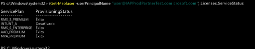

# Gerir licenças do Intune

[!INCLUDE[classic-portal](../includes/classic-portal.md)]

Este tópico informa os administradores sobre como podem atribuir licenças do Intune aos utilizadores para que possam trazer dispositivos para gestão.

Antes de os utilizadores poderem iniciar sessão para utilizar o serviço do Intune ou inscreverem os dispositivos para gestão, primeiro tem de atribuir uma licença a cada utilizador para a sua subscrição do Intune no [portal do Office 365](http://go.microsoft.com/fwlink/p/?LinkId=698854).

As organizações que utilizam Microsoft Enterprise Mobility + Security (EMS) podem ter utilizadores que apenas necessitam do Azure Active Directory Premium ou dos serviços do Intune no pacote EMS. Pode atribuir um ou um conjunto de serviços através dos [cmdlets do PowerShell do Azure Active Directory](https://msdn.microsoft.com/library/jj151815.aspx). Para obter mais informações, consulte [Gerir licenças do Intune através do PowerShell](start-with-a-paid-subscription-to-microsoft-intune-step-4-posh.md).

## Como são atribuídas as licenças do Intune
Quando as contas de utilizador são sincronizadas a partir do Active Directory no local ou adicionadas manualmente à subscrição de serviços em cloud através do [portal do Office 365](http://go.microsoft.com/fwlink/p/?LinkId=698854), não lhes é atribuída automaticamente uma licença do Intune. Em vez disso, posteriormente, um administrador inquilino do Intune tem de editar a conta de utilizador para atribuir uma licença ao utilizador a partir do portal do Office 365.

Quando a sua subscrição partilha o Azure AD com outros serviços na cloud associados à subscrição, também tem acesso aos utilizadores que foram adicionados a esses serviços. Estes utilizadores não possuem uma licença para o [!INCLUDE[wit_nextref](../includes/wit_nextref_md.md)] até que a atribua a cada um deles.

> [!TIP]
> Se a opção de atribuir ou revogar uma licença do [!INCLUDE[wit_nextref](../includes/wit_nextref_md.md)] estiver desativada, a sua subscrição poderá incluir opções de licenciamento em volume, como as que estão disponíveis ao utilizar o [Enterprise Mobility Suite + Security](https://www.microsoft.com/en-us/server-cloud/enterprise-mobility/overview.aspx). Para obter informações sobre como atribuir ou revogar licenças, consulte a documentação das opções de licenciamento.

## Atribuir uma licença de utilizador do Intune

Para adicionar manualmente utilizadores baseados na cloud e atribuir licenças às contas de utilizador baseadas na cloud e às contas sincronizadas do Active Directory no local com o Azure AD, é utilizado o [Portal do Office 365](http://go.microsoft.com/fwlink/p/?LinkId=698854).

1.  Inicie sessão no [portal do Office 365](http://go.microsoft.com/fwlink/p/?LinkId=698854) com as suas credenciais de administrador inquilino e depois selecione **Pessoas** > **Todos os Utilizadores**.

2.  Selecione a conta de utilizador à qual pretende atribuir uma licença de utilizador do Intune e então selecione ou **Microsoft Intune** (autónomo) ou o **Enterprise Mobility Suite**.

3.  A conta de utilizador tem agora as permissões necessárias para utilizar o serviço e inscrever dispositivos para gestão.

> [!NOTE]
> Os utilizadores serão apresentados na consola após terem inscrito um dispositivo.

### Utilizar o PowerShell para gerir seletivamente licenças de utilizador do EMS
As organizações que utilizam Microsoft Enterprise Mobility + Security (anteriormente denominado Enterprise Mobility Suite) podem ter utilizadores que apenas necessitam do Azure Active Directory Premium ou dos serviços do Intune no pacote EMS. Pode atribuir um ou um subconjunto de serviços através dos [cmdlets do PowerShell do Azure Active Directory](https://msdn.microsoft.com/library/jj151815.aspx).

Para atribuir seletivamente licenças de utilizador para serviços do EMS, abra o PowerShell como administrador num computador com o [Módulo Azure Active Directory para Windows PowerShell](https://msdn.microsoft.com/library/jj151815.aspx#bkmk_installmodule) instalado. Pode instalar o PowerShell num computador local ou num servidor do ADFS.

Tem de criar uma nova definição de SKU de licença que se aplique apenas aos planos de serviço pretendidos. Para tal, desative os planos que não pretende aplicar. Por exemplo, pode criar uma definição de SKU de licença que não atribua uma licença do Intune. Para ver uma lista dos serviços disponíveis, escreva:

    (Get-MsolAccountSku | Where {$_.SkuPartNumber -eq "EMS"}).ServiceStatus

Pode executar o comando seguinte para excluir o plano de serviço do Intune. Pode utilizar o mesmo método para expandir para um grupo de segurança completo ou pode utilizar filtros mais granulares.

**Exemplo 1** 
Criar um novo utilizador na linha de comandos e atribuir uma licença de EMS sem ativar a parte do Intune da licença:

    Connect-MsolService

    New-MsolUser -DisplayName “Test User” -FirstName FName -LastName LName -UserPrincipalName user@<TenantName>.onmicrosoft.com –Department DName -UsageLocation US

    $CustomEMS = New-MsolLicenseOptions -AccountSkuId "<TenantName>:EMS" -DisabledPlans INTUNE_A
    Set-MsolUserLicense -UserPrincipalName user@<TenantName>.onmicrosoft.com -AddLicenses <TenantName>:EMS -LicenseOptions $CustomEMS

Verificar com:

    (Get-MsolUser -UserPrincipalName "user@<TenantName>.onmicrosoft.com").Licenses.ServiceStatus

**Exemplo 2** 
Desativar a parte do Intune da licença de EMS para um utilizador a quem já foi atribuída uma licença:

    Connect-MsolService

    $CustomEMS = New-MsolLicenseOptions -AccountSkuId "<TenantName>:EMS" -DisabledPlans INTUNE_A
    Set-MsolUserLicense -UserPrincipalName user@<TenantName>.onmicrosoft.com -LicenseOptions $CustomEMS

Verificar com:

    (Get-MsolUser -UserPrincipalName "user@<TenantName>.onmicrosoft.com").Licenses.ServiceStatus

>[!div class="step-by-step"]

>[&larr; **Sincronizar utilizadores com o Intune**](.\start-with-a-paid-subscription-to-microsoft-intune-step-2.md)     [**Organizar utilizadores e dispositivos** &rarr;](.\start-with-a-paid-subscription-to-microsoft-intune-step-5.md)  

