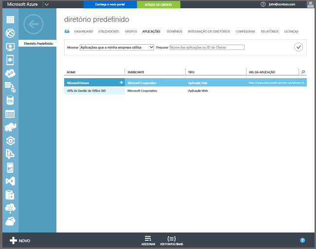

## Inscrição no Azure Active Directory

A inscrição automática permite aos utilizadores inscrever PCs Windows 10 e dispositivos Windows 10 Mobile pertencentes à empresa ou pessoais no Intune, ao adicionar uma conta profissional ou escolar e ao aceitar que sejam geridos. Tão simples quanto isto. Em segundo plano, o dispositivo do utilizador regista e associa-se ao Azure Active Directory. Depois de registado, o dispositivo é gerido com o Intune.

**Pré-requisitos**
- Subscrição do Azure Active Directory Premium ([subscrição de avaliação](http://go.microsoft.com/fwlink/?LinkID=816845))
- Subscrição do Microsoft Intune

### Configurar a inscrição MDM automática

1. No [portal de gestão do Azure](https://manage.windowsazure.com) (https://manage.windowsazure.com), navegue para o nó **Active Directory** e selecione o seu diretório.

2. Clique no separador **Aplicações** e deverá ver **Microsoft Intune** na lista de aplicações.

    

3. Clique na seta para o **Microsoft Intune** e deverá ver uma página que lhe permite configurar o Microsoft Intune.

4. Clique em **Configurar** para iniciar a configuração da inscrição MDM automática com o Microsoft Intune.

5. Especifique os URLs do Intune:

  - **URL de Inscrição de MDM** – utilize o valor predefinido.
  - **URL dos Termos de Utilização do MDM** – utilize o valor predefinido. Este URL apresenta os termos de utilização para os utilizadores ao inscrever dispositivos.
  - **URL de Conformidade do MDM** – utilize o valor predefinido. Se um dispositivo estiver não conforme, é apresentada uma mensagem de **Acesso negado** com este URL. O URL aponta para uma página que ajuda o utilizador a compreender por que motivo o dispositivo dele não está em conformidade com a política e como pode repor a conformidade.

6.  Especifique os dispositivos de utilizadores que devem ser geridos pelo Microsoft Intune. Os dispositivos Windows 10 dos utilizadores serão automaticamente inscritos na gestão com o Microsoft Intune.

  - **Todas**
  - **Grupos**
  - **Nenhum**

7. Escolha **Guardar**.

<!--HONumber=Oct16_HO2-->

