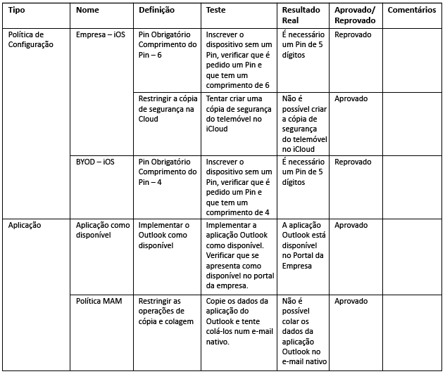
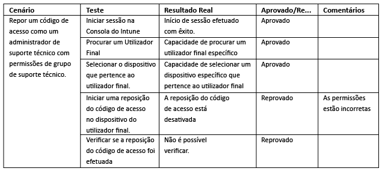
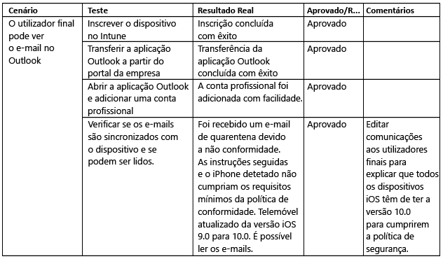

# Teste e validação do Intune

[!INCLUDE[note for both-portals](../includes/note-for-both-portals.md)]

A fase de teste deve ter lugar durante e após a fase de implementação. Precisará de ter contas, grupos e dispositivos de teste para testar todos os cenários necessários de TI (administrador) e de utilizador final (caso de utilização) identificados anteriormente.

É recomendado incorporar a sua equipa de suporte de TI/suporte técnico na fase de teste para que seja criada a documentação de suporte e para que a equipa de suporte de TI/suporte técnico se familiarize com a prestação de suporte do produto. Se um componente ou cenário não funcionar com base nos casos de utilização, certifique-se de que documenta as alterações necessárias e inclui o motivo de uma determinada alteração.

## Antes de começar

É recomendado documentar o seguinte:

-   **Critérios de teste:** identifica os testes de avaliação.

-   **Componentes de estrutura:** têm de existir em pelo menos um critério de teste.

Se um componente de estrutura não existir em, pelo menos, um critério de teste ajustado a um requisito ou cenário, pondere se o componente de estrutura é necessário ou não. Além disso, certifique-se de que tem os seguintes itens:

-   **Contas:** as contas utilizadas no teste devem ser contas de teste licenciadas para o EMS e o Office 365 para testar todos os cenários de casos de utilização.

-   **Dispositivos:** os dispositivos utilizados nesta fase devem ser dispositivos de teste que podem ser potencialmente apagados ou repostos para as predefinições de fábrica.

-   **Componentes de integração:** todos os componentes de integração (Certificate Connector, conector de serviços do Intune para o Exchange alojado e conector do Exchange no local do Intune) devem ser instalados e configurados, se necessário.

Poderá ser necessário fazer alterações de estrutura para acomodar dificuldades imprevistas. Além disso, todas as alterações de estrutura devem ser documentadas com o motivo de cada alteração. Segue-se um exemplo para ilustrar o que poderá ser uma alteração:

-   Pode aperceber-se de que não cumpre os requisitos do Serviço de Inscrição de Dispositivos de Rede (NDES) e que os perfis de VPN e Wi-Fi podem ser configurados com uma AC de raiz que satisfaça os mesmos requisitos sem uma implementação do NDES.

Podem ocorrer problemas que necessitem de orientação técnica ou resolução de problemas especializada durante o processo de teste e validação. É recomendado contactar a assistência através dos canais de suporte da Microsoft.

-   [Como obter suporte do Intune](https://docs.microsoft.com/intune/troubleshoot/how-to-get-support-for-microsoft-intune)

-   [Sugestões de resolução de problemas genéricos do Microsoft Intune](https://docs.microsoft.com/intune/troubleshoot/general-troubleshooting-tips-for-microsoft-intune).

-   [Saiba como obter suporte para o Microsoft Intune.](https://docs.microsoft.com/intune/troubleshoot/how-to-get-support-for-microsoft-intune)

-   [Contactar o suporte assistido por telefone do Microsoft Intune](https://docs.microsoft.com/intune/troubleshoot/contact-assisted-phone-support-for-microsoft-intune)

## Teste de validação funcional

A validação funcional consiste no teste de cada componente e configuração para determinar se está a funcionar corretamente. Segue-se um exemplo de teste de validação na tabela abaixo.

## Testes de validação de casos de utilização

Os testes de validação de casos de utilização devem ser efetuados para verificar se os cenários estão completos e funcionais. Existem dois tipos de cenários de casos de utilização, administrador de TI e utilizador final.

### Administrador de TI

Os testes de validação de Administrador de TI devem ser executados para verificar se uma ação Administrativa efetuada num dispositivo ou utilizador funciona corretamente. Segue-se um exemplo de um cenário de administrador de IT para validação final.

### Utilizador final

Os testes de validação do utilizador final devem ser feitos para verificar se a experiência do utilizador final é a esperada e se é apresentada corretamente em todas as comunicações ao utilizador. É importante verificar se a experiência do utilizador final está correta, uma vez que a falha em fazê-lo pode originar taxas de adoção mais baixas e um maior número de chamadas de suporte técnico.

## Passos Seguintes

Agora que testou e validou os cenários funcionais e de casos de utilização do Intune, está pronto para a implementação de produção do Intune. Consulte [Recursos adicionais](additional-resources.md) para obter mais informações.

<!--HONumber=Dec16_HO5-->

