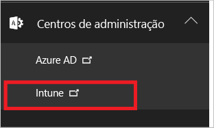
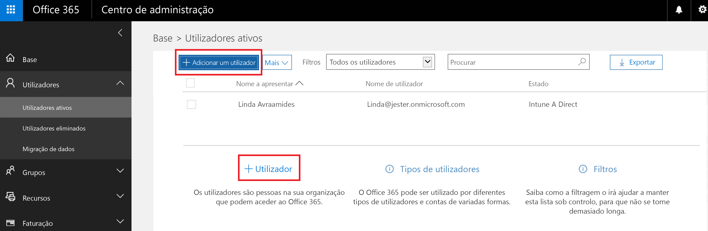
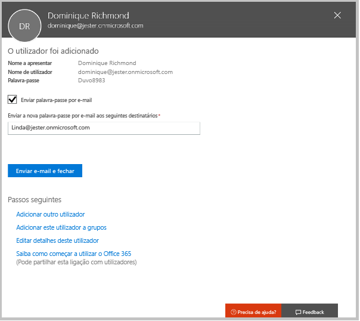
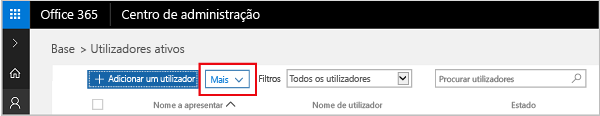

# Inscreva-se numa avaliação gratuita do Microsoft Intune
Este artigo explica os passos da inscrição para uma versão de avaliação do Intune e prepara a sua versão de avaliação com alguns utilizadores para que, em seguida, possa seguir o guia de avaliação associado para ver como o Intune gere dispositivos móveis. <!---or app data when devices are not enrolled in Intune.--->

## Pressupostos
Este artigo de inscrição e o guia de avaliação assumem que está a utilizar a versão de avaliação apenas para o fim destinado e pretende começar com um ambiente limpo na altura da subscrição.

Para facilitar a introdução à utilização da versão de avaliação, estamos a configurar um ambiente muito simples que utiliza apenas o Intune e assume que este será o único método de gestão de dispositivos (conhecido como a autoridade de gestão de dispositivos móveis). No entanto, no decorrer do guia, iremos destacar conteúdo técnico mais aprofundado, se pretender explorar mais.

A versão de avaliação permite-lhe fazer tudo o que normalmente faria numa versão de subscrição, a única diferença é que a versão de avaliação está limitada a 100 contas de utilizador.

## Inscrever-se para a versão de avaliação
Visite a página [Inscrição no Intune](https://portal.office.com/Signup/Signup.aspx?OfferId=40BE278A-DFD1-470a-9EF7-9F2596EA7FF9&dl=INTUNE_A&ali=1#0%20) e preencha o formulário para se inscrever para uma subscrição de avaliação.

Se tiver uma conta profissional ou escolar e pretende utilizá-la para a sua versão de avaliação do Intune, siga antes [estas instruções de início de sessão](https://docs.microsoft.com/en-us/intune/get-started/start-with-a-paid-subscription-to-microsoft-intune-step-1). Contudo, este artigo e os guias de avaliação assumem que não está a utilizar tal conta.

> [!TIP]
> Se a maioria das suas operações de TI e dos seus utilizadores estiverem numa região diferente da sua, pode querer definir essa mesma região para que a sua versão de avaliação possa testar o desempenho.

### Considerações de pós-inscrição
Quando se inscreve para uma versão avaliação, receberá uma mensagem de e-mail com as informações da sua conta para o endereço de e-mail que indicou durante o processo de inscrição. Este e-mail confirma que a sua versão de avaliação está ativa.

Depois de concluir o processo de inscrição, será direcionado para uma página utilizada para adicionar utilizadores e atribuir-lhes licenças com o Centro de administração do Office 365. Da próxima vez que iniciar sessão no Intune, será redirecionado automaticamente para a consola de administração do Intune.

## Manter o Centro de administração e a consola de administração do Intune em ordem
Existem dois portais que irá utilizar para o Intune: o Centro de administração do Office 365 ([portal.office.com](https://portal.office.com)) e a consola de administração do Intune ([manage.microsoft.com](https://manage.microsoft.com)).

Normalmente, irá realizar o seu trabalho na consola de administração do Intune, como se mostra abaixo. Este é o site onde configura e gere os grupos, as políticas, os dispositivos e as aplicações.

No entanto, irá utilizar o Centro de administração do Office 365, conforme mostrado abaixo, para adicionar e gerir os seus utilizadores e outros aspetos da sua conta, incluindo a faturação e o suporte.

Pode navegar do Centro de administração do Office 365 para a consola de administração do Intune. Os centros de administração estão no último item no painel de navegação à esquerda. Escolha **Intune** para abrir a consola de administração do Intune num novo separador.

Para passar do Intune para o Centro de administração do Office 365, escolha a tarefa **Adicionar Utilizadores** na página Descrição Geral dos Grupos.

## Adicionar utilizadores
Antes de sair do Centro de administração do Office 365 para o Intune, precisa de adicionar alguns utilizadores à conta de avaliação.

No Centro de administração do Office 365, pode adicionar utilizadores individualmente ou em massa ao carregar um ficheiro .csv. Serão realizados ambos para configurar a sua versão de avaliação. No entanto, no ambiente de produção, é provável que pretenda tirar partido das suas contas de utilizador do Azure Active Directory, que pode saber mais no nosso [Guia de introdução](https://docs.microsoft.com/en-us/intune/get-started/start-with-a-paid-subscription-to-microsoft-intune-step-3) e na secção [Passos seguintes ](#Next-steps) deste artigo.

### Adicionar um utilizador individual
1. Escolha uma das opções para adicionar um utilizador para abrir um formulário que lhe permite criar um utilizador. Apenas os itens que começam por um asterisco (\*) são precisos.

2.  Quando adiciona o utilizador, o passo final será o envio de um e-mail para esse utilizador com a palavra-passe temporária do Intune. Para efeitos desta avaliação, utilize o seu próprio endereço de e-mail profissional para receber as informações de início de sessão e ver o e-mail que os seus utilizadores receberão. Em seguida, pode utilizar estas identidades de utilizador para inscrever os dispositivos de teste. 

 

3. Se pretender atribuir uma função de administrador a um utilizador depois de o criar, pode editar a função no Centro de administração do Office 365 ao selecionar o nome de utilizador na lista de utilizadores e, em seguida, escolher **Editar** na linha Função para ver a lista de funções de utilizador que pode selecionar e atribuir a esse utilizador.

 

### Importar múltiplos utilizadores
1. Encontrará o assistente para importar vários utilizadores na lista **Mais**.

 

2. Para o ajudar a configurar corretamente o ficheiro. csv, pode transferir um ficheiro de modelo para preencher com os seus dados de utilizador. Transfira o ficheiro. csv com os cabeçalhos e as informações de utilizadores de exemplo para ver exatamente o tipo de dados necessários para cada campo.

 

3. Depois de ter criado e guardado o ficheiro. csv, escolha **Procurar** para selecionar o ficheiro. Verifique e escolha **Seguinte**. Os seus utilizadores serão carregados e adicionados à lista de utilizadores ativos.

Agora está na altura de seguir para a consola de administração do Intune para começar a gerir os utilizadores, os respetivos dispositivos e aplicações.

> [!NOTE]
> Os utilizadores não aparecerão no Intune até que tenham inscrito um dispositivo a gerir.

## Próximos passos
Cenário de avaliação: [Avaliar a gestão de dispositivos móveis no Microsoft Intune](mobile-device-management-trial-guide-microsoft-intune.md)

Saiba mais sobre a utilização das suas contas de utilizador do Azure Active Directory com o Intune:
- [Requisitos de identidade](https://docs.microsoft.com/en-us/active-directory/active-directory-hybrid-identity-design-considerations-overview#design-considerations-overview)
- [Requisitos da sincronização de diretórios](https://docs.microsoft.com/en-us/active-directory/active-directory-hybrid-identity-design-considerations-directory-sync-requirements)
- [Requisitos de autenticação multifator](https://docs.microsoft.com/en-us/active-directory/active-directory-hybrid-identity-design-considerations-multifactor-auth-requirements)

Saiba mais sobre a utilização do [Intune com o System Center Configuration Manager](https://docs.microsoft.com/en-us/sccm/mdm/understand/hybrid-mobile-device-management)

<!--HONumber=Dec16_HO2-->

