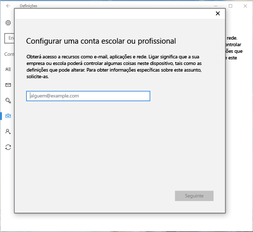
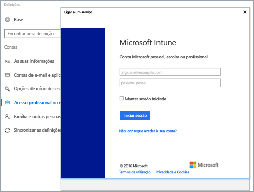
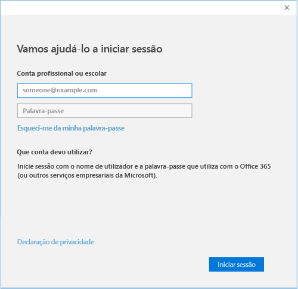

# Registrar dispositivos Windows 10 com o Portal da Empresa do Intune

Use Portal da Empresa do Intune para registrar seu dispositivo Windows 10 no gerenciamento de sua organização. Este artigo descreve como registrar dispositivos com o Windows 10 versão 1607 e posterior e o Windows 10 versão 1511 e anterior. Antes de começar, certifique-se [de verificar a versão em seu dispositivo](windows-enrollment-company-portal.md#find-windows-10-version-number) para que você possa seguir as etapas corretas.  

O Windows 10 tem suporte em vários tipos de dispositivo, incluindo área de trabalho, telefone e Tablet. As etapas de registro são as mesmas em qualquer dispositivo que você esteja usando. No entanto, sua tela pode parecer um pouco diferente das imagens mostradas neste artigo.  
 
> [!VIDEO https://www.youtube.com/embed/TKQxEckBHiE?rel=0]

## Registrar o Windows 10 versão 1607 e o dispositivo posterior 
Estas etapas descrevem como registrar um dispositivo que é executado no Windows 10, versão 1607 e posterior.  

1. Aceda a **Iniciar**. Se você estiver em um dispositivo Windows 10 Mobile, vá para a lista **todos os aplicativos** .

2. Abra a aplicação **Definições**. Se o aplicativo não estiver prontamente disponível na sua lista de aplicativos, vá para a barra de pesquisa e digite "configurações".

3. Selecione **Contas** > **Aceder a profiss./escolar** > **Ligar**.  

      

4. Para acessar a página de entrada do Intune da sua organização, insira seu endereço de email corporativo ou de estudante. e selecione **Seguinte**.  

     

5. Inicie sessão no Intune com a sua conta profissional ou escolar.  

      

    Eventualmente, você verá uma mensagem informando que sua empresa ou escola está registrando seu dispositivo.

6. Se sua organização exigir que você configure um PIN para o Windows Hello, você será solicitado a inserir um código de verificação. Insira o código e continue nas etapas na tela para criar um PIN.  

7. Tudo pronto **!** selecione **Concluído**. O dispositivo está agora inscrito.  

8. Para verificar a conexão novamente, volte para **configurações** > **contas** > **acessar trabalho ou escola**.  Sua conta agora deve estar listada.  

      

Continua sem aceder ao seu e-mail, ficheiros ou outros dados do trabalho ou da escola? Saiba como [solucionar problemas de conta](troubleshoot-your-windows-10-device-windows.md#troubleshooting-steps-to-follow-if-you-see-access-work-or-school).  

## Registrar o Windows 10 versão 1511 e o dispositivo anterior  
Estas etapas descrevem como registrar um dispositivo que é executado no Windows 10, versão 1511 e anterior.  

1. Aceda a **Iniciar**. Se você estiver em um dispositivo Windows 10 Mobile, vá para a lista **todos os aplicativos** .

2. Abra a aplicação **Definições**. Se o aplicativo não estiver prontamente disponível na sua lista de aplicativos, vá para a barra de pesquisa e digite "configurações".

3. Selecione **contas** > **sua conta**.  

      

5. Selecione **Adicionar uma conta escolar ou profissional**.  

      

6. Inicie sessão com as credenciais da sua conta profissional ou escolar.  

      

Continua sem aceder ao seu e-mail, ficheiros ou outros dados do trabalho ou da escola? Saiba como [solucionar problemas relacionados à conta](troubleshoot-your-windows-10-device-windows.md#troubleshooting-steps-to-follow-if-you-see-your-account) durante o registro.  

## Suporte do administrador de ti   

Se você for um administrador de ti e estiver em problemas ao registrar dispositivos, consulte [Solucionando problemas de registro de dispositivo Windows no Microsoft Intune](https://support.microsoft.com/help/4469913). Este artigo lista os erros comuns, suas causas e as etapas para resolvê-los. 

## Próximos passos  
Se precisar de ajuda com Portal da Empresa ou registro, entre em contato com a equipe de suporte de ti de sua organização. Você encontrará suas informações de contato no [site Portal da empresa](https://go.microsoft.com/fwlink/?linkid=2010980). Entre no site com sua conta corporativa ou de estudante.  

 

