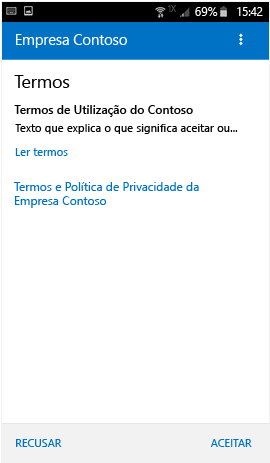
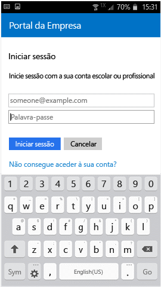
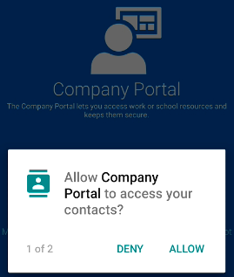

# Inscrever o seu dispositivo Android no Intune

Se a sua empresa ou escola utiliza o Microsoft Intune, pode inscrever o seu dispositivo Android para aceder a e-mails, ficheiros e outros recursos da empresa. Quando inscreve os seus dispositivos, o seu departamento de TI pode gerir esses recursos de trabalho ou da escola, mantê-los seguros e dar-lhe a liberdade para utilizar o seu dispositivo preferencial para realizar o seu trabalho. Para mais informações sobre a inscrição, consulte [O que acontece quando instalo a aplicação Portal da Empresa e inscrevo o meu dispositivo?](what-happens-if-you-install-the-Company-Portal-app-and-enroll-your-device-in-intune-android.md)

> [!VIDEO https://channel9.msdn.com/Series/IntuneEnrollment/Android-Enrollment/player]

Estas instruções de inscrição destinam-se a dispositivos Android nativos e Samsung KNOX. Samsung KNOX é um tipo de segurança utilizado por determinados dispositivos Samsung para proporcionar proteção adicional fora de o que proporciona o Android nativo. Para verificar se tem um dispositivo Samsung KNOX, aceda a **Definições** > **Acerca do dispositivo**. Se não vir a "versão KNOX" aí listada, tem um dispositivo Android nativo.

Antes ou depois da inscrição, poderá ser-lhe pedido para escolher uma categoria que melhor descreve como utiliza o seu dispositivo. O suporte da empresa utiliza esta categoria para ajudar a verificar as aplicações a que tem acesso.

**Para inscrever o seu dispositivo Android:**

1.  Instale a aplicação gratuita Portal da Empresa do Intune a partir do [Google Play](http://play.google.com/store/apps/details?id=com.microsoft.windowsintune.companyportal).

2.  Abra a aplicação Portal da Empresa.

3.  No ecrã **Bem-vindo** do Portal da Empresa, toque em **Iniciar sessão** e, em seguida, inicie sessão com a sua conta escolar ou profissional.

       

4.  Se o suporte da empresa configurar termos e condições empresariais, toque em **ACEITAR** para aceitar os termos. Este ecrã poderá ser ligeiramente diferente da imagem abaixo, com base na versão do Android que está a utilizar atualmente.

    

5.  Inicie sessão na aplicação Portal da Empresa com a sua conta e palavra-passe profissional ou escolar e, em seguida, toque em **Iniciar sessão**.

    

6.  No ecrã **Configuração de Acesso da Empresa**, toque em **CONTINUAR**.

    

    > [!NOTE]
    > Os triângulos amarelos não significam que já tem um erro. Esses ícones indicam que ainda existem passos a concluir no processo de inscrição.

7.  Consulte uma lista do que o suporte da empresa pode e não pode ver no seu dispositivo e, em seguida, toque em **CONTINUAR**.

    

9.  No ecrã **O que se segue?**, leia sobre o que acontece durante a inscrição e, em seguida, toque em **INSCREVER**.

    

10.  Se estiver a utilizar o Android 6.0 ou posterior, efetue este passo. Caso contrário, avance para o passo seguinte.

    Se o suporte da empresa tiver configurado determinadas políticas, poderá ver as seguintes mensagens:
    -   **Permitir que o Portal da Empresa efetue e faça a gestão de chamadas telefónicas?**

        

    Se vir esta mensagem, toque em **PERMITIR**. É seguro tocar em PERMITIR, porque a **Microsoft nunca efetua ou gere as suas chamadas telefónicas.** A Google controla o texto da mensagem e a Microsoft não a pode alterar. Quando permite o acesso, está a permitir que o seu dispositivo envie o número de identidade internacional do equipamento móvel (IMEI) do seu dispositivo ao Intune. O número IMEI é como um número de série que identifica exclusivamente um dispositivo móvel.

    Se negar o acesso, a mensagem aparecerá quando iniciar sessão novamente no Portal da Empresa, mas pode desativar futuras mensagens ao tocar na caixa **Não voltar a perguntar**. Se, posteriormente, decidir permitir o acesso, aceda a **Definições** &gt; **Aplicações** &gt; **Portal da Empresa** &gt; **Permissões** &gt; **Telemóvel** e ative a permissão.

    -   **Permitir que o Portal da Empresa aceda aos seus contactos?**

        

        Se vir esta mensagem, toque em **PERMITIR**. É seguro tocar em PERMITIR, porque a **Microsoft nunca acede aos seus contactos.** A Google controla o texto da mensagem e a Microsoft não a pode alterar. Ao permitir o acesso, só permite à aplicação Portal da Empresa criar, utilizar e gerir a sua conta profissional.

        Se negar o acesso, a mensagem aparecerá quando iniciar sessão novamente no Portal da Empresa, mas pode desativar futuras mensagens ao tocar na caixa **Não voltar a perguntar**. Se, posteriormente, decidir permitir o acesso, aceda a **Definições** &gt; **Aplicações** &gt; **Portal da Empresa** &gt; **Permissões** &gt; **Telemóvel** e ative a permissão.

11.  No ecrã **Ativar administrador de dispositivo**, toque em **Ativar**.

    

    A função de administrador de dispositivos é uma função que o Portal da Empresa precisa para gerir o seu dispositivo. Permite ao administrador ver algumas coisas como, por exemplo, quantas vezes tentou desbloquear o ecrã e tomar algumas ações.

    O fundamental a recordar é que estas ações são executadas em nome da segurança. O suporte da empresa não está a tentar violar a sua privacidade ou a apagar as suas informações sem motivo, mas quer confirmar se os dados da empresa estão seguros.

    A Microsoft não controla esta mensagem e compreendemos que a respetiva formulação pode parecer um pouco drástica. Não há uma forma para o Portal da Empresa apresentar apenas as restrições e o acesso que são relevantes para a sua organização. Todos eles são concedidos em simultâneo neste ecrã. Contacte o suporte da empresa para obter mais informações, através das informações de contacto no [site do Portal da Empresa](https://portal.manage.microsoft.com), se tiver questões específicas da utilização por parte da sua organização a título individual.

12.  Siga as indicações para introduzir um PIN ou palavra-passe. Se já configurou um PIN ou uma palavra-passe neste dispositivo, não verá este ecrã nem terá de introduzir um novo PIN ou palavra-passe.

    

13.  Se estiver a utilizar um dispositivo Samsung KNOX, toque em **Confirmar** e verá uma mensagem a indicar que o dispositivo está a ser inscrito. Se estiver a utilizar um dispositivo Android nativo, repare apenas no ecrã seguinte que mostra que o dispositivo está a ser inscrito.

    

    Este ecrã mostra que o dispositivo está a ser inscrito.

    

14. Quando o ecrã **Configuração de Acesso à Empresa** aparece, toque em **CONTINUAR**. Se uma mensagem indicar que o seu dispositivo não está em conformidade, siga as instruções para corrigir o problema e, em seguida, toque em **CONTINUAR**.

    

    

    Pode encontrar mais informações sobre os problemas ao tocar nos mesmos.

    

      

15. No ecrã **Configuração de Acesso à Empresa concluída**, toque em **CONCLUÍDO**. O dispositivo está agora inscrito.

    

Antes de tentar instalar aplicações da empresa, aceda a **Definições** &gt; **Segurança** e ative as **Origens desconhecidas**. Se não ativar esta opção antes de tentar instalar aplicações, verá a seguinte mensagem: "Instalação bloqueada. Por motivos de segurança, o dispositivo está definido para bloquear as instalações de aplicações obtidas a partir de origens desconhecidas." Pode tocar em **Definições**, na caixa de diálogo de erro, para ir para a opção **Origens desconhecidas**.

> [!Note]
> Se a sua organização utilizar software de gestão de despesas de telecomunicações, terá de completar alguns passos adicionais antes de o dispositivo ficar totalmente inscrito. Saiba mais [aqui](enroll-your-device-with-telecom-expense-management-android.md).

Se obtiver um erro enquanto tenta inscrever o dispositivo no Intune, pode [enviar erros de inscrição ao suporte da empresa](send-enrollment-errors-to-your-it-admin-android.md).

Ainda precisa de ajuda? Contacte o suporte da empresa (verifique as informações de contacto no [site do Portal da Empresa](https://portal.manage.microsoft.com)) ou escreva para a <a href="mailto:wintunedroidfbk@microsoft.com?subject=I'm having trouble with enrolling my Android device&body=Describe the issue you're experiencing here.">equipa Android da Microsoft</a>.
