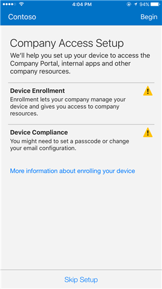

# Inscrever o dispositivo iOS no Intune

Se a sua empresa ou escola utiliza o Microsoft Intune, pode inscrever o seu dispositivo iOS para aceder a e-mails, ficheiros e outros recursos da empresa. Quando inscreve os seus dispositivos, o seu departamento de TI pode gerir esses recursos de trabalho ou da escola, mantê-los seguros e dar-lhe a liberdade para utilizar o seu dispositivo preferencial para realizar o seu trabalho. Para saber mais sobre a inscrição, veja [O que acontece quando instala a aplicação Portal da Empresa e inscreve o seu dispositivo no Intune?](what-happens-if-you-install-the-company-portal-app-and-enroll-your-device-in-intune-ios.md)

> [!VIDEO https://channel9.msdn.com/Series/IntuneEnrollment/iOS-Enrollment/player]

> [!NOTE]
> Se estiver a tentar inscrever um dispositivo macOS, tal como um MacBook Pro ou um iMac, [experimente antes estas instruções](enroll-your-device-in-intune-macos.md).

**Antes de começar:**

- Certifique-se de que conclui a inscrição antes de iniciar os passos. Normalmente, se colocar em pausa durante mais do que alguns minutos, interromperá o processo e será necessário reiniciar.
- Se, por qualquer motivo, a inscrição falhar, tem de voltar à aplicação Portal da Empresa para tentar novamente.
- Certifique-se de que a sua ligação Wi-Fi está a funcionar. Caso contrário, não será possível efetuar a inscrição.
- Se tiver bloqueado o Safari no seu dispositivo, desbloqueie-o. O Safari é utilizado como parte do processo de inscrição de dispositivos.

**Para inscrever o seu dispositivo iOS:**

1.  Siga os passos em [Instalar e iniciar sessão na aplicação Portal da Empresa do Intune](install-and-sign-in-to-the-intune-company-portal-app-ios.md).

2. Na página **Configuração de Acesso à Empresa**, toque em **Começar**.

    

3. No ecrã **Porquê inscrever o seu dispositivo?**, leia sobre o que pode fazer quando inscrever o seu dispositivo e, em seguida, toque em **Continuar**.

    

  > [!NOTE]
  > Os triângulos amarelos não significam que já tem um erro. Esses ícones indicam que ainda existem passos a concluir no processo de inscrição.

4. Reveja uma lista do que o administrador de TI pode e não pode ver no seu dispositivo inscrito e, em seguida, toque em **Continuar**.

    

5.  No ecrã **O que vem a seguir**, leia sobre o que acontece durante a inscrição e, em seguida, toque em **Inscrever**.

    

6.  No ecrã **Instalar Perfil**, toque em **Instalar** e introduza o código de acesso, se lhe for solicitado.

    

7.  Toque em **Instalar**.

        

8.  Toque em **Instalar** para indicar que leu o aviso.

    

9.  Toque em **Confiar**.

    

10.  Quando o ecrã mudar para mostrar que o perfil concluiu a instalação, toque em **Concluído**.

    

    A mensagem "A inscrever dispositivo" é apresentada no ecrã.

11.  Quando uma mensagem lhe perguntar se quer abrir a página no Portal da Empresa, toque em **Abrir**.

    

12. No ecrã **Configuração de Acesso à Empresa**, toque em **Continuar**. Este ecrã mostra-lhe outros requisitos de que poderá necessitar para que o seu dispositivo fique em conformidade, como configurar uma palavra-passe. Siga as instruções no ecrã até cumprir todos os requisitos de conformidade. Assim que terminar, regressa ao ecrã Configuração de Acesso à Empresa. Toque em **Continuar**.

    

13. Toque em **Concluído**.

    

O dispositivo está agora inscrito no Intune e o utilizador é direcionado novamente para a aplicação Portal da Empresa.

> [!Note]
> Tem mais alguns passos para concluir antes de o seu dispositivo estar totalmente inscrito. Saiba mais sobre a [inscrição do seu dispositivo através da gestão de despesas de telecomunicações](enroll-your-device-with-telecom-expense-management-ios.md). Se a sua organização estiver a utilizar o Programa de Registo de Aparelho da Apple, descubra mais informações [aqui](enroll-your-device-dep-ios.md).

Ainda precisa de ajuda? Contacte o administrador de TI. Para encontrar as informações de contacto dele, verifique o [site do Portal da Empresa](http://portal.manage.microsoft.com).
