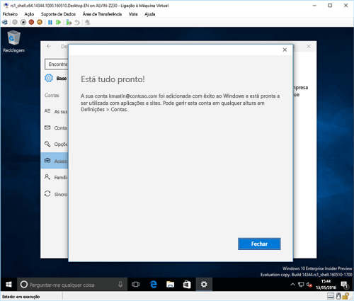

# Inscrever o seu dispositivo com o Windows 10 no Intune

> [!NOTE]
> O Windows 10 funciona em todos os tipos de dispositivos. Quer esteja a utilizar um computador, telemóvel ou tablet, os passos que segue são os mesmos, ainda que tenham um aspeto ligeiramente diferente daquele nas imagens nesta página.

> [!VIDEO https://channel9.msdn.com/Series/IntuneEnrollment/Windows-Enrollment/player]

1. Aceda a **Iniciar**.

  - Se estiver a utilizar um dispositivo com **Windows 10 Desktop**, aceda ao **menu Iniciar**.
  - Se estiver a utilizar um dispositivo **Windows 10 Mobile**, aceda ao **ecrã Início** e, em seguida, percorra até à lista **Todas as Aplicações**.

2.  Abra as **Definições** da aplicação Windows ao procurar "definições" na barra de pesquisa.

3. Selecione **Contas** > **Aceder a profiss./escolar** > **Ligar**.

    

3.  Introduza o seu e-mail profissional ou escolar e, em seguida, selecione **Seguinte**.

    

4. Inicie sessão no Intune com a sua conta profissional ou escolar.

    

    Verá uma mensagem a indicar que a sua empresa ou escola está a registar o dispositivo.

5. Quando vir o ecrã **Está tudo pronto!** selecione **Fechar**. Terminou.

  

6. Se pretender verificar novamente se a ligação tem o aspeto pretendido, volte às **Definições**, onde deve conseguir ver a sua conta profissional ou escolar listada.

    

Se seguiu os passos anteriores, mas continua a não conseguir aceder à conta de e-mail e aos ficheiros profissionais ou escolares, siga os passos em [Passos de resolução de problemas a seguir se vir Acesso profissional ou escolar](troubleshoot-your-windows-10-device-windows.md#troubleshooting-steps-to-follow-if-you-see-access-work-or-school).
