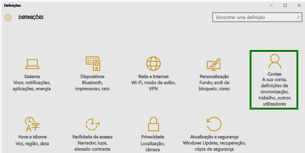

# Inscrever o seu dispositivo com o Windows 10 no Intune

> [!NOTE]
> O Windows 10 funciona em todos os tipos de dispositivos. Quer esteja a utilizar um computador, telemóvel ou tablet, os passos que segue são os mesmos, ainda que tenham um aspeto ligeiramente diferente daquele nas imagens nesta página.

1.  Aceda a **Iniciar**.

  - Se estiver a utilizar um dispositivo com **Windows 10 Desktop**, aceda ao **menu Iniciar**.
  - Se estiver a utilizar um dispositivo **Windows 10 Mobile**, aceda ao **ecrã Início** e, em seguida, percorra até à lista **Todas as Aplicações**.

2. Abra as **Definições** da aplicação Windows ao procurar "definições" na barra de pesquisa.

3. Selecione **Contas**.

    

4. Selecione **A sua conta**.

    

5. Selecione **Adicionar uma conta escolar ou profissional**.

    

6. Inicie sessão com as credenciais da sua conta profissional ou escolar.

    

Continua sem aceder ao seu e-mail, ficheiros ou outros dados do trabalho ou da escola? Tente corrigir o acesso através da [resolução de problemas com a sua conta](troubleshoot-your-windows-10-device-windows.md#troubleshooting-steps-to-follow-if-you-see-your-account). Se continuar sem funcionar, terá de contactar o seu administrador de TI para obter mais ajuda.

Uma forma fácil de obter a ajuda do seu administrador de TI é através das informações de contacto disponíveis na aplicação Portal da Empresa, que também permite localizar e transferir aplicações recomendadas e necessárias para o seu trabalho diário. É possível que já tenha a aplicação Portal da Empresa instalada no seu dispositivo. Uma forma rápida de o verificar é ao procurar o __Portal da Empresa__ na lista __Todas as aplicações__.

Se não vir o Portal da Empresa na lista de aplicações, siga estes passos para instalá-lo.

1. Selecione **Iniciar** > **Loja**.

2. Selecione **Pesquisar** e, em seguida, escreva **portal da empresa**.

3. Na lista de resultados, selecione **Portal da Empresa** > **Instalar**.

4. Selecione **Instalar** ou **Gratuito**. Não existe qualquer diferença entre estas duas opções; a opção apresentada depende da forma como a sua organização configurou a aplicação Portal da Empresa.

