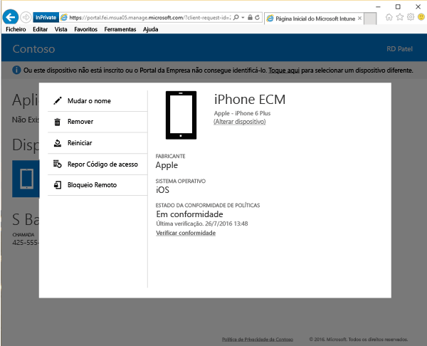

# Como repor o código de acesso do dispositivo a partir do site do Portal da Empresa

Se perder o PIN ou a palavra-passe de um dispositivo que tenha inscrito no Intune, pode utilizar o [site do Portal da Empresa](https://portal.manage.microsoft.com#HelpDeskDialog) para efetuar a reposição. Pode utilizar o site do Portal da Empresa para gerir computadores e dispositivos que tenha inscrito no Intune e para realizar a maioria das tarefas que pode fazer com a aplicação Portal da Empresa.

> [!NOTE]
> É possível que não veja o botão Repor Código de Acesso no site do Portal da Empresa se utilizar um dispositivo da empresa inscrito. Se não vir o botão, terá de contactar o suporte da empresa para que este reponha o código de acesso.

Para repor o código de acesso:

1. No [site do Portal da Empresa](https://portal.manage.microsoft.com#HelpDeskDialog), toque no botão __menu__  e, em seguida, selecione __Os Meus Dispositivos__.

2. Na página __Os Meus Dispositivos__, selecione o nome do dispositivo cujo código de acesso quer repor.

   

3. O dispositivo será aberto numa janela de pop-up. Selecione o botão **Repor Código de Acesso**.

   

4. Será apresentada uma faixa a pedir-lhe para confirmar que pretende repor o código de acesso e que a sua sessão irá terminar no dispositivo depois de esta ação ser efetuada. Em seguida, terá de aguardar 5 minutos antes de iniciar sessão novamente.

   

5. Selecione **Terminar sessão** e receberá uma mensagem final a informá-lo sobre a remoção do código de acesso do dispositivo. Se não tiver o dispositivo consigo, não remova o código de acesso, pois quem tiver acesso físico ao dispositivo poderá aceder à maioria das informações pessoais ou empresariais no mesmo. 

   

   Diferentes dispositivos têm diferentes tipos de códigos de acesso.

   **Android**: remove o código de acesso existente e cria um código de acesso alfanumérico temporário 
  
   > [!NOTE]
   > Não pode repor o código de acesso para dispositivos com o Android 7.0 e versões posteriores. Caso se esqueça do código de acesso, terá de repor as definições de fábrica destes dispositivos.

   **iOS**: remove o código de acesso existente e não cria um código de acesso temporário. Se estiver a utilizar a deteção de impressão digital do Touch ID para abrir o dispositivo ou para fazer compras, terá de voltar a configurá-la.

   **Windows 10 Mobile**: remove o código de acesso existente e cria um código de acesso alfanumérico temporário. Se estiver a utilizar o reconhecimento facial do Windows Hello para iniciar sessão, este continuará a ser suportado.
    
   **Windows Phone 8.1**: remove o código de acesso existente e cria um código de acesso numérico temporário

   Para dispositivos Android e Windows, a palavra-passe temporária aparecerá nos **Detalhes do Dispositivo**. 

6. Desbloqueie o dispositivo e defina um novo código de acesso ou altere o código de acesso temporário ao aceder a **Definições** no seu dispositivo.

Para ver uma notificação a confirmar que a palavra-passe foi reposta com êxito, clique no sinalizador de notificação na parte superior direita do site do Portal da Empresa.

Ainda precisa de ajuda? Contacte o suporte da empresa. Para encontrar as informações de contacto dele, verifique o [site do Portal da Empresa](https://portal.manage.microsoft.com#HelpDeskDialog).
