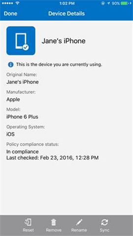

# Sincronizar o seu dispositivo iOS manualmente

Por vezes, uma aplicação pode demorar demasiado tempo a ser transferida do Portal da Empresa. Se isto lhe acontecer, pode tentar sincronizar manualmente o seu dispositivo. Significa que está a comandar o seu dispositivo para tentar obter novamente as informações que este não consegue transferir.

1. Abra a aplicação Portal da Empresa.

2. Na secção **Os Meus Dispositivos**, selecione o dispositivo que está a utilizar. Este é o mosaico de dispositivo mais à esquerda e inclui uma marca de verificação.

    

3. Toque no botão **Sincronizar** no canto inferior direito do ecrã.

    

Uma barra de carregamento será apresentada no ecrã e carregada até que a sincronização seja concluída.

Ainda precisa de ajuda? Contacte o suporte da empresa. Para encontrar as informações de contacto dele, verifique o [site do Portal da Empresa](https://portal.manage.microsoft.com#HelpDeskDialog).
