---
title: Sincronizar o seu dispositivo Windows manualmente | Documentos da Microsoft
description: 
keywords: 
author: barlanmsft
ms.author: barlan
manager: angrobe
ms.date: 05/19/2017
ms.topic: article
ms.prod: 
ms.service: microsoft-intune
ms.technology: 
ms.assetid: 443c6de7-5187-4dc4-b844-6085a0c659bd
searchScope: User help
ROBOTS: 
ms.reviewer: priyar
ms.suite: ems
ms.custom: intune-enduser
ms.openlocfilehash: 1c1ade50ff6a458633598d2788d176dd79cbfebd
ms.sourcegitcommit: f2f147a1177d1cf5bbc8001701eb8f44dd833b7d
ms.translationtype: HT
ms.contentlocale: pt-PT
ms.lasthandoff: 12/12/2017
---
# Sincronizar o seu dispositivo Windows manualmente

Por vezes, a tentativa de instalação de uma aplicação no seu dispositivo Windows pode ser mais morosa do que pensa que deveria ser. Se isto acontecer, pode tentar sincronizar manualmente o seu dispositivo Windows. A sincronização pode ajudar a acelerar a instalação.

> [!Note]
> A instalação das aplicações poderá demorar algum tempo se estiver numa rede com velocidades mais lentas ou com um número superior de dispositivos a transferir conteúdos simultaneamente.

As versões do Windows que se seguem podem sincronizar manualmente. Infelizmente, se o seu dispositivo estiver a utilizar uma versão diferente do Windows, não pode iniciar uma sincronização manual.

* [Sincronizar computadores com o Windows 10](#windows-10-desktop)
* [Sincronizar o Windows 10 Mobile](#windows-10-mobile)
* [Sincronizar o Windows Phone 8.1](#windows-phone-81)

## Computadores com o Windows 10
Existe mais do que uma versão do Windows 10, pelo que existem dois conjuntos de passos. Para saber que passos que deve utilizar, observe as capturas de ecrã e, em seguida, siga os passos que se parecem com o que vê no seu dispositivo.

1. Selecione o botão **Iniciar** e, em seguida, selecione **Definições**.

    

2. Na página **Definições**, selecione **Contas**.

    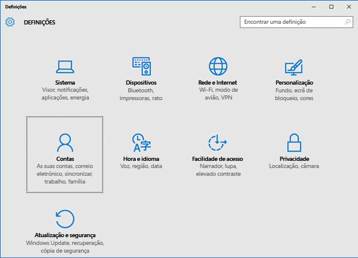

3. Observe os dois ecrãs seguintes e veja qual deles se parece com o que vê no seu dispositivo. Siga os passos que acompanham o ecrã que aparece no seu dispositivo.

    Se vir este ecrã, que mostra "Acesso profissional ou escolar", siga as instruções em [Passos a seguir se vir Acesso profissional ou escolar](#steps-to-follow-if-you-see-access-work-or-school).

    

    Se vir este ecrã, que mostra "Acesso de trabalho", siga os passos em [Passos a seguir se vir Acesso profissional ou escolar](#steps-to-follow-if-you-see-work-access).

    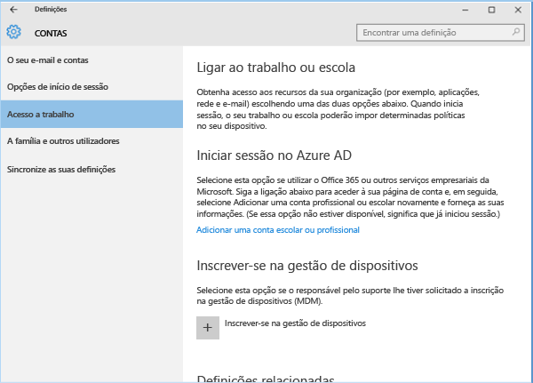

### Passos a seguir se vir Acesso profissional ou escolar

1. Na página **Contas**, selecione **Acesso profissional ou escolar**.

    

2. Selecione a sua conta escolar ou profissional. Dependendo da configuração que o suporte da empresa efetuou, poderá ver duas contas com aspeto semelhante ao exemplo mostrado abaixo. Uma conta tem uma pasta junto à mesma, e a outra conta tem o logótipo da Microsoft.

    - Se vir a conta com a pasta, selecione-a e procure o botão **Informações** sob a mesma.
    - Se vir apenas a conta com o logótipo da Microsoft, selecione a conta e procure o botão **Informações** sob a mesma.

    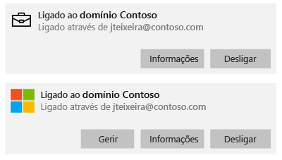

3. Selecione o botão **Informações**. É aberta uma caixa de diálogo semelhante à do exemplo abaixo.

    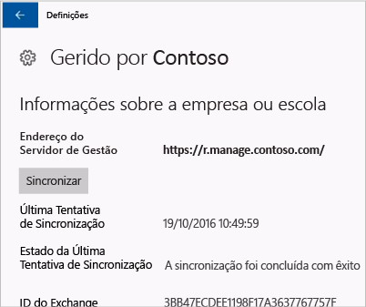

4. Selecione o botão**Sincronizar**. O seu dispositivo será sincronizado com o Intune.

### Passos a seguir se vir Acesso de trabalho

1. Na página **Contas**, selecione **Acesso de trabalho**.

    

2. Na secção **Inscrever na gestão de dispositivos**, selecione o nome da sua empresa.

    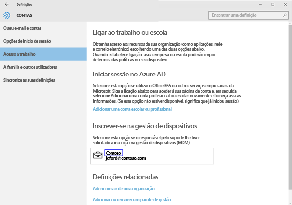

3. Selecione o botão**Sincronizar**.

    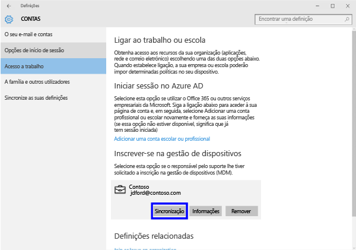

   O botão fica a cinzento até a sincronização estar concluída.

### Windows 10 Mobile
Para sincronizar manualmente o seu dispositivo Windows 10 Mobile para acelerar uma instalação de aplicações lenta:

   1. Aceda a **Todas as aplicações** > **Definições** > **Contas**.

       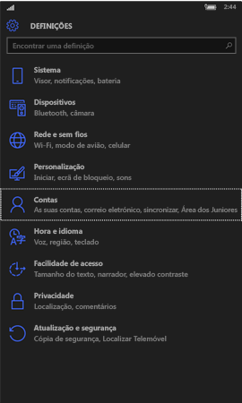

   2. Selecione **Acesso de trabalho**.

       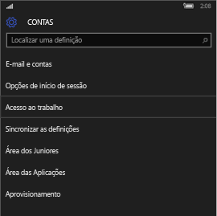

   3. Em **Inscrever na gestão de dispositivos**, selecione o nome da sua empresa.

       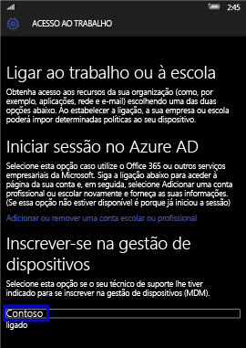

   4. Selecione o ícone **Sincronizar**.

       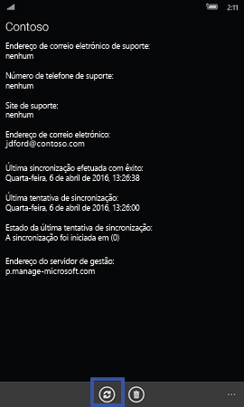

       É apresentada a mensagem "Estamos a sincronizar a sua conta" na parte superior do ecrã. O botão **Sincronizar** aparece a cinzento até que seja concluída a sincronização do dispositivo.

## Windows Phone 8.1
Para sincronizar manualmente o seu dispositivo Windows Phone 8.1 para acelerar uma instalação de aplicações lenta:

1. Aceda a **Todas as aplicações** > **Definições** > **área de trabalho**.

    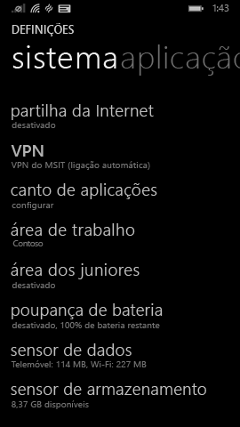

2. Selecione o nome da sua empresa.

    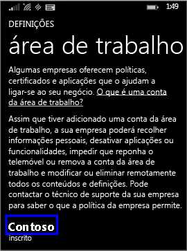

3. Selecione o ícone **Sincronizar**.

    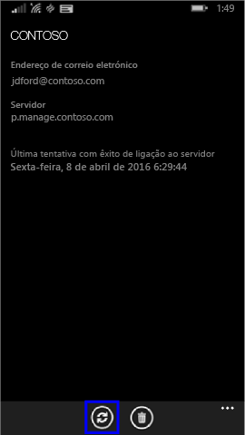

   É apresentada a mensagem "Estamos a sincronizar a sua conta" na parte superior do ecrã até que seja concluída a sincronização do dispositivo.

Ainda precisa de ajuda? Contacte o suporte da empresa. Para encontrar as informações de contacto dele, verifique o [site do Portal da Empresa](https://portal.manage.microsoft.com#HelpDeskDialog).
