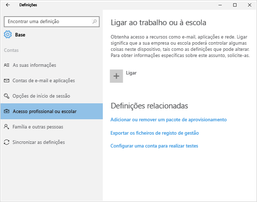
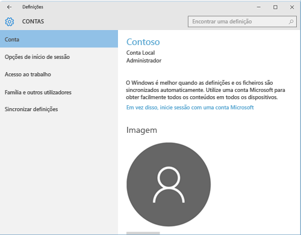
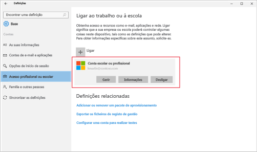

# Resolver problemas de inscrição no dispositivo Windows 10
Se tiver seguido os passos em [Inscrever o seu computador com Windows 10 ou dispositivo móvel com Windows 10 Mobile no Intune](enroll-your-w10-phone-or-w10-pc-windows.md), mas ainda não conseguir aceder ao seu e-mail e ficheiros profissionais ou escolares, experimente estes passos de resolução de problemas.

1.  Observe os dois ecrãs abaixo e veja qual deles se parece com o que vê no seu dispositivo. Siga os passos que acompanham o ecrã que aparece no seu dispositivo.

    Se vir este ecrã, siga os passos em [Passos de resolução de problemas a seguir se vir Acesso profissional ou escolar](#troubleshooting-steps-to-follow-if-you-see-access-work-or-school).

    

    Se vir este ecrã, siga os passos em [Passos de resolução de problemas a seguir se vir A sua conta](#troubleshooting-steps-to-follow-if-you-see-your-account).

    

## Passos de resolução de problemas a seguir se vir Acesso profissional ou escolar

1.  Se seguiu os passos acima, mas continua a não conseguir aceder ao e-mail e aos ficheiros profissionais ou escolares, volte a **Acesso profissional ou escolar**.

2. Efetue uma das seguintes ações:

    - Se vir uma ligação que tem um aspeto semelhante à imagem abaixo, toque na mesma e, em seguida, confira se vê as opções Gerir, Informações e Desligar. Se vir estas opções, significa que já está inscrito e ligado.

    

    - Se não vir as informações de ligação mostradas acima ou se de facto as vir, mas faltarem algumas das opções, toque em **Ligar** e, em seguida, inicie sessão com as suas credenciais profissionais ou escolares. Agora, já deverá estar ligado.

## Passos de resolução de problemas a seguir se vir A sua conta

Se seguiu os passos acima, mas continua a não conseguir aceder ao e-mail, aos ficheiros e a outros dados profissionais ou escolares, volte a **Contas** e toque em **Acesso profissional**.

- Se visualizar a sua conta profissional ou escolar, parabéns, está ligado. Está ligado.

- Se não vir a sua conta profissional ou escolar, toque em **Ligar** e, em seguida, inicie sessão com as credenciais da sua conta profissional ou escolar.

Ainda precisa de ajuda? Contacte o administrador de TI. Para encontrar as informações de contacto dele, verifique o [site do Portal da Empresa](http://portal.manage.microsoft.com).

