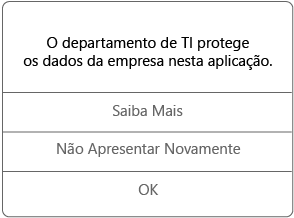

# Utilizar aplicações geridas no seu dispositivo iOS

As aplicações geridas são as aplicações que o suporte da empresa pode configurar para ajudar a proteger os dados da empresa a que pode aceder nessa aplicação. Ao aceder aos dados da empresa numa aplicação gerida no seu dispositivo iOS, poderá reparar que a aplicação funciona de forma ligeiramente diferente do que o que esperava. Por exemplo, poderá não conseguir copiar e colar dados protegidos da empresa ou poderá não conseguir guardar os dados em determinadas localizações.

As diferentes aplicações geridas também podem trabalhar em conjunto no seu dispositivo para que possa efetuar as tarefas diárias, mantendo os dados empresariais protegidos. Por exemplo, se abrir um ficheiro da empresa numa aplicação gerida e for necessária outra aplicação gerida para ver esse ficheiro, a aplicação gerida que lhe permite ver o ficheiro abre-se automaticamente. Se não estiver disponível uma aplicação necessária, determinadas ações, como abrir um documento ou aceder a uma ligação Web a partir de um documento gerido, poderão não estar disponíveis.

Ao aceder a dados da empresa numa aplicação gerida, verá uma mensagem como a que se apresenta abaixo, que lhe permite saber que a aplicação que está a abrir é gerida.

## Como obtenho aplicações geridas?  
Obtém aplicações geridas de duas formas diferentes:

- Quando o dispositivo está inscrito no Microsoft Intune, pode instalar a aplicação a partir da sua aplicação Portal da Empresa ou do site do Portal da Empresa, ou o suporte da empresa poderá instalá-la no seu dispositivo. Para mais informações sobre a inscrição, veja [Inscrever o dispositivo iOS no Intune](enroll-your-device-in-intune-ios.md) ou [Inscrever o dispositivo macOS no Intune](enroll-your-device-in-intune-macos.md).

- Instala uma aplicação da App Store e, em seguida, inicia sessão com a sua conta de utilizador empresarial gerida pelo Intune.

Por vezes, o suporte da empresa poderá adquirir múltiplas licenças para uma aplicação que instalar. Se vir uma mensagem a pedir que aceite o contrato do Apple Volume Purchase Program, isto é normal e pode aceitá-lo. Se não o aceitar, não poderá instalar a aplicação.

## Aplicações disponíveis   
 Sua organização seleciona aplicativos que são apropriados e úteis para você no trabalho ou na escola. Esses aplicativos são os únicos que você encontrará na Portal da Empresa.   

 Os aplicativos também são disponibilizados para você com base no tipo de dispositivo. Por exemplo, se você estiver usando o aplicativo Portal da Empresa para iOS, terá acesso aos aplicativos iOS, mas não aos aplicativos Android.   

## Solicitar um aplicativo para trabalho ou escola   
 Se houver um aplicativo de que você precisa, mas não vir no Portal da Empresa, você poderá solicitá-lo. Encontre detalhes de contato para a **assistência técnica** na guia **suporte** do aplicativo portal da empresa. Você encontrará as mesmas informações de contato no [site Portal da empresa](https://go.microsoft.com/fwlink/?linkid=2010980).   
 

## O que pode gerir o suporte da minha empresa numa aplicação?  
Eis alguns exemplos das opções que o suporte da empresa pode gerir numa aplicação e que podem afetar as suas interações com os dados da empresa no seu dispositivo:

- Acesso a sites específicos

- Transferências de dados entre aplicações

- Guardar ficheiros

- Operações de copiar e colar

- Requisitos de acesso do PIN

- O seu início de sessão com as credenciais da empresa

- Capacidade de cópia de segurança para a cloud

- Capacidade para tirar capturas de ecrã

- Requisitos de encriptação de dados

Contacte o suporte da empresa para obter mais informações sobre as aplicações geridas no seu dispositivo. Para encontrar as informações de contacto dele, verifique o [site do Portal da Empresa](https://go.microsoft.com/fwlink/?linkid=2010980).
