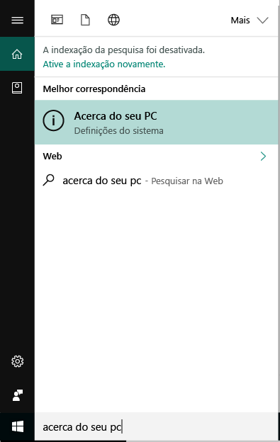
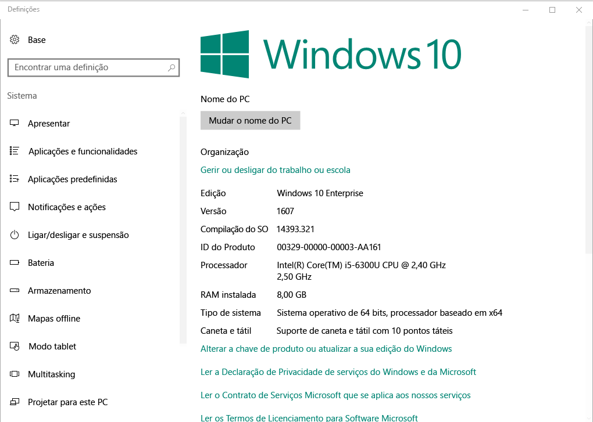

# Registro de dispositivo do Windows no Portal da Empresa do Intune  

Registre seu dispositivo Windows no aplicativo Portal da Empresa do Intune para obter acesso seguro a aplicativos de trabalho e escolares, emails e arquivos. Se sua organização exigir ou recomendar determinados aplicativos, como o Office ou OneDrive, você os receberá durante o registro ou eles estarão disponíveis no Portal da Empresa após o registro.  

Você pode registrar dispositivos Windows 10 por meio do site Portal da Empresa *ou* aplicativo. Se você estiver registrando um dispositivo com uma versão anterior do Windows, deverá registrar o dispositivo por meio do site Portal da Empresa.  

## Instalar Portal da Empresa aplicativo  
Talvez você já tenha o aplicativo Portal da Empresa instalado em seu dispositivo. Verifique o aplicativo em sua lista de __todos os aplicativos__ .  Se você não vir Portal da Empresa na lista de aplicativos, siga estas etapas para instalá-lo.  

1. Abra **Microsoft Store** em seu dispositivo.

2. No campo de **pesquisa** , digite **portal da empresa**.

3. Na lista de resultados, selecione **Portal da Empresa** > **Instalar**.

4. Selecione **Instalar** ou **Gratuito**. Não há nenhuma diferença entre essas duas opções; as palavras são exibidas com base em como sua organização configurou o aplicativo.  

## Localizar número de versão do Windows 10  
As etapas de registro são diferentes para versões diferentes de dispositivos Windows 10. As etapas a seguir descrevem como localizar o número de versão em dispositivos Windows 10 desktop e Mobile. Depois de saber sua versão, continue nas etapas de registro recomendadas.  

### Dispositivos com o Windows 10 Desktop  

1. Aceda a **Iniciar**.

2. Na barra de pesquisa, digite a frase "sobre seu PC". Selecione __sobre o seu PC__ nos resultados.  

     

3. Role para baixo até **especificações do Windows** para encontrar a **versão** do Windows 10 instalada em seu computador.  

     

4. Se sua versão for  

    * __1607 ou posterior__: Registre seu dispositivo por meio das [ **configurações** > **conta** > acessar a rota **corporativa ou de estudante** ](enroll-windows-10-device.md#enroll-windows-10-version-1607-and-later-device).   
    * __1511 ou anterior__: Registre seu dispositivo por meio das [ **configurações** > **conta** > **sua** rota de contas](enroll-windows-10-device.md#enroll-windows-10-version-1511-and-earlier-device).  

### Dispositivos com o Windows 10 Mobile

1. Vá para __todos os aplicativos__ e selecione o aplicativo __configurações__ .
2. Selecione __Sistema__ > __Acerca de__.
3. Em __informações do dispositivo__, localize a __versão__.  
4. Se sua versão for  

    * __1607 ou posterior__: Registre seu dispositivo usando as [ **configurações** > **acessar a rota corporativa ou de estudante** ](enroll-windows-10-device.md#enroll-windows-10-version-1607-and-later-device).   
    * __1511 ou anterior__: Registre seu dispositivo usando as [ **configurações** > rota de **contas** ](enroll-windows-10-device.md#enroll-windows-10-version-1511-and-earlier-device).  

## Registrar dispositivos que não são do Windows 10  
Use os seguintes artigos para registrar outros dispositivos Windows com suporte por meio do site Portal da Empresa:   
* [Windows 8.1. ou dispositivo Windows RT 8,1](enroll-your-W81-or-rt81-windows.md)  
* [Dispositivo Windows Phone 8,1](enroll-your-wp81-windows.md)    

## Suporte do administrador de ti  
Se você for um administrador de ti e estiver em problemas ao registrar dispositivos, consulte [Solucionando problemas de registro de dispositivo Windows no Microsoft Intune](https://support.microsoft.com/help/4469913). Este artigo lista os erros comuns, suas causas e as etapas para resolvê-los.  

## Próximos passos  
Agora que você conhece os dispositivos com suporte e seu número de versão do Windows 10, vá para o artigo de registro recomendado.  
 
Para obter mais informações sobre o gerenciamento de dispositivos, Portal da Empresa e como ambos são usados em escolas e no trabalho, consulte os seguintes artigos:  
* [Usar dispositivos gerenciados para acessar recursos corporativos ou de estudante](use-managed-devices-to-get-work-done.md)  
* [O que acontece quando você registra seu dispositivo no Intune](what-happens-if-you-install-the-company-portal-app-and-enroll-your-device-in-intune-windows.md)  
* [Quais informações minha organização pode ver quando eu registro meu dispositivo?](what-info-can-your-company-see-when-you-enroll-your-device-in-intune.md)  

Precisa de ajuda? Contacte o suporte da empresa. [Acesse o site Portal da empresa](https://go.microsoft.com/fwlink/?linkid=2010980) para localizar as informações de contato de ti da sua organização.  
