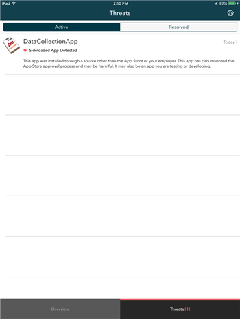

# Resolver uma ameaça detetada pelo Lookout for Work

O Lookout for Work encontrou uma potencial ameaça no seu dispositivo. Tem de corrigir o problema para recuperar o acesso ao seu e-mail profissional ou escolar, aplicações e ficheiros.

Para resolver este problema, abra a aplicação Lookout for Work e siga as instruções apresentadas na aplicação.

## O que poderá ver se o dispositivo inscrito estiver impedido de aceder ao e-mail ou aos ficheiros

Se existir um vírus ou outra ameaça de segurança no dispositivo inscrito e tentar aceder aos ficheiros ou ao e-mail da sua empresa, poderá ver uma mensagem como esta:

Toque na ligação **portal de gestão de dispositivos** para aceder ao [Site do Portal da Empresa](https://portal.manage.microsoft.com#HelpDeskDialog), onde verá instruções sobre como resolver o problema.

## Exemplo de uma aplicação que a Lookout for Work vê como uma ameaça

Se instalou uma aplicação que o Lookout for Work pensa ser uma ameaça, verá um ecrã semelhante a este:

Se vir algo deste género, toque no nome da aplicação que aparece na parte superior do ecrã e siga as instruções para remover a ameaça.

Depois de desinstalar a aplicação, recupera o acesso ao e-mail e a outros dados da empresa ou escola imediatamente. Se ignorar o pedido para desinstalar a aplicação, perderá o acesso ao e-mail e aos dados da empresa até desinstalar a aplicação.

Ainda precisa de ajuda? Contacte o suporte da empresa. Para encontrar as informações de contacto dele, verifique o [site do Portal da Empresa](https://portal.manage.microsoft.com#HelpDeskDialog).

