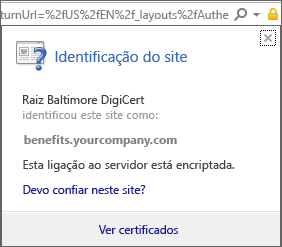
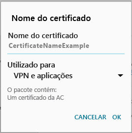

# Instalar o certificado ausente exigido pela sua organização  

Se o seu dispositivo não estiver inscrito no Intune e não tiver um determinado certificado de que o suporte da empresa necessita, não poderá iniciar sessão na aplicação Portal da Empresa. Ao tentar iniciar sessão, verá a seguinte mensagem:

Há duas opções que você pode tentar baixar o certificado necessário e obter seu dispositivo registrado. 

- Habilite o acesso do navegador no aplicativo Portal da Empresa.
- Identifique o certificado ausente em um PC corporativo ou de estudante. Em seguida, pesquise a Internet para baixar o certificado ausente. 

Conclua as etapas para habilitar o acesso ao navegador primeiro. Depois disso, se você ainda não puder registrar seu dispositivo, siga as etapas para localizar o certificado na Internet. 

## Habilitar o acesso ao navegador
Conclua estas etapas para habilitar o acesso ao navegador. Depois de habilitar o acesso, o Portal da Empresa instalará o certificado apropriado e continuará o registro.    

1. No aplicativo Portal da Empresa, vá para o canto direito e selecione o menu.  
2. Selecione **definições**.  
3. Ao lado de **habilitar o acesso ao navegador** , selecione **habilitar**.  
4. Na tela administrador do dispositivo, selecione **Ativar**. 

## Identificar e baixar o certificado ausente por meio da pesquisa na Web
Conclua estas etapas para identificar e instalar manualmente o certificado em seu dispositivo.  

1. Num PC, abra o Internet Explorer. Se não tiver um PC para utilizar para esta finalidade, contacte o suporte da empresa. Para encontrar as informações de contacto do suporte da empresa, consulte o [site do Portal da Empresa](https://go.microsoft.com/fwlink/?linkid=2010980).

2. Aceda ao [Web site do Portal da Empresa](https://go.microsoft.com/fwlink/?linkid=2010980) e inicie sessão com as credenciais profissionais ou escolares.

3. Na extremidade mais à direita da barra de endereço do browser, selecione o símbolo semelhante a um cadeado, conforme mostrado na captura de ecrã seguinte.

    

    Se não vir o símbolo de cadeado, pare e contacte o suporte da empresa. O cadeado significa que tem sessão iniciada em segurança, pelo que só deve avançar se ver este símbolo.

4. Selecione **Ver certificados**.

    

5. Escolha a guia **caminho de certificação** e identifique o certificado que você precisa obter da Internet. O nome do certificado necessário estará na mesma posição que aquele que está realçado na captura de ecrã de exemplo anterior.

6. Num motor de busca como o Bing ou o Google, procure o nome do certificado em falta que identificou na secção anterior. O certificado pode terminar com diferentes "extensões," como ".crt", “.pem", etc.

7. Transfira o certificado de raiz do Web site.

8. Depois de transferido o certificado, arraste desde a parte superior do dispositivo para baixo para abrir as notificações e toque no nome do certificado na lista de notificações.

4. Na caixa de diálogo **Nomear o Certificado** mostrada na captura de ecrã seguinte, aceite o nome predefinido do certificado.

5. Certifique-se de que a **Utilização da Credencial** está definida como **Utilizada para VPN e aplicações** e, em seguida, toque em **OK**.

    

6. Feche a aplicação Portal da Empresa.

7. Reabra a aplicação Portal da Empresa. Agora deverá conseguir iniciar sessão na aplicação Portal da Empresa. Se precisar de ajuda, contacte o suporte da empresa.

Se vir a mesma mensagem que diz "certificado em falta", como mostrado anteriormente, e já tiver seguido os passos, significa que, provavelmente, ainda há outro certificado que o suporte da empresa o vai ter de ajudar a instalar. Contacte o suporte da empresa para obter ajuda, ao utilizar as informações de contacto disponibilizadas no [site do Portal da Empresa](https://go.microsoft.com/fwlink/?linkid=2010980).
